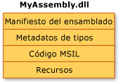
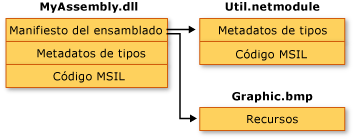

# Contenido de los ensamblados
En general, un ensamblado estático está formado por cuatro elementos:  
  
-   El [manifiesto del ensamblado](../../../docs/framework/app-domains/assembly-manifest.md), que contiene los metadatos del ensamblado.  
  
-   Los metadatos de tipos.  
  
-   El código de lenguaje intermedio de Microsoft (MSIL) que implementa los tipos.  
  
-   Un conjunto de recursos.  
  
 El manifiesto del ensamblado es el único elemento obligatorio, pero se necesitan o bien los tipos o bien los recursos para proporcionar al ensamblado una funcionalidad significativa.  
  
 Estos elementos se pueden agrupar en un ensamblado de varias formas. Se puede agrupar todos los elementos en un solo archivo físico, como se observa en la ilustración siguiente.  
  
   
Ensamblado de único archivo  
  
 Alternativamente, los elementos de un ensamblado se pueden incluir en varios archivos. Estos archivos pueden ser módulos de código compilado (.netmodule), de recursos (como archivos .bmp o .jpg) u otros archivos necesarios para la aplicación. Puede crear un ensamblado de múltiples archivos para combinar módulos escritos en idiomas diferentes y optimizar la descarga de una aplicación al colocar los tipos que rara vez se utilizan en un módulo que se descargue sólo cuando sea necesario.  
  
 En la siguiente ilustración, el programador de una aplicación hipotética ha decidido separar el código de alguna utilidad en un módulo diferente y mantener un archivo de recursos grande (en este caso, una imagen .bmp) en su archivo original. .NET Framework descarga un archivo sólo cuando se hace referencia al mismo, por lo que la descarga de código se ve optimizada cuando se mantiene el código al que no se hace referencia frecuentemente en un archivo aparte de la aplicación.  
  
   
Ensamblado de múltiples archivos  
  
> [!NOTE]
>  El sistema de archivos no vincula físicamente los archivos que forman un ensamblado de múltiples archivos. En su lugar, se vinculan a través del manifiesto del ensamblado y Common Language Runtime los administra como una unidad.  
  
 En esta ilustración, los tres archivos pertenecen a un ensamblado, como se describe en el manifiesto del ensamblado contenido en MyAssembly.dll. Para el sistema de archivos, se trata de tres archivos diferentes. Tenga en cuenta que el archivo Util.netmodule se compiló como módulo porque no contiene información de ensamblado. Cuando se creó el ensamblado, el manifiesto del ensamblado se agregó a MyAssembly.dll, lo que indica su relación con Util.netmodule y Graphic.bmp.  
  
 Actualmente, al diseñar el código fuente, se toman decisiones explícitas sobre cómo repartir la funcionalidad de una aplicación entre uno o más archivos. Al diseñar el código de .NET Framework, tomará decisiones similares sobre cómo dividir la funcionalidad en uno o más ensamblados.  
  
## Vea también  
 [Ensamblados en Common Language Runtime](../../../docs/framework/app-domains/assemblies-in-the-common-language-runtime.md)  
 [Manifiesto del ensamblado](../../../docs/framework/app-domains/assembly-manifest.md)  
 [Consideraciones de seguridad sobre ensamblados](../../../docs/framework/app-domains/assembly-security-considerations.md)
