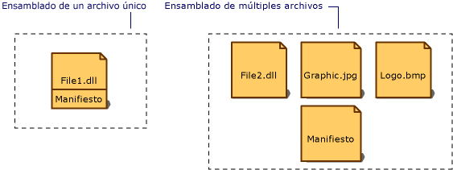

# Manifiesto del ensamblado
Todos los ensamblados, ya sean estáticos o dinámicos, contienen una colección de datos que describen cómo se relacionan entre sí los elementos del ensamblado. El manifiesto contiene estos metadatos del ensamblado. Un manifiesto del ensamblado contiene todos los metadatos necesarios para especificar los requisitos de versión y la identidad de seguridad del ensamblado, y todos los metadatos necesarios para definir el ámbito del ensamblado y resolver las referencias a los recursos y las clases. El manifiesto del ensamblado se puede almacenar en un archivo PE (.exe o .dll) con código de lenguaje intermedio de Microsoft (MSIL) o en un archivo PE independiente que contenga sólo la información sobre el manifiesto del ensamblado.  
  
 En la siguiente ilustración se muestran las distintas formas de almacenar un manifiesto.  
  
   
Tipos de ensamblados  
  
 En el caso de un ensamblado que tenga un solo archivo asociado, el manifiesto se incluye en el archivo PE para formar un ensamblado de un solo archivo. Se puede crear un ensamblado de múltiples archivos con un archivo de manifiesto independiente o incorporando el manifiesto en uno de los archivos PE del ensamblado.  
  
 Un manifiesto de ensamblado realiza las funciones siguientes:  
  
-   Enumera los archivos que componen el ensamblado.  
  
-   Controla cómo se asignan las referencias a los tipos y recursos del ensamblado a los archivos que contienen sus declaraciones e implementaciones.  
  
-   Enumera otros ensamblados de los que depende este ensamblado.  
  
-   Proporciona un nivel de direccionamiento indirecto entre los consumidores del ensamblado y los detalles de implementación del ensamblado.  
  
-   Representa el ensamblado como autodescriptivo.  
  
## Contenido del manifiesto del ensamblado  
 En la tabla siguiente, se muestra la información que contiene el manifiesto del ensamblado. Los cuatro primeros elementos (nombre del ensamblado, número de versión, referencia cultural e información sobre el nombre seguro) constituyen la identidad del ensamblado.  
  
|Información|Descripción|  
|-----------------|-----------------|  
|Nombre del ensamblado|Cadena de texto donde se especifica el nombre del ensamblado.|  
|Número de versión|Número de versión principal y secundaria, y número de revisión y de compilación. Common Language Runtime utiliza estos números para exigir las directivas de versión.|  
|Referencia cultural|Información sobre la referencia cultural o idioma que admite el ensamblado. Esta información se debe utilizar sólo para designar un ensamblado como ensamblado satélite que contiene información específica sobre la referencia cultural o el idioma. (Se asume que un ensamblado con información de referencia cultural es un ensamblado satélite).|  
|Información sobre el nombre seguro|Clave pública del editor si el ensamblado tiene un nombre seguro|  
|Lista de todos los archivos del ensamblado|Un código hash de cada archivo que contiene el ensamblado y nombre de archivo . Tenga en cuenta que todos los archivos que componen el ensamblado deben encontrarse en el mismo directorio que el archivo que contiene el manifiesto del ensamblado.|  
|Información de referencia de tipos|Información que utiliza el motor en tiempo de ejecución para asignar una referencia de tipos al archivo que contiene su declaración e implementación. Se utiliza para tipos que se exportan desde el ensamblado.|  
|Información sobre ensamblados a los que se hace referencia|Lista de otros ensamblados a los que este ensamblado hace referencia estáticamente. Cada referencia incluye el nombre del ensamblado dependiente, los metadatos del ensamblado (versión, referencia cultural, sistema operativo, etc.) y la clave pública, si el ensamblado tiene un nombre seguro.|  
  
 Si desea agregar o modificar información en el manifiesto del ensamblado, puede utilizar atributos de ensamblado en su código. Se puede cambiar la información de versión y los atributos informativos, como Trademark, Copyright, Product, Company e Informational Version. Para obtener una lista completa de los atributos de ensamblado, vea [Setting Assembly Attributes](../../../docs/framework/app-domains/set-assembly-attributes.md) (Establecer atributos de ensamblado).  
  
## Vea también  
 [Contenido de los ensamblados](../../../docs/framework/app-domains/assembly-contents.md)  
 [Versiones de los ensamblados](../../../docs/framework/app-domains/assembly-versioning.md)  
 [Crear ensamblados satélite](../../../docs/framework/resources/creating-satellite-assemblies-for-desktop-apps.md)  
 [Ensamblados con nombre seguro](../../../docs/framework/app-domains/strong-named-assemblies.md)
