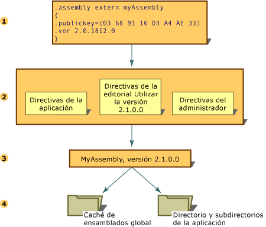

# Versiones de los ensamblados
La creación de versiones de ensamblados mediante Common Language Runtime se realiza en el nivel de ensamblado. La versión específica de un ensamblado y las versiones de los ensamblados dependientes se guardan en el manifiesto del ensamblado. La directiva de versiones predeterminada para el motor en tiempo de ejecución es que las aplicaciones se ejecuten sólo en las versiones con las que se compilaron y comprobaron, a menos que se reemplace con una directiva de versiones explícita en los archivos de configuración (el archivo de configuración de la aplicación, el archivo de directivas de la compañía de software y el archivo de configuración del administrador del equipo).  
  
> [!NOTE]
>  La creación de versiones sólo se realiza en ensamblados con nombres seguros.  
  
 El motor en tiempo de ejecución ejecuta varios pasos para resolver la solicitud de enlace de un ensamblado:  
  
1.  Comprueba la referencia del ensamblado original para determinar la versión del ensamblado que se va a enlazar.  
  
2.  Comprueba todos los archivos de configuración correspondientes para aplicar la directiva de versiones.  
  
3.  Determina el ensamblado correcto a partir de la referencia del ensamblado original y las posibles redirecciones especificadas en los archivos de configuración, y determina la versión que debería enlazarse al ensamblado que realiza la llamada.  
  
4.  Comprueba la caché global de ensamblados, el código base especificado en los archivos de configuración y, después, el directorio y los subdirectorios de la aplicación mediante las reglas de búsqueda que se describen en [How the Runtime Locates Assemblies](../../../docs/framework/deployment/how-the-runtime-locates-assemblies.md) (Cómo el tiempo de ejecución ubica ensamblados).  
  
 La ilustración siguiente muestra estos pasos.  
  
   
Resolver la solicitud de enlace de un ensamblado  
  
 Para obtener más información sobre cómo configurar aplicaciones, vea [Configuring Apps](../../../docs/framework/configure-apps/index.md) (Configurar aplicaciones). Para obtener más información sobre la directiva de enlace, vea [How the Runtime Locates Assemblies](../../../docs/framework/deployment/how-the-runtime-locates-assemblies.md) (Cómo el tiempo de ejecución ubica ensamblados).  
  
## Información de versión  
 Cada ensamblado tiene dos maneras distintas de expresar la información de versión:  
  
-   El número de versión del ensamblado, que, junto con el nombre del ensamblado y la información de referencia cultural, es parte de la identidad del ensamblado. El motor en tiempo de ejecución utiliza este número para imponer la directiva de versiones y juega un papel importante en el proceso de resolución de tipos en tiempo de ejecución.  
  
-   Una versión informativa, que es una cadena que representa información adicional sobre la versión que se incluye sólo con carácter informativo.  
  
### Número de versión del ensamblado  
 Cada ensamblado tiene un número de versión como parte de su identidad. Por tanto, el motor en tiempo de ejecución considera que son totalmente diferentes dos ensamblados que se diferencien por el número de versión. El número de versión se representa físicamente como una cadena de cuatro partes con el formato siguiente:  
  
 \<*versión principal*>.\<*versión secundaria*>.\<*número de compilación*>.\<*revisión*>  
  
 Por ejemplo, la versión 1.5.1254.0 indica que 1 es la versión principal, 5 es la versión secundaria, 1254 es el número de compilación y 0 es el número de revisión.  
  
 El número de versión se almacena en el manifiesto del ensamblado junto con otra información de identidad, incluidos el nombre del ensamblado y la clave pública, así como información sobre las relaciones e identidades de otros ensamblados relacionados con la aplicación.  
  
 Cuando se compila un ensamblado, la herramienta de programación registra la información de dependencia de cada ensamblado al que se haga referencia en el manifiesto. El motor en tiempo de ejecución utiliza estos números de versión, junto con la información de configuración establecida por un administrador, una aplicación o una compañía de software, para cargar la versión correcta de un ensamblado al que se hace referencia.  
  
 El motor en tiempo de ejecución distingue los ensamblados normales de los ensamblados con nombres seguros para crear las versiones. La comprobación de versión sólo se produce para los ensamblados con nombres seguros.  
  
 Para obtener información sobre cómo especificar directivas de enlace de versión, vea [Configuring Apps](../../../docs/framework/configure-apps/index.md) (Configurar aplicaciones). Para obtener información sobre cómo el tiempo de ejecución usa la información de versión para buscar un ensamblado determinado, vea [How the Runtime Locates Assemblies](../../../docs/framework/deployment/how-the-runtime-locates-assemblies.md) (Cómo el tiempo de ejecución ubica los ensamblados).  
  
### Versión informativa del ensamblado  
 La versión informativa es una cadena que asocia a un ensamblado información adicional sobre la versión sólo con carácter informativo; esta información no se utiliza en tiempo de ejecución. La versión informativa basada en texto corresponde a la literatura de marketing del producto, al paquete o al nombre del producto, y no la utiliza el motor en tiempo de ejecución. Por ejemplo, una versión informativa podría ser "Common Language Runtime version 1.0" o "NET Control SP 2". En la ficha Versión del cuadro de diálogo de propiedades del archivo en Microsoft Windows, esta información aparece en el elemento "Product Version".  
  
> [!NOTE]
>  Aunque es posible especificar cualquier texto, aparecerá un mensaje de advertencia durante la compilación si la cadena no tiene el formato utilizado por el número de versión del ensamblado o si, teniendo ese formato, contiene comodines. Esta advertencia es inofensiva.  
  
 La versión informativa se representa utilizando el atributo personalizado <xref:System.Reflection.AssemblyInformationalVersionAttribute?displayProperty=nameWithType>. Para obtener más información sobre el atributo de versión informativa, vea [Setting Assembly Attributes](../../../docs/framework/app-domains/set-assembly-attributes.md) (Establecer atributos de ensamblado).  
  
## Vea también  
 [Cómo el motor en tiempo de ejecución ubica ensamblados](../../../docs/framework/deployment/how-the-runtime-locates-assemblies.md)  
 [Configurar aplicaciones](../../../docs/framework/configure-apps/index.md)  
 [Configurar atributos de ensamblados](../../../docs/framework/app-domains/set-assembly-attributes.md)  
 [Ensamblados en Common Language Runtime](../../../docs/framework/app-domains/assemblies-in-the-common-language-runtime.md)
