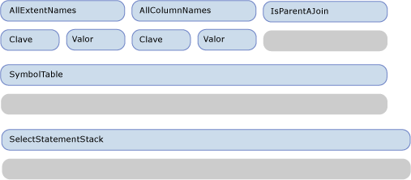
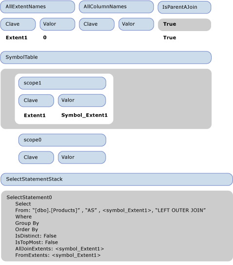
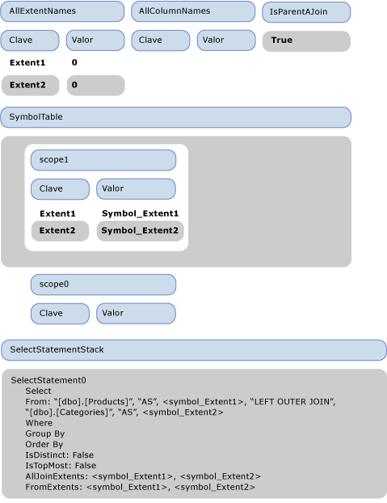
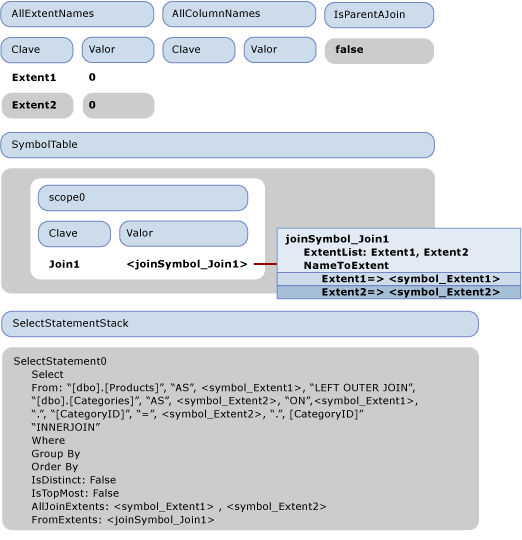
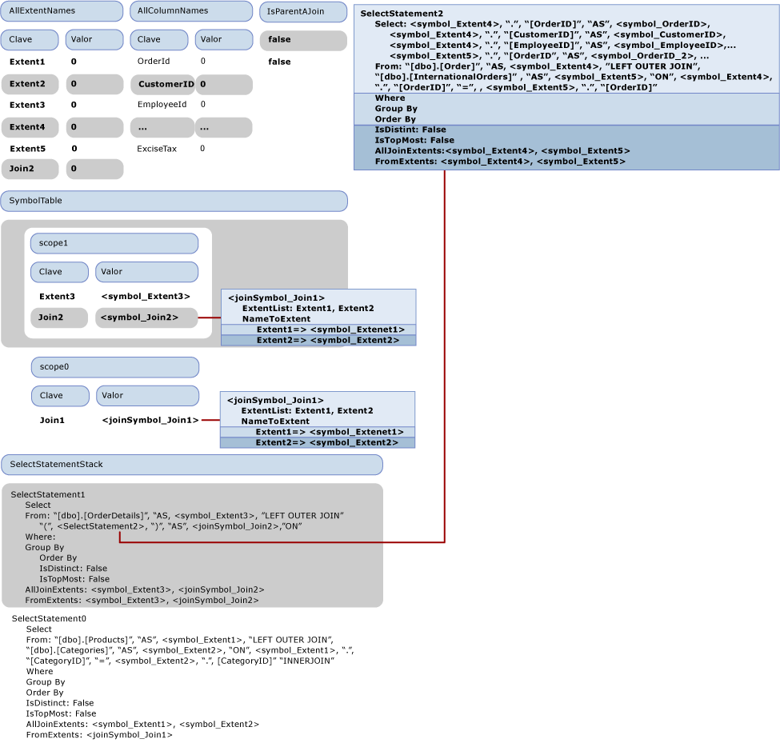

# <a name="walkthrough-sql-generation"></a>Tutorial: Generación de SQL
En este tema se muestra cómo se produce la generación de SQL en el [proveedor de ejemplo](https://code.msdn.microsoft.com/windowsdesktop/Entity-Framework-Sample-6a9801d0). La siguiente consulta de Entity SQL utiliza el modelo incluido con el proveedor de ejemplo:  
  
```  
SELECT  j1.ProductId, j1.ProductName, j1.CategoryName, j2.ShipCountry, j2.ProductId  
FROM (  SELECT P.ProductName, P.ProductId, P.Category.CategoryName  
        FROM NorthwindEntities.Products AS P) as j1  
INNER JOIN (SELECT OD.ProductId, OD.Order.ShipCountry as ShipCountry  
            FROM NorthwindEntities.OrderDetails AS OD) as j2  
            ON j1.ProductId == j2.ProductId   
```  
  
 La consulta genera el siguiente árbol de comandos de salida que se pasa al proveedor:  
  
```  
DbQueryCommandTree  
|_Parameters  
|_Query : Collection{Record['C1'=Edm.Int32, 'ProductID'=Edm.Int32, 'ProductName'=Edm.String, 'CategoryName'=Edm.String, 'ShipCountry'=Edm.String, 'ProductID1'=Edm.Int32]}  
  |_Project  
    |_Input : 'Join4'  
    | |_InnerJoin  
    |   |_Left : 'Join1'  
    |   | |_LeftOuterJoin  
    |   |   |_Left : 'Extent1'  
    |   |   | |_Scan : dbo.Products  
    |   |   |_Right : 'Extent2'  
    |   |   | |_Scan : dbo.Categories  
    |   |   |_JoinCondition  
    |   |     |_  
    |   |       |_Var(Extent1).CategoryID  
    |   |       |_=  
    |   |       |_Var(Extent2).CategoryID  
    |   |_Right : 'Join3'  
    |   | |_LeftOuterJoin  
    |   |   |_Left : 'Extent3'  
    |   |   | |_Scan : dbo.OrderDetails  
    |   |   |_Right : 'Join2'  
    |   |   | |_LeftOuterJoin  
    |   |   |   |_Left : 'Extent4'  
    |   |   |   | |_Scan : dbo.Orders  
    |   |   |   |_Right : 'Extent5'  
    |   |   |   | |_Scan : dbo.InternationalOrders  
    |   |   |   |_JoinCondition  
    |   |   |     |_  
    |   |   |       |_Var(Extent4).OrderID  
    |   |   |       |_=  
    |   |   |       |_Var(Extent5).OrderID  
    |   |   |_JoinCondition  
    |   |     |_  
    |   |       |_Var(Extent3).OrderID  
    |   |       |_=  
    |   |       |_Var(Join2).Extent4.OrderID  
    |   |_JoinCondition  
    |     |_  
    |       |_Var(Join1).Extent1.ProductID  
    |       |_=  
    |       |_Var(Join3).Extent3.ProductID  
    |_Projection  
      |_NewInstance : Record['C1'=Edm.Int32, 'ProductID'=Edm.Int32, 'ProductName'=Edm.String, 'CategoryName'=Edm.String, 'ShipCountry'=Edm.String, 'ProductID1'=Edm.Int32]  
        |_Column : 'C1'  
        | |_1  
        |_Column : 'ProductID'  
        | |_Var(Join4).Join1.Extent1.ProductID  
        |_Column : 'ProductName'  
        | |_Var(Join4).Join1.Extent1.ProductName  
        |_Column : 'CategoryName'  
        | |_Var(Join4).Join1.Extent2.CategoryName  
        |_Column : 'ShipCountry'  
        | |_Var(Join4).Join3.Join2.Extent4.ShipCountry  
        |_Column : 'ProductID1'  
          |_Var(Join4).Join3.Extent3.ProductID  
```  
  
 En este tema se describe cómo traducir este árbol de comandos de salida en las siguientes instrucciones SQL.  
  
```  
SELECT   
1 AS [C1],   
[Extent1].[ProductID] AS [ProductID],   
[Extent1].[ProductName] AS [ProductName],   
[Extent2].[CategoryName] AS [CategoryName],   
[Join3].[ShipCountry] AS [ShipCountry],   
[Join3].[ProductID] AS [ProductID1]  
FROM   [dbo].[Products] AS [Extent1]  
LEFT OUTER JOIN [dbo].[Categories] AS [Extent2] ON [Extent1].[CategoryID] = [Extent2].[CategoryID]  
INNER JOIN    
(SELECT [Extent3].[OrderID] AS [OrderID1], [Extent3].[ProductID] AS [ProductID], [Extent3].[UnitPrice] AS [UnitPrice], [Extent3].[Quantity] AS [Quantity], [Extent3].[Discount] AS [Discount], [Join2].[OrderID2], [Join2].[CustomerID], [Join2].[EmployeeID], [Join2].[OrderDate], [Join2].[RequiredDate], [Join2].[ShippedDate], [Join2].[Freight], [Join2].[ShipName], [Join2].[ShipAddress], [Join2].[ShipCity], [Join2].[ShipRegion], [Join2].[ShipPostalCode], [Join2].[ShipCountry], [Join2].[OrderID3], [Join2].[CustomsDescription], [Join2].[ExciseTax]  
FROM  [dbo].[OrderDetails] AS [Extent3]  
LEFT OUTER JOIN    
      (SELECT [Extent4].[OrderID] AS [OrderID2], [Extent4].[CustomerID] AS [CustomerID], [Extent4].[EmployeeID] AS [EmployeeID], [Extent4].[OrderDate] AS [OrderDate], [Extent4].[RequiredDate] AS [RequiredDate], [Extent4].[ShippedDate] AS [ShippedDate], [Extent4].[Freight] AS [Freight], [Extent4].[ShipName] AS [ShipName], [Extent4].[ShipAddress] AS [ShipAddress], [Extent4].[ShipCity] AS [ShipCity], [Extent4].[ShipRegion] AS [ShipRegion], [Extent4].[ShipPostalCode] AS [ShipPostalCode], [Extent4].[ShipCountry] AS [ShipCountry], [Extent5].[OrderID] AS [OrderID3], [Extent5].[CustomsDescription] AS [CustomsDescription], [Extent5].[ExciseTax] AS [ExciseTax]  
FROM  [dbo].[Orders] AS [Extent4]  
LEFT OUTER JOIN [dbo].[InternationalOrders] AS [Extent5] ON [Extent4].[OrderID] = [Extent5].[OrderID]   
      ) AS [Join2] ON [Extent3].[OrderID] = [Join2].[OrderID2]   
   ) AS [Join3] ON [Extent1].[ProductID] = [Join3].[ProductID]  
```  
  
## <a name="first-phase-of-sql-generation-visiting-the-expression-tree"></a>Primera fase de generación de SQL: Visitar el árbol de expresión  
 La siguiente figura muestra el estado vacío inicial del visitante.  A lo largo de este tema, solo se muestran las propiedades pertinentes a la explicación del tutorial.  
  
   
  
 Cuando se visita el nodo Project, se llama a VisitInputExpression en su entrada (Join4), que activa la visita de Join4 por el método VisitJoinExpression. Dado que esta es la combinación de nivel superior, IsParentAJoin devuelve el valor false y se crea una nueva instrucción SqlSelectStatement (SelectStatement0) que se inserta en la pila de instrucciones SELECT. Asimismo, se introduce un nuevo ámbito (scope0) en la tabla de símbolos. Antes de visitar la primera entrada (izquierda) de la combinación, se inserta "true" en la pila de IsParentAJoin. Justo antes de visitar Join1, que es la entrada izquierda de Join4, el estado del visitante es el que se muestra en la figura siguiente.  
  
   
  
 Cuando el método de visita de combinación se invoca en Join4, IsParentAJoin es "true", por lo que reutiliza la instrucción de selección SelectStatement0 actual. Se introduce un nuevo ámbito (scope1). Antes de visitar su elemento secundario izquierdo, Extent1, se inserta otro valor "true" en la pila de IsParentAJoin.  
  
 Cuando se visita Extent1, dado que IsParentAJoin devuelve "true", devuelve un objeto SqlBuilder que contiene "[dbo].[Products]". El control vuelve al método que visita Join4. Se extrae una entrada de IsParentAJoin y se llama a ProcessJoinInputResult, que anexa el resultado de la visita a Extent1 a la cláusula From de SelectStatement0. Se crea un nuevo símbolo FROM, symbol_Extent1, para el nombre de enlace de entrada "Extent1" y se agrega a FromExtents de SelectStatement0. Asimismo, se anexan "As" y symbol_Extent1 a la cláusula FROM. Se agrega una nueva entrada a AllExtentNames para "Extent1" con el valor de 0. Se agrega una nueva entrada al ámbito actual en la tabla de símbolos para asociar "Extent1" a su símbolo symbol_Extent1. Symbol_Extent1 también se agrega a AllJoinExtents de SqlSelectStatement.  
  
 Antes de que se visite la entrada derecha de Join1, se agrega "LEFT OUTER JOIN" a la cláusula From de SelectStatement0. Dado que la entrada derecha es una expresión Scan, se inserta de nuevo "true" en la pila de IsParentAJoin. El estado antes de visitar la entrada derecha es el que se muestra en la figura siguiente.  
  
   
  
 La entrada derecha se procesa de la misma manera que la entrada izquierda. El estado después de visitar la entrada derecha es el que se muestra en la figura siguiente.  
  
   
  
 A continuación, se inserta "false" en la pila de IsParentAJoin y se procesa la condición de combinación Var(Extent1).CategoryID == Var(Extent2).CategoryID. Var(Extent1) se resuelve como <symbol_Extent1> después de una búsqueda en la tabla de símbolos. Dado que la instancia se resuelve como un símbolo simple, como resultado del procesamiento Var(Extent1). Id. de categoría, un objeto SqlBuilder con \<symbol1 >. " Se devuelve el CategoryID". De igual forma se procesa el otro lado de la comparación. El resultado de la visita de la condición de combinación se anexa a la cláusula FROM de SelectStatement1 y el valor "false" se extrae de la pila de IsParentAJoin.  
  
 Con esto, Join1 se ha procesado completamente y se ha extraído un ámbito de la tabla de símbolos.  
  
 El control vuelve a procesar Join4, el elemento primario de Join1. Dado que el elemento secundario reutilizó la instrucción Select, las extensiones de Join1 se reemplazan con un único símbolo de combinación <joinSymbol_Join1>. También se agrega una nueva entrada a la tabla de símbolos para asociar Join1 a <joinSymbol_Join1>.  
  
 El nodo siguiente que se va a procesar es Join3, el segundo elemento secundario de Join4. Como es un elemento secundario derecho, se inserta "false" en la pila de IsParentAJoin. En la figura siguiente se muestra el estado del visitante en este punto.  
  
   
  
 Para Join3, IsParentAJoin devuelve "false" y necesita iniciar una nueva instrucción SqlSelectStatement (SelectStatement1) e insertarla en la pila. El procesamiento continúa de la misma forma que en las combinaciones anteriores, se inserta un nuevo ámbito en la pila y se procesan los elementos secundarios. El elemento secundario izquierdo es una extensión (Extent3) y el elemento secundario derecho es una combinación (Join2) que también se necesita para iniciar una nueva instrucción SqlSelectStatement: SelectStatement2. Los elementos secundarios de Join2 también son extensiones y se agregan en SelectStatement2.  
  
 En la siguiente figura se muestra el estado del visitante justo después de visitar Join2, pero antes de que se realice su procesamiento posterior (ProcessJoinInputResult):  
  
   
  
 En la figura anterior, SelectStatement2 se muestra como flotante porque se extrajo de la pila, pero todavía no se ha procesado en el elemento primario. Necesita agregarse a la parte FROM del elemento primario, pero no es una instrucción SQL completa sin una cláusula SELECT. Así que, en este punto, las columnas predeterminadas (todas las columnas generadas por sus entradas) se agregan a la lista de selección mediante el método AddDefaultColumns. AddDefaultColumns recorre en iteración los símbolos de FromExtents y para cada símbolo agrega todas las columnas introducidas en el ámbito. Para un símbolo simple, examina el tipo de símbolo para recuperar todas sus propiedades que se van a agregar. También rellena el diccionario de AllColumnNames con los nombres de columna. La instrucción SelectStatement2 completa se anexa a la cláusula FROM de SelectStatement1.  
  
 A continuación, se crea un nuevo símbolo de combinación para representar Join2, se marca como combinación anidada y se agrega a AllJoinExtents de SelectStatement1 y a la tabla de símbolos.  Ahora es necesario procesar la condición de combinación de Join3, Var(Extent3).OrderID = Var(Join2).Extent4.OrderID. El procesamiento del lado izquierdo es similar a la condición de combinación de Join1. Sin embargo, el procesamiento del lado derecho "Var(Join2).Extent4.OrderID" es diferente porque es necesario reducir la combinación.  
  
 La figura siguiente muestra el estado del visitante justo antes de procesar la expresión DbPropertyExpression "Var(Join2).Extent4.OrderID".  
  
 Observe cómo se visita "Var(Join2).Extent4.OrderID". En primer lugar, se visita la propiedad de instancia "Var(Join2).Extent4", que es otra expresión DbPropertyExpression y visita primero su instancia "Var(Join2)". En el ámbito de nivel superior de la tabla de símbolos, "Join2" se resuelve como <joinSymbol_join2>. En el método de visita en el que DbPropertyExpression procesa "Var(Join2).Extent4", observe que se devuelve un símbolo de combinación al visitar la instancia y que es preciso quitar información de estructura jerárquica.  
  
 Dado que se trata de una combinación anidada, se busca la propiedad "Extent4" en el diccionario de NameToExtent del símbolo de combinación, se resuelve como <symbol_Extent4> y se devuelve un nuevo SymbolPair(<joinSymbol_join2>, <symbol_Extent4>). Puesto que se devuelve un par de símbolos del procesamiento de la instancia de "Var(Join2).Extent4.OrderID", la propiedad "OrderID" se resuelve a partir del valor ColumnPart de ese par de símbolos (<symbol_Extent4>), que tiene una lista de las columnas de la extensión que representa. Por tanto, "Var(Join2).Extent4.OrderID" se resuelve como {<joinSymbol_Join2>, ".", <symbol_OrderID>}.  
  
 De igual forma se procesa la condición de combinación de Join4. El control vuelve al método VisitInputExpression que procesó el proyecto de nivel superior. Si se examina FromExtents de la instrucción SelectStatement0 devuelta, la entrada se identifica como una combinación, se quitan las extensiones originales y se reemplazan con una nueva extensión que únicamente incluye el símbolo de combinación. La tabla de símbolos también se actualiza y, a continuación, se procesa la parte de la proyección del proyecto. La resolución de las propiedades y la reducción de la extensión de la combinación se realizan como se ha descrito anteriormente.  
  
   
  
 Por último, se genera la siguiente instrucción SqlSelectStatement:  
  
```  
SELECT:   
  "1", " AS ", "[C1]",  
  <symbol_Extent1>, ".", "[ProductID]", " AS ", "[ProductID]",   
  <symbol_Extent1>, ".", "[ProductName]", " AS ", "[ProductName]",  
  <symbol_Extent2>, ".", "[CategoryName]", " AS ", "[CategoryName]",  
  <joinSymbol_Join3>, ".", <symbol_ShipCountry>, " AS ", "[ShipCountry]",   
  <joinSymbol_Join3>, ".", <symbol_ProductID>, " AS ", "[ProductID1]"  
FROM: "[dbo].[Products]", " AS ", <symbol_Extent1>,   
        "LEFT OUTER JOIN ""[dbo].[Categories]", " AS ", <symbol_Extent2>, " ON ", <symbol_Extent1>, ".", "[CategoryID]", " = ", <symbol_Extent2>, ".", "[CategoryID]",   
        "INNER JOIN ",   
        " (", SELECT:   
           <symbol_Extent3>, ".", "[OrderID]", " AS ", <symbol_OrderID>, ",   
              <symbol_Extent3>, ".", "[ProductID]", " AS ", <symbol_ProductID>, ...,  
         <joinSymbol_Join2>, ".", <symbol_OrderID_2>, ", ",   
           <joinSymbol_Join2>, ".", <symbol_CustomerID>, ....,    
        <joinSymbol_Join2>, ".", <symbol_OrderID_3>,   
<joinSymbol_Join2>, ".", <symbol_CustomsDescription>,   
<joinSymbol_Join2>, ".", <symbol_ExciseTax>  
FROM: "[dbo].[OrderDetails]", " AS ", <symbol_Extent3>,   
"LEFT OUTER JOIN ",   
" (", SELECT:   
<symbol_Extent4>, ".", "[OrderID]", " AS ", <symbol_OrderID_2>,   
<symbol_Extent4>, ".", "[CustomerID]", " AS ", <symbol_CustomerID>, ...  
<symbol_Extent5>, ".", "[OrderID]", " AS ", <symbol_OrderID_3>,  
<symbol_Extent5>, ".", "[CustomsDescription]", " AS ", <symbol_CustomsDescription>,  
<symbol_Extent5>, ".", "[ExciseTax]", " AS ", <symbol_ExciseTax>  
FROM: "[dbo].[Orders]", " AS ", <symbol_Extent4>,  
"LEFT OUTER JOIN ", , "[dbo].[InternationalOrders]", " AS ", <symbol_Extent5>,   
" ON ", <symbol_Extent4>, ".", "[OrderID]", " = ", , <symbol_Extent5>, ".", "[OrderID]"  
" )", " AS ", <joinSymbol_Join2>, " ON ", , , <symbol_Extent3>, ".", "[OrderID]", " = ", , <joinSymbol_Join2>, ".", <symbol_OrderID_2>  
" )", " AS ", <joinSymbol_Join3>, " ON ", , , <symbol_Extent1>, ".", "[ProductID]", " = ", , <joinSymbol_Join3>, ".", <symbol_ProductID>  
```  
  
### <a name="second-phase-of-sql-generation-generating-the-string-command"></a>Segunda fase de generación de SQL: Generar el comando String  
 La segunda fase genera los nombres reales de los símbolos; únicamente nos centraremos en los símbolos que representan las columnas denominadas "OrderID", ya que en este caso es necesario resolver un conflicto. Estas columnas se resaltan en la instrucción SqlSelectStatement. Tenga en cuenta que los sufijos utilizados en la figura solo pretenden destacar que se trata de instancias diferentes y no representan ningún nuevo nombre, ya que en esta fase todavía no se han asignado sus nombres finales (posiblemente diferentes de los nombres originales).  
  
 El primer símbolo localizado que necesita cambiar de nombre es <symbol_OrderID>. Su nuevo nombre se asigna como "OrderID1", 1 se marca como el último sufijo utilizado para "OrderID" y el símbolo se marca como símbolo que no necesita cambio de nombre. A continuación se localiza el primer uso de <symbol_OrderID_2>. Se cambia el nombre para utilizar el siguiente sufijo disponible ("OrderID2") y de nuevo se marca como símbolo que no necesita cambio de nombre, para que la próxima vez que se utilice no se cambie el nombre. Esto también se lleva a cabo para <symbol_OrderID_3>.  
  
 Al final de la segunda fase, se genera la instrucción SQL final.  
  
## <a name="see-also"></a>Vea también
- [Generación de SQL en el proveedor de ejemplo](../../../../../docs/framework/data/adonet/ef/sql-generation-in-the-sample-provider.md)
