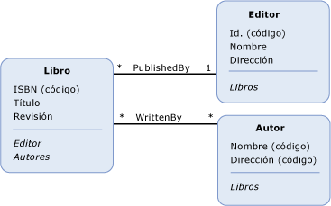

# Conceptos clave de Entity Data Model
Entity Data Model (EDM) utiliza tres conceptos clave para describir la estructura de datos: *tipo de entidad*, *tipo de asociación*, y *propiedad*. Estos son los conceptos más importantes para describir la estructura de datos en cualquier implementación de EDM.  
  
## Tipo de entidad  
 El [tipo de entidad](../../../../docs/framework/data/adonet/entity-type.md) es el bloque de creación fundamental para describir la estructura de datos con Entity Data Model. En un modelo conceptual, los tipos de entidad se construyen a partir [propiedades](../../../../docs/framework/data/adonet/property.md) y describir la estructura de conceptos de nivel superior, como clientes y pedidos en una aplicación empresarial. Del mismo modo que una definición de clase en un programa es una plantilla para las instancias de la clase, un tipo de entidad es una plantilla para las entidades. Una entidad representa un objeto concreto (como un cliente o pedido concreto). Cada entidad debe tener un único [clave de entidad](../../../../docs/framework/data/adonet/entity-key.md) dentro de un [conjunto de entidades](../../../../docs/framework/data/adonet/entity-set.md).  Un conjunto de entidades es una colección de instancias de un tipo de entidad concreto. Los conjuntos de entidades (y [conjuntos de asociaciones](../../../../docs/framework/data/adonet/association-set.md)) se agrupan lógicamente en un [contenedor de entidades](../../../../docs/framework/data/adonet/entity-container.md).  
  
 Los tipos de entidad admiten la herencia: es decir, un tipo de entidad se puede derivar de otro. Para obtener más información, consulte [Entity Data Model: herencia](../../../../docs/framework/data/adonet/entity-data-model-inheritance.md).  
  
## Tipo de asociación  
 Un [tipo de asociación](../../../../docs/framework/data/adonet/association-type.md) (también denominado asociación) es el bloque de creación fundamental para describir las relaciones en el Entity Data Model. En un modelo conceptual, una asociación representa una relación entre dos tipos de entidad (como Customer y Order). Cada asociación tiene dos [extremos de asociación](../../../../docs/framework/data/adonet/association-end.md) que especifican los tipos de entidad implicados en la asociación. Cada extremo de la asociación también especifica un [multiplicidad de extremo de asociación](../../../../docs/framework/data/adonet/association-end-multiplicity.md) que indica el número de entidades que pueden existir en ese extremo de la asociación. La multiplicidad de extremo de asociación puede tener el valor uno (1), cero o uno (0..1), o muchos (*). Pueden tener acceso a las entidades de un extremo de una asociación a través de [propiedades de navegación](../../../../docs/framework/data/adonet/navigation-property.md), o a través de las claves externas si estas propiedades se exponen en un tipo de entidad. Para obtener más información, consulte [propiedad de clave externa](../../../../docs/framework/data/adonet/foreign-key-property.md).  
  
 En una aplicación, una instancia de una asociación representa una asociación concreta (como por ejemplo una asociación entre una instancia Customer y una instancia Order). Instancias de la asociación se agrupan lógicamente en un [conjunto de asociaciones](../../../../docs/framework/data/adonet/association-set.md). Conjuntos de asociaciones (y [conjuntos de entidades](../../../../docs/framework/data/adonet/entity-set.md)) se agrupan lógicamente en un [contenedor de entidades](../../../../docs/framework/data/adonet/entity-container.md).  
  
## Property  
 [Tipos de entidad](../../../../docs/framework/data/adonet/entity-type.md) contienen [propiedades](../../../../docs/framework/data/adonet/property.md) que definen su estructura y sus características. Por ejemplo, un tipo de entidad Customer puede tener propiedades como CustomerId, Name y Address.  
  
 Las propiedades en un modelo conceptual son análogas a las propiedades definidas en una clase en un programa. Del mismo modo que las propiedades en una clase definen la forma de la clase y proporcionan información sobre los objetos, las propiedades en un modelo conceptual definen la forma de un tipo de entidad y proporcionan información sobre las instancias del tipo de entidad.  
  
 Una propiedad puede contener datos primitivos (como una cadena, un entero o un valor booleano) o estructura los datos (como un tipo complejo). Para obtener más información, consulte [Entity Data Model: tipos de datos primitivos](../../../../docs/framework/data/adonet/entity-data-model-primitive-data-types.md).  
  
## Representaciones de un modelo conceptual  
 A *modelo conceptual* es una representación específica de la estructura de algunos datos como entidades y relaciones. Una manera de representar un modelo conceptual es con un diagrama. El siguiente diagrama representa un modelo conceptual con tres tipos de entidad (`Book`, `Publisher` y `Author`) y dos asociaciones (`PublishedBy` y `WrittenBy`):  
  
   
  
 Esta representación, sin embargo, tiene algunas limitaciones a la hora de representar algunos detalles acerca del modelo. Por ejemplo, la información sobre el tipo de propiedad y el conjunto de entidades no se representa en el diagrama. La riqueza de un modelo conceptual se puede representar con mayor claridad mediante un lenguaje específico de dominio (ADSL). El [ADO.NET Entity Framework](../../../../docs/framework/data/adonet/ef/index.md) utiliza un ADSL basado en XML denominado *lenguaje de definición de esquemas conceptuales* ([CSDL](../../../../docs/framework/data/adonet/ef/language-reference/csdl-specification.md)) para definir los modelos conceptuales. A continuación se muestra la definición CSDL del modelo conceptual del diagrama anterior:  
  
 [!code-xml[EDM_Example_Model#EDMExampleCSDL](../../../../samples/snippets/xml/VS_Snippets_Data/edm_example_model/xml/books.edmx#edmexamplecsdl)]  
  
## Vea también  
 [Entity Data Model](../../../../docs/framework/data/adonet/entity-data-model.md)
