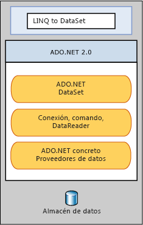

# LINQ to DataSet
[!INCLUDE[linq_dataset](../../../../includes/linq-dataset-md.md)] facilita y acelera las consultas en datos almacenados en caché en un objeto <xref:System.Data.DataSet>. En concreto, [!INCLUDE[linq_dataset](../../../../includes/linq-dataset-md.md)] simplifica la consulta permitiendo a los desarrolladores escribir consultas desde el lenguaje de programación mismo, en lugar de mediante un lenguaje de consulta independiente. Esto es especialmente útil para los desarrolladores de Visual Studio, que ahora pueden aprovechar las ventajas de la comprobación de sintaxis en tiempo de compilación, tipos estáticos y compatibilidad con IntelliSense proporcionado por Visual Studio en las consultas.  
  
 [!INCLUDE[linq_dataset](../../../../includes/linq-dataset-md.md)] también se puede usar para consultar los datos que se han consolidado de uno o más orígenes de datos. Esto permite muchos casos que requieren flexibilidad en la forma de representar y controlar los datos, como consultar datos agregados localmente y almacenar en caché en el nivel medio en aplicaciones web. En concreto, las aplicaciones de inteligencia empresaria, análisis e informes genéricos requieren este método de manipulación.  
  
 El [!INCLUDE[linq_dataset](../../../../includes/linq-dataset-md.md)] funcionalidad se expone principalmente a través de los métodos de extensión en el <xref:System.Data.DataRowExtensions> y <xref:System.Data.DataTableExtensions> clases. [!INCLUDE[linq_dataset](../../../../includes/linq-dataset-md.md)] se basa en y usa existente [!INCLUDE[ado_whidbey_long](../../../../includes/ado-whidbey-long-md.md)] arquitectura y no está pensada para reemplazar [!INCLUDE[ado_whidbey_long](../../../../includes/ado-whidbey-long-md.md)] en código de aplicación. El código de ADO.NET 2.0 existente continuará funcionando en una aplicación [!INCLUDE[linq_dataset](../../../../includes/linq-dataset-md.md)]. La relación de [!INCLUDE[linq_dataset](../../../../includes/linq-dataset-md.md)] con [!INCLUDE[ado_whidbey_long](../../../../includes/ado-whidbey-long-md.md)] y los datos almacenados se muestran en el diagrama siguiente.  
  
   
  
## En esta sección  
 [Introducción](../../../../docs/framework/data/adonet/getting-started-linq-to-dataset.md)  
  
 [Guía de programación](../../../../docs/framework/data/adonet/programming-guide-linq-to-dataset.md)  
  
## Referencia  
 <xref:System.Data.DataTableExtensions>  
  
 <xref:System.Data.DataRowExtensions>  
  
 <xref:System.Data.DataRowComparer>  
  
## Vea también
- [LINQ (Language Integrated Query)](https://msdn.microsoft.com/library/a73c4aec-5d15-4e98-b962-1274021ea93d)
- [LINQ y ADO.NET](../../../../docs/framework/data/adonet/linq-and-ado-net.md)
- [ADO.NET](../../../../docs/framework/data/adonet/index.md)
