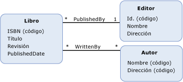

# función definida por el modelo
A *función definida por el modelo* es una función que se define en un modelo conceptual. El cuerpo de una función definida por el modelo se expresa en [Entity SQL](../../../../docs/framework/data/adonet/ef/language-reference/entity-sql-language.md), lo que permite la función se exprese independientemente de las reglas o lenguajes admitidos en el origen de datos.  
  
 La definición para una función definida por el modelo contiene la información siguiente:  
  
-   El nombre de la función. (Necesario)  
  
-   El tipo del valor devuelto. (Opcional)  
  
    > [!NOTE]
    >  Si no se especifica ningún tipo de valor devuelto, este es void.  
  
-   Información de parámetros. (Opcional)  
  
-   Un [Entity SQL](../../../../docs/framework/data/adonet/ef/language-reference/entity-sql-language.md) expresión que define el cuerpo de la función.  
  
 Tenga en cuenta que las funciones definidas por el modelo no admiten parámetros de salida. Esta restricción se aplica para que las funciones definidas por el modelo puedan ser compuestas.  
  
## Ejemplo  
 El diagrama siguiente muestra un modelo conceptual con tres tipos de entidades: `Book`, `Publisher` y `Author`.  
  
   
  
 El [ADO.NET Entity Framework](../../../../docs/framework/data/adonet/ef/index.md) usa un lenguaje específico de dominio (DSL) denominado lenguaje de definición de esquemas conceptuales ([CSDL](../../../../docs/framework/data/adonet/ef/language-reference/csdl-specification.md)) para definir los modelos conceptuales. El código CSDL siguiente define una función en el modelo conceptual que devuelve el número de años transcurridos desde la publicación de una instancia de `Book` (en el diagrama anterior).  
  
 [!code-xml[EDM_Example_Model#ModelDefinedFunction](../../../../samples/snippets/xml/VS_Snippets_Data/edm_example_model/xml/books4.edmx#modeldefinedfunction)]  
  
## Vea también  
 [Conceptos clave de Entity Data Model](../../../../docs/framework/data/adonet/entity-data-model-key-concepts.md)  
 [Entity Data Model](../../../../docs/framework/data/adonet/entity-data-model.md)  
 [Entity Data Model: Tipos de datos primitivos](../../../../docs/framework/data/adonet/entity-data-model-primitive-data-types.md)
