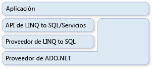

# ADO.NET y LINQ to SQL
[!INCLUDE[vbtecdlinq](../../../../../../includes/vbtecdlinq-md.md)]forma parte de la [!INCLUDE[vstecado](../../../../../../includes/vstecado-md.md)] familia de tecnologías. Se basa en los servicios proporcionados por el modelo de proveedor [!INCLUDE[vstecado](../../../../../../includes/vstecado-md.md)]. Por lo tanto, puede mezclar [!INCLUDE[vbtecdlinq](../../../../../../includes/vbtecdlinq-md.md)] código existente [!INCLUDE[vstecado](../../../../../../includes/vstecado-md.md)] aplicaciones y migrar actual [!INCLUDE[vstecado](../../../../../../includes/vstecado-md.md)] soluciones a [!INCLUDE[vbtecdlinq](../../../../../../includes/vbtecdlinq-md.md)]. La ilustración siguiente proporciona una visión de alto nivel de la relación.  
  
   
  
## Conexiones  
 Puede proporcionar una existente [!INCLUDE[vstecado](../../../../../../includes/vstecado-md.md)] conexión cuando se crea un [!INCLUDE[vbtecdlinq](../../../../../../includes/vbtecdlinq-md.md)] <xref:System.Data.Linq.DataContext>. Todas las operaciones contra el <xref:System.Data.Linq.DataContext> (incluidas las consultas) Utilice esta conexión proporcionada. Si la conexión ya está abierta, [!INCLUDE[vbtecdlinq](../../../../../../includes/vbtecdlinq-md.md)] deja como estaba cuando haya terminado con él.  
  
 [!code-csharp[DLinqCommunicatingWithDatabase#4](../../../../../../samples/snippets/csharp/VS_Snippets_Data/DLinqCommunicatingWithDatabase/cs/Program.cs#4)]
 [!code-vb[DLinqCommunicatingWithDatabase#4](../../../../../../samples/snippets/visualbasic/VS_Snippets_Data/DLinqCommunicatingWithDatabase/vb/Module1.vb#4)]  
  
 Siempre puede tener acceso a la conexión y cerrarla usted mismo utilizando la propiedad <xref:System.Data.Linq.DataContext.Connection%2A>, como en el código siguiente:  
  
 [!code-csharp[DLinqAdoNet#1](../../../../../../samples/snippets/csharp/VS_Snippets_Data/DLinqAdoNet/cs/Program.cs#1)]
 [!code-vb[DLinqAdoNet#1](../../../../../../samples/snippets/visualbasic/VS_Snippets_Data/DLinqAdoNet/vb/Module1.vb#1)]  
  
## Transacciones  
 Puede proporcionar <xref:System.Data.Linq.DataContext> con su propia transacción de base de datos si la aplicación ya ha iniciado la transacción y desea incluir en ella su <xref:System.Data.Linq.DataContext>.  
  
 El método preferido para realizar transacciones con [!INCLUDE[dnprdnshort](../../../../../../includes/dnprdnshort-md.md)] es utilizar el objeto <xref:System.Transactions.TransactionScope>. Con este enfoque, puede realizar transacciones distribuidas que funcionan entre bases de datos y otros administradores de recursos residentes en memoria. Los ámbitos de transacción requieren pocos recursos para iniciarse. Se promueven a sí mismos a transacciones distribuidas solo cuando hay varias conexiones en el ámbito de la transacción.  
  
 [!code-csharp[DLinqAdoNet#2](../../../../../../samples/snippets/csharp/VS_Snippets_Data/DLinqAdoNet/cs/Program.cs#2)]
 [!code-vb[DLinqAdoNet#2](../../../../../../samples/snippets/visualbasic/VS_Snippets_Data/DLinqAdoNet/vb/Module1.vb#2)]  
  
 No puede utilizar este enfoque para todas las bases de datos. Por ejemplo, la conexión de SqlClient no puede promover las transacciones del sistema cuando funciona en un servidor [!INCLUDE[ss2k](../../../../../../includes/ss2k-md.md)]. En su lugar, se da de alta automáticamente en una transacción distribuida completa cada vez que detecta que se utiliza un ámbito de transacción.  
  
## Comandos SQL directos  
 A veces pueden darse situaciones en las que la capacidad de <xref:System.Data.Linq.DataContext> para realizar consultas o enviar cambios es insuficiente para la tarea especializada que se desea realizar. En estas circunstancias, se puede utilizar el método <xref:System.Data.Linq.DataContext.ExecuteQuery%2A> para emitir comandos SQL a la base de datos y convertir los resultados de la consulta en objetos.  
  
 Por ejemplo, supongamos que los datos de la clase `Customer` ocupan dos tablas (customer1 y customer2). La consulta siguiente devuelve una secuencia de objetos `Customer`:  
  
 [!code-csharp[DLinqAdoNet#3](../../../../../../samples/snippets/csharp/VS_Snippets_Data/DLinqAdoNet/cs/Program.cs#3)]
 [!code-vb[DLinqAdoNet#3](../../../../../../samples/snippets/visualbasic/VS_Snippets_Data/DLinqAdoNet/vb/Module1.vb#3)]  
  
 Siempre y cuando los nombres de columna en los resultados tabulares coincidan con las propiedades de columna de la clase de entidad, [!INCLUDE[vbtecdlinq](../../../../../../includes/vbtecdlinq-md.md)] crea objetos a partir de cualquier consulta SQL.  
  
### Parámetros  
 El método <xref:System.Data.Linq.DataContext.ExecuteQuery%2A> acepta parámetros: El código siguiente ejecuta una consulta parametrizada:  
  
 [!code-csharp[DlinqAdoNet#4](../../../../../../samples/snippets/csharp/VS_Snippets_Data/DLinqAdoNet/cs/Program.cs#4)]
 [!code-vb[DlinqAdoNet#4](../../../../../../samples/snippets/visualbasic/VS_Snippets_Data/DLinqAdoNet/vb/Module1.vb#4)]  
  
> [!NOTE]
>  Los parámetros se expresan en el texto de la consulta con la misma notación con llaves que `Console.WriteLine()` y `String.Format()`. `String.Format()` toma la cadena de consulta proporcionada y sustituye los parámetros entre llaves por nombres de parámetros generados, como `@p0`, `@p1` …, `@p(n)`.  
  
## Vea también  
 [Información general](../../../../../../docs/framework/data/adonet/sql/linq/background-information.md)  
 [Reutilización de una conexión entre un comando de ADO.NET y un objeto DataContext](../../../../../../docs/framework/data/adonet/sql/linq/how-to-reuse-a-connection-between-an-ado-net-command-and-a-datacontext.md)
