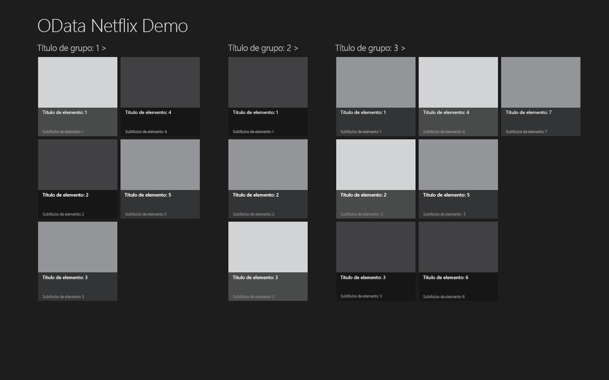
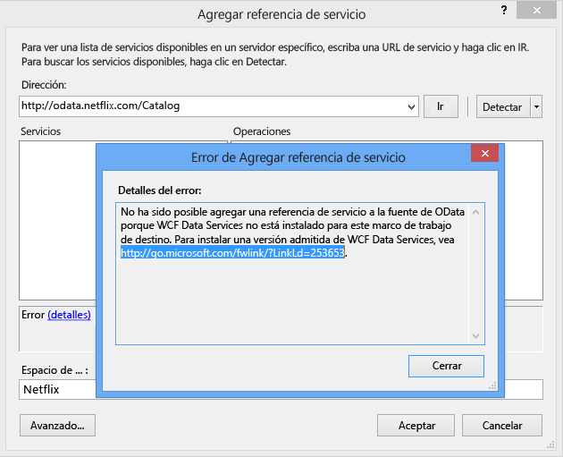

# <a name="writing-a-windows-store-app-that-consumes-an-odata-service"></a>Escribir una Aplicación de la Tienda Windows que usa un servicio de OData
Windows 8 presenta un nuevo tipo de aplicación: la aplicación de la tienda de Windows. Las aplicaciones de la Tienda de Windows tienen una apariencia y funcionamiento actualizados, que se ejecutan en una serie de dispositivos y están disponibles en la Tienda de Windows. Este tema describe cómo escribir una aplicación de la Tienda de Windows que use un servicio de OData, específicamente el servicio OData del catálogo de NetFlix. Para obtener más información acerca de aplicaciones de la tienda de Windows, lea [Introducción a aplicaciones de la tienda de Windows](http://msdn.microsoft.com/library/windows/apps/br211386.aspx).  
  
## <a name="prerequisites"></a>Requisitos previos  
  
1.  [Microsoft Windows 8](http://go.microsoft.com/fwlink/p/?LinkId=266654)  
  
2.  [Microsoft Visual Studio 2012](http://go.microsoft.com/fwlink/p/?LinkId=266655)  
  
3.  [Servicios de datos WCF](http://msdn.microsoft.com/data/bb931106)  
  
#### <a name="creating-the-default-windows-store-grid-application"></a>Crear la Aplicación de cuadrícula de la Tienda de Windows predeterminada  
  
1.  Cree una nueva aplicación de cuadrícula de la Tienda de Windows usando C# y XAML. Asigne un nombre a la aplicación OData.WindowsStore.NetflixDemo:  
  
       
  
2.  Abra Package.appxmanifest y escriba un nombre descriptivo en el cuadro de texto Nombre para mostrar. Esto especifica el nombre de aplicación usado con la funcionalidad de búsqueda de Windows 8.  
  
       
  
3.  Escriba un nombre descriptivo en el \<AppName > elemento en el archivo App.xaml. Esto establece el nombre de la aplicación que se muestra cuando se inicia la aplicación:  
  
       
  
4.  Compilar e iniciar la aplicación. La primera vez que se ve la pantalla de presentación de la aplicación. La captura de pantalla siguiente muestra la pantalla de presentación predeterminada. La imagen usada se almacena en la carpeta Activos del proyecto.  
  
       
  
     Entonces, podrá ver la aplicación.  
  
       
  
     La aplicación predeterminada define un conjunto de clases en SampleDataSource.cs: SampleDataGroup y SampleDataItem, que derivan de SampleDataCommon, que a su vez deriva de BindableBase. SampleDataGroup y SampleDataItem se enlazan a la GridView predeterminada. SampleDataSource.cs se encuentra en la carpeta DataModel en el proyecto de NetflixDemo. La aplicación muestra una colección agrupada. Cada grupo contiene cualquier número de elementos, representado por SampleDataGroup y SampleDataItem, respectivamente. En la captura de pantalla anterior puede ver un grupo denominado Título de grupo 1 y todos los elementos del grupo mostrados juntos.  
  
     La página principal de la aplicación es GroupedItemsPage.xaml. Contiene una GridView que muestra los datos de ejemplo creados por la clase SampleDataSource.cs. App.xaml.cs carga GroupedItemsPage en una llamada a rootFrame.Navigate:  
  
    ```csharp  
    if (!rootFrame.Navigate(typeof(GroupedItemsPage), "AllGroups"))  
    {  
        throw new Exception("Failed to create initial page");  
    }  
    ```  
  
     Esto hace que GroupedItemsPage se convierta en instancia y se llame al LoadState. LoadState hace que la instancia estática SampleDataSource se cree, lo que crea a su vez una colección de objetos SampleDataGroup. Cada objeto SampleDataGroup contiene una colección de objetos SampleDataItem. LoadState almacena la colección de objetos SampleDataGroup en DefaultViewModel:  
  
    ```csharp  
    protected override void LoadState(Object navigationParameter, Dictionary<String, Object> pageState)  
    {  
        var sampleDataGroups = SampleDataSource.GetGroups((String)navigationParameter);  
        this.DefaultViewModel["Groups"] = sampleDataGroups;  
    }  
    ```  
  
     DefaultViewModel se enlaza, a continuación, a la GridView. Esto se referencia en el archivo GroupedItemsPage.xaml al configurar el enlace de datos.  
  
    ```xaml
    <CollectionViewSource  
                x:Name="groupedItemsViewSource"  
                Source="{Binding Groups}"  
                IsSourceGrouped="true"  
                ItemsPath="TopItems"  
                d:Source="{Binding AllGroups, Source={d:DesignInstance Type=data:SampleDataSource, IsDesignTimeCreatable=True}}"/>  
    ```  
  
     CollectionViewSource se usa como proxy para administrar colecciones agrupadas. Cuando se produce el enlace, recorre la colección de objetos de SampleDataGroup para rellenar GridView.  El atributo ItemsPath indica a CollectionViewSource qué propiedad de cada objeto SampleDataGroup debe usar para encontrar el SampleDataItems que contiene. En este caso cada objeto SampleDataGroup contiene una colección de objetos TopItems.  
  
     Para la aplicación de Netflix, las películas se agrupan por el género. La aplicación muestra varios géneros y una lista de películas de ese género.  
  
#### <a name="add-a-service-reference-to-the-netflix-odata-service"></a>Agregar una referencia de servicio al servicio Netflix OData  
  
1.  Antes de poder realizar cualquier llamada al servicio de Netflix OData necesitamos agregar una referencia de servicio. En el Explorador de soluciones, haga clic con el botón secundario en el proyecto y seleccione Agregar referencia de servicio...  
  
       
  
2.  Escriba la dirección URL para el servicio de Netflix OData en la barra de direcciones y haga clic en Ir. Establezca el espacio de nombres de referencia de servicio en Netflix y haga clic en Aceptar.  
  
       
  
    > [!NOTE]
    >  Si aún no ha instalado [WCF datos servicios herramientas para aplicaciones tienda Windows](http://go.microsoft.com/fwlink/p/?LinkId=266652), se le pedirá con un mensaje como el anterior. Deberá descargar e instalar las herramientas a las que se hace referencia en el vínculo para continuar.  
  
 Agregar una referencia de servicio genera clases muy tipadas que WCF Data Services usará para analizar el OData devuelto por el servicio de Netflix OData. Las clases definidas en SampleDataSource.cs se pueden enlazar a GridView, de manera que necesitamos transferir los datos de las clases de cliente generadas de OData a las clases enlazables definidas en SampleDataSource.cs.  Para ello, necesitamos realizar algunos cambios en el modelo de datos definido en SampleDataSource.cs.  
  
#### <a name="update-the-data-model-for-the-application"></a>Actualizar el modelo de datos para la aplicación  
  
1.  Reemplace el código existente en SampleDataSource.cs con el código de [este](https://gist.github.com/3419288). El código actualizado agrega un método de LoadMovies (a la clase de SampleDataSource) que realiza una consulta en el servicio de Netflix OData y rellena una lista de géneros (allGroups) y en cada género una lista de películas. La clase SampleDataGroup se usa para representar un género y la clase SampleDataItem se usa para representar una película.  
  
    ```csharp  
    public static async void LoadMovies()  
    {  
        IEnumerable<Title> titles = await ((DataServiceQuery<Title>)Context.Titles  
            .Expand("Genres,AudioFormats,AudioFormats/Language,Awards,Cast")  
            .Where(t => t.Rating == "PG")  
            .OrderByDescending(t => t.ReleaseYear)  
            .Take(300)).ExecuteAsync();  
  
        foreach (Title title in titles)  
        {  
            foreach (Genre netflixGenre in title.Genres)  
            {  
                SampleDataGroup genre = GetGroup(netflixGenre.Name);  
                if (genre == null)  
                {  
                    genre = new SampleDataGroup(netflixGenre.Name, netflixGenre.Name, String.Empty, title.BoxArt.LargeUrl, String.Empty);  
                    Instance.AllGroups.Add(genre);  
                }  
                var content = new StringBuilder();  
                // Write additional things to content here if you want them to display in the item detail.  
                genre.Items.Add(new SampleDataItem(title.Id, title.Name, String.Format("{0}rnrn{1} ({2})", title.Synopsis, title.Rating, title.ReleaseYear), title.BoxArt.HighDefinitionUrl ?? title.BoxArt.LargeUrl, "Description", content.ToString()));  
            }  
        }  
    }  
    ```  
  
     El [modelo asincrónico basado en tareas](http://go.microsoft.com/fwlink/p/?LinkId=266651) (TAP) se usa de forma asincrónica para obtener 300 (tomas) reciente (OrderByDescending) clasificación PG (Where) películas valoradas de Netflix. El resto de código crea SimpleDataItems y SimpleDataGroups de entidades que fueron devueltas en la fuente OData.  
  
     La clase SampleDataSource también implementa un método de búsqueda simple. En este caso, realiza una búsqueda simple en memoria de las películas cargadas.  
  
    ```csharp  
    public static IEnumerable<SampleDataItem> Search(string searchString)  
    {  
            var regex = new Regex(searchString, RegexOptions.CultureInvariant | RegexOptions.IgnoreCase | RegexOptions.IgnorePatternWhitespace);  
            return Instance.AllGroups  
                .SelectMany(g => g.Items)  
                .Where(m => regex.IsMatch(m.Title) || regex.IsMatch(m.Subtitle))  
                    .Distinct(new SampleDataItemComparer());  
    }  
    ```  
  
     También SampleDataSource.cs se define una clase denominada ExtensionMethods. Cada uno de estos métodos de extensión usa el patrón TAP para que SampleDataSource pueda ejecutar una consulta de OData sin bloquear la interfaz de usuario. Por ejemplo, el código siguiente usa el método Task.Factory.FromAsync para implementar TAP.  
  
    ```csharp  
    public static async Task<IEnumerable<T>> ExecuteAsync<T>(this DataServiceQuery<T> query)  
    {  
        return await Task.Factory.FromAsync<IEnumerable<T>>(query.BeginExecute(null, null), query.EndExecute);  
    }  
    ```  
  
     Como en la aplicación predeterminada, la página principal de la aplicación es GroupedItemsPage. Esta vez, sin embargo, muestra películas recuperadas de Netflix agrupadas por el género.  Cuando GroupedItemsPage se convierte en instancia, se llama al método LoadState. LoadState hace que la instancia estática SampleDataSource se cree, realizando una llamada al servicio de Netflix OData como se describía anteriormente. LoadState almacena la colección de géneros (objetos SampleDataGroup) en DefaultViewModel:  
  
    ```csharp  
    protected override void LoadState(Object navigationParameter, Dictionary<String, Object> pageState)  
    {  
  
        var sampleDataGroups = SampleDataSource.GetGroups((String)navigationParameter);  
        this.DefaultViewModel["Groups"] = sampleDataGroups;  
    }  
    ```  
  
     Como se ha descrito anteriormente, DefaultViewModel se usa para enlazar datos en GridView.  
  
#### <a name="add-a-search-contract-to-allow-the-application-to-participate-in-windows-search"></a>Agregar un contrato de búsqueda para permitir que la aplicación participe en búsqueda de Windows  
  
1.  Agregar un contrato de búsqueda a la aplicación. Esto permite a la aplicación integrarse con la experiencia de búsqueda de Windows 8. Dé un nombre al contrato de búsqueda SearchResultsPage.xaml  
  
       
  
2.  Modifique la línea 58 de SearchResultsPage.xaml.cs eliminando las comillas incrustadas alrededor de queryText.  
  
    ```csharp  
    // Communicate results through the view model  
    this.DefaultViewModel["QueryText"] = queryText;  
    this.DefaultViewModel["Filters"] = filterList;  
    this.DefaultViewModel["ShowFilters"] = filterList.Count > 1;  
    ```  
  
3.  Inserte las dos líneas de código siguientes en la línea 81 en SearchResultsPage.xaml.cs para recuperar los resultados de la búsqueda.  
  
    ```csharp  
    // TODO: Respond to the change in active filter by setting this.DefaultViewModel["Results"]  
                    //       to a collection of items with bindable Image, Title, Subtitle, and Description properties  
                    var searchValue = (string)this.DefaultViewModel["QueryText"];  
                    this.DefaultViewModel["Results"] = new List<SampleDataItem>(SampleDataSource.Search(searchValue));  
    ```  
  
 Cuando un usuario invoca una búsqueda de Windows, escribe un término de búsqueda y después toca el icono de la aplicación de demostración de Netflix en la barra de búsqueda, el método LoadState de SearchResultsPage se ejecuta. El parámetro de navegación enviado a LoadState contiene el texto de la consulta. A continuación se llama al método Filter_SelectionChanged que después llama al método Search en la clase SampleDataSource. Los resultados se devuelven como se muestran en la página SearchResultsPage.xaml.  
  
```csharp  
/// <summary>  
        /// Invoked when a filter is selected using the ComboBox in snapped view state.  
        /// </summary>  
        /// <param name="sender">The ComboBox instance.</param>  
        /// <param name="e">Event data describing how the selected filter was changed.</param>  
        void Filter_SelectionChanged(object sender, SelectionChangedEventArgs e)  
        {  
            // Determine what filter was selected  
            var selectedFilter = e.AddedItems.FirstOrDefault() as Filter;  
            if (selectedFilter != null)  
            {  
                // Mirror the results into the corresponding Filter object to allow the  
                // RadioButton representation used when not snapped to reflect the change  
                selectedFilter.Active = true;  
  
                // TODO: Respond to the change in active filter by setting this.DefaultViewModel["Results"]  
                //       to a collection of items with bindable Image, Title, Subtitle, and Description properties  
                var searchValue = (string)this.DefaultViewModel["QueryText"];  
                this.DefaultViewModel["Results"] = new List<SampleDataItem>(SampleDataSource.Search(searchValue));  
  
                // Ensure results are found  
                object results;  
                ICollection resultsCollection;  
                if (this.DefaultViewModel.TryGetValue("Results", out results) &&  
                    (resultsCollection = results as ICollection) != null &&  
                    resultsCollection.Count != 0)  
                {  
                    VisualStateManager.GoToState(this, "ResultsFound", true);  
                    return;  
                }  
            }  
  
            // Display informational text when there are no search results.  
            VisualStateManager.GoToState(this, "NoResultsFound", true);  
        }  
```  
  
 Para obtener más información sobre la integración de búsqueda en una aplicación, vea [búsqueda: integrar la experiencia de búsqueda de Windows 8](http://go.microsoft.com/fwlink/p/?LinkId=266650).  
  
## <a name="run-the-application"></a>Ejecutar la aplicación  
 Inicie la aplicación presionando F5. Observe que tardará segundos en cargar las imágenes en la versión de la aplicación. Además, es posible que el primer intento de búsqueda no devuelva ningún resultado. En una aplicación del mundo real, querría tratar estos dos problemas.  
  
 La aplicación llama al servicio de Netflix OData, recibe los datos en las clases de cliente OData generadas y después transfiere esos datos a clases de datos enlazables (SampleDataSource, SampleDataGroup y SampleDataItem). Usa estas clases enlazables para enlazar datos en GridView. Si no está familiarizado con cómo funciona databinding de XAML, vea [cómo agrupar elementos en una lista o una cuadrícula (aplicaciones de la tienda Windows con C# / VB/C++ y XAML)](http://msdn.microsoft.com/library/windows/apps/xaml/hh780627).
