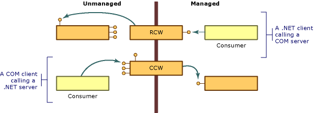

# Contenedores COM
COM se diferencia del modelo de objetos de .NET Framework en varios aspectos importantes:  
  
-   Los clientes de objetos COM deben administrar la duración de los objetos; Common Language Runtime administra la duración de los objetos en su entorno.  
  
-   Los clientes de objetos COM detectan si un servicio está disponible solicitando una interfaz que proporciona ese servicio y obteniendo o no un puntero de interfaz. Los clientes de objetos .NET pueden obtener una descripción de la funcionalidad de un objeto mediante la reflexión.  
  
-   Los objetos .NET residen en memoria administrada por el entorno de ejecución de .NET Framework. El entorno de ejecución puede mover los objetos en la memoria por motivos de rendimiento y actualizar todas las referencias a los objetos que mueve. Los clientes no administrados, una vez obtenido un puntero a un objeto, se basan en el objeto para permanecer en la misma ubicación. Estos clientes no disponen de ningún mecanismo para tratar con un objeto cuya ubicación no es fija.  
  
 Para superar estas diferencias, el tiempo de ejecución proporciona clases contenedoras para que los clientes administrados y no administrados crean que están llamando a objetos dentro de su propio entorno. Cada vez que un cliente administrado llama a un método en un objeto COM, el tiempo de ejecución crea un [contenedor RCW](../../../docs/framework/interop/runtime-callable-wrapper.md). Los contenedores RCW analizan las diferencias entre los mecanismos de referencia administrados y no administrados, entre otras cosas. El tiempo de ejecución crea también un [contenedor CCW](../../../docs/framework/interop/com-callable-wrapper.md) para invertir el proceso, lo que permite a un cliente COM llamar sin problemas a un método en un objeto. NET. Como se muestra en la ilustración siguiente, la perspectiva del código de llamada determina la clase contenedora que crea el tiempo de ejecución.  
  
   
Información general sobre los contenedores COM  
  
 En la mayoría de los casos, el contenedor estándar RCW o CCW generado por el tiempo de ejecución proporciona la serialización adecuada para las llamadas que traspasan los límites entre COM y .NET Framework. Mediante atributos personalizados, puede ajustar el modo en que el tiempo de ejecución representa el código administrado y no administrado.  
  
## Vea también  
 [Interoperabilidad COM avanzada](http://msdn.microsoft.com/en-us/3ada36e5-2390-4d70-b490-6ad8de92f2fb)  
 [Contenedor al que se puede llamar en tiempo de ejecución](../../../docs/framework/interop/runtime-callable-wrapper.md)  
 [Contenedor CCW (COM callable wrapper)](../../../docs/framework/interop/com-callable-wrapper.md)  
 [Personalizar contenedores estándar](http://msdn.microsoft.com/en-us/c40d089b-6a3c-41b5-a20d-d760c215e49d)  
 [Cómo: Personalizar contenedores RCW](http://msdn.microsoft.com/en-us/4a4bb3da-4d60-4517-99f2-78d46a681732)
