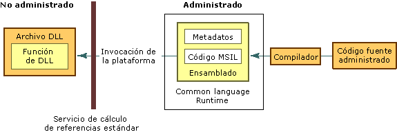

# Consumir funciones DLL no administradas
La invocación de plataforma es un servicio que permite al código administrado llamar a funciones no administradas implementadas en bibliotecas de vínculos dinámicos (DLL), como los de la API Win32. Busca y llama a una función exportada y calcula las referencias de sus argumentos (enteros, cadenas, matrices, estructuras etc.) a través de los límites de interoperación según sea necesario.  
  
 En esta sección se introducen las tareas asociadas con el consumo de funciones DLL no administradas y se proporciona más información sobre la invocación de plataforma. Además de las tareas siguientes, hay consideraciones generales y un vínculo que proporciona más información y ejemplos.  
  
#### Para consumir funciones DLL exportadas  
  
1.  [Identificar funciones en archivos DLL](../../../docs/framework/interop/identifying-functions-in-dlls.md).  
  
     Como mínimo, debe especificar el nombre de la función y el nombre del archivo DLL que la contiene.  
  
2.  [Crear una clase para contener funciones de archivos DLL](../../../docs/framework/interop/creating-a-class-to-hold-dll-functions.md).  
  
     Puede usar una clase existente, crear una clase individual para cada función no administrada o crear una clase que contiene un conjunto de funciones no administradas relacionadas.  
  
3.  [Crear prototipos en código administrado](../../../docs/framework/interop/creating-prototypes-in-managed-code.md).  
  
     [Visual Basic] Use la instrucción **Declare** con las palabras clave **Function** y **Lib**. En algunos casos excepcionales, puede usar **DllImportAttribute** con las palabras clave **Shared Function**. Estos casos se explican más adelante en esta sección.  
  
     [C#] Use **DllImportAttribute** para identificar el archivo DLL y la función. Marque el método con los modificadores **static** y **extern**.  
  
     [C++] Use **DllImportAttribute** para identificar el archivo DLL y la función. Marque la función o el método contenedor con **extern "C"**.  
  
4.  [Llamar a una función DLL](../../../docs/framework/interop/calling-a-dll-function.md).  
  
     Llame al método de la clase administrada como haría con cualquier otro método administrado. [Pasar estructuras](../../../docs/framework/interop/passing-structures.md) e [implementar funciones de devolución de llamada](../../../docs/framework/interop/callback-functions.md) son casos especiales.  
  
 Para obtener ejemplos que muestran cómo construir declaraciones basadas en .NET para usarse con la invocación de plataforma, vea [Serialización de datos con invocación de plataforma](../../../docs/framework/interop/marshaling-data-with-platform-invoke.md).  
  
## Aproximación a la invocación de plataforma  
 La invocación de plataforma usa metadatos para encontrar las funciones exportadas y calcular las referencias de sus argumentos en tiempo de ejecución. En la siguiente ilustración se muestra este proceso.  
  
   
Una invocación de plataforma llama a una función DLL no administrada  
  
 Cuando la invocación de plataforma llama a una función no administrada, realiza la siguiente secuencia de acciones:  
  
1.  Busca el archivo DLL que contiene la función.  
  
2.  Carga el archivo DLL en la memoria.  
  
3.  Busca la dirección de la función en la memoria, inserta sus argumentos en la pila y calcula las referencias de los datos si es necesario.  
  
    > [!NOTE]
    >  La búsqueda y carga del archivo DLL y la búsqueda de la dirección de la función en memoria solo se realiza en la primera llamada a la función.  
  
4.  Transfiere el control a la función no administrada.  
  
 La invocación de plataforma devuelve las excepciones generadas por la función no administrada al llamador administrado.

## Vea también
- [Interoperating with Unmanaged Code](../../../docs/framework/interop/index.md) (Interoperar con código no administrado)
- [Ejemplos de invocación de plataforma](../../../docs/framework/interop/platform-invoke-examples.md)
- [Serialización de interoperabilidad](../../../docs/framework/interop/interop-marshaling.md)
