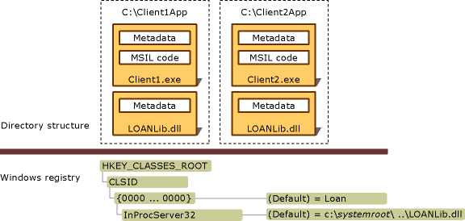

# Deploying an Interop Application
Normalmente, una aplicación de interoperabilidad contiene un ensamblado de cliente .NET, uno o varios ensamblados de interoperabilidad que representan distintas bibliotecas de tipos COM y uno o varios componentes COM registrados.  Visual Studio y [!INCLUDE[winsdklong](../../../includes/winsdklong-md.md)] proporcionan herramientas para importar y convertir una biblioteca de tipos en un ensamblado de interoperabilidad, tal y como se trata en [Importing a Type Library as an Assembly](../../../docs/framework/interop/importing-a-type-library-as-an-assembly.md).  Hay dos maneras de implementar una aplicación de interoperabilidad:  
  
-   Usando tipos de interoperabilidad incrustados: a partir de [!INCLUDE[net_v40_long](../../../includes/net-v40-long-md.md)], puede indicar al compilador que incruste información de tipo de un ensamblado de interoperabilidad en una aplicación ejecutable.  El compilador incrusta solo la información de tipo que su aplicación utiliza.  No es necesario implementar el ensamblado de interoperabilidad con la aplicación.  Esta es la técnica recomendada.  
  
-   Implementando ensamblados de interoperabilidad: puede crear una referencia estándar a un ensamblado de interoperabilidad.  En este caso, el ensamblado de interoperabilidad se debe implementar con la aplicación.  Si utiliza esta técnica y no usa ningún componente COM privado, haga siempre referencia al ensamblado de interoperabilidad primario \(PIA\) publicado por el autor del componente COM que prevé incorporar en el código administrado.  Para obtener más información sobre la creación y el uso de ensamblados de interoperabilidad primarios, vea [Ensamblados de interoperabilidad primarios](http://msdn.microsoft.com/es-es/b977a8be-59a0-40a0-a806-b11ffba5c080).  
  
 Si utiliza los tipos de interoperabilidad insertados, la implementación es sencilla y directa.  No es necesario hacer nada.  En lo que queda del artículo se describe los escenarios para implementar ensamblados de interoperabilidad con una aplicación.  
  
## Implementar ensamblados de interoperabilidad  
 Los ensamblados pueden tener nombres seguros.  Un ensamblado con nombre seguro contiene la clave pública del editor, que proporciona una identidad única.  El publicador puede firmar los ensamblados producidos por la herramienta [Importador de la biblioteca de tipos \(Tlbimp.exe\)](../../../docs/framework/tools/tlbimp-exe-type-library-importer.md) utilizando la opción **\/keyfile**.  Los ensamblados firmados pueden instalarse en la caché global de ensamblados.  Los ensamblados que no están firmados deben instalarse en el equipo del usuario como ensamblados privados.  
  
### Ensamblados privados  
 Para instalar un ensamblado que se va a utilizar de forma privada, tanto el archivo ejecutable de la aplicación como el ensamblado de interoperabilidad que contiene los tipos COM importados deben estar instalados en la misma estructura de directorios.  En la siguiente ilustración se muestra un ensamblado de interoperabilidad no firmado que Client1.exe y Client2.exe van a utilizar de forma privada, residiendo cada aplicación en un directorio diferente.  El ensamblado de interoperabilidad, denominado LOANLib.dll en este ejemplo, se instala dos veces.  
  
   
Estructura de directorios y entradas del Registro para una implementación privada  
  
 Todos los componentes COM asociados a la aplicación deben instalarse en el Registro de Windows.  Si los archivos Client1.exe y Client2.exe que se muestran en la ilustración se instalan en equipos distintos, los componentes COM deben registrarse en ambos equipos.  
  
### Ensamblados compartidos  
 Los ensamblados compartidos por varias aplicaciones deben instalarse en un repositorio centralizado, denominado caché global de ensamblados.  Los clientes .NET pueden tener acceso a la misma copia del ensamblado de interoperabilidad, que se firma y se instala en la caché global de ensamblados.  Para obtener más información sobre la creación y el uso de ensamblados de interoperabilidad primarios, vea [Ensamblados de interoperabilidad primarios](http://msdn.microsoft.com/es-es/b977a8be-59a0-40a0-a806-b11ffba5c080).  
  
## Vea también  
 [Exposing COM Components to the .NET Framework](../../../docs/framework/interop/exposing-com-components.md)   
 [Importing a Type Library as an Assembly](../../../docs/framework/interop/importing-a-type-library-as-an-assembly.md)   
 [Using COM Types in Managed Code](http://msdn.microsoft.com/es-es/1a95a8ca-c8b8-4464-90b0-5ee1a1135b66)   
 [Compiling an Interop Project](../../../docs/framework/interop/compiling-an-interop-project.md)