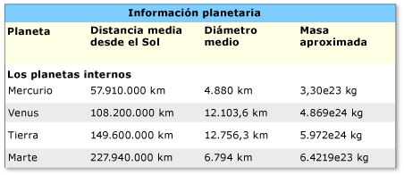
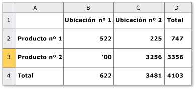

# Implementar el patrón de control Table de UI Automation
> [!NOTE]
>  Esta documentación está dirigida a los desarrolladores de .NET Framework que quieran usar las clases [!INCLUDE[TLA2#tla_uiautomation](../../../includes/tla2sharptla-uiautomation-md.md)] administradas definidas en el espacio de nombres <xref:System.Windows.Automation>. Para obtener información más reciente sobre [!INCLUDE[TLA2#tla_uiautomation](../../../includes/tla2sharptla-uiautomation-md.md)], consulte [Windows Automation API: automatización de interfaz de usuario](https://go.microsoft.com/fwlink/?LinkID=156746).  
  
 En este tema se presentan las directrices y convenciones para implementar <xref:System.Windows.Automation.Provider.ITableProvider>, incluida la información sobre propiedades, métodos y eventos. Al final de la información general se proporcionan vínculos a referencias adicionales.  
  
 El <xref:System.Windows.Automation.TablePattern> patrón de control se usa para admitir controles que actúan como contenedores para una colección de elementos secundarios. Los elementos secundarios de este elemento deben implementar <xref:System.Windows.Automation.Provider.ITableItemProvider> y organizarse en un sistema de coordenadas lógico bidimensional que se puede atravesar por filas y columnas. Este patrón de control es análogo a <xref:System.Windows.Automation.Provider.IGridProvider>, con la diferencia de que cualquier control que implemente <xref:System.Windows.Automation.Provider.ITableProvider> también debe exponer una relación de encabezado de columna o fila para cada elemento secundario. Para obtener ejemplos de controles que implementan este patrón de control, vea [Control Pattern Mapping for UI Automation Clients](../../../docs/framework/ui-automation/control-pattern-mapping-for-ui-automation-clients.md).  
  
   
## Directrices y convenciones de implementación  
 Al implementar el patrón de control Table, tenga en cuenta las siguientes directrices y convenciones:  
  
-   Acceso al contenido de celdas individuales es a través de un sistema de coordenadas lógico bidimensional o la matriz proporcionada por la implementación simultánea necesaria de <xref:System.Windows.Automation.Provider.IGridProvider>.  
  
-   Un encabezado de columna o fila puede estar dentro de un objeto de tabla o ser un objeto de encabezado independiente asociado a un objeto de tabla.  
  
-   Los encabezados de fila y columna pueden incluir tanto un encabezado principal como cualquier encabezado auxiliar.  
  
> [!NOTE]
>  Este concepto se vuelve evidente en una [!INCLUDE[TLA#tla_xl](../../../includes/tlasharptla-xl-md.md)] donde un usuario ha definido una columna "First name" de la hoja de cálculo. Esta columna tiene ahora dos encabezados: el encabezado "Nombre" definido por el usuario y la designación alfanumérica para esa columna asignada por la aplicación.  
  
-   Consulte [implementar el patrón de Control Grid de UI Automation](../../../docs/framework/ui-automation/implementing-the-ui-automation-grid-control-pattern.md) para la funcionalidad de cuadrícula relacionada.  
  
   
Ejemplo de una tabla con encabezados de columna compleja  
  
   
Ejemplo de una tabla con propiedad RowOrColumnMajor ambigua  
  
   
## Miembros requeridos para ITableProvider  
 Se requieren los siguientes métodos y propiedades para la interfaz de ITableProvider.  
  
|Miembros requeridos|Tipo de miembro|Notas|  
|----------------------|-----------------|-----------|  
|<xref:System.Windows.Automation.Provider.ITableProvider.RowOrColumnMajor%2A>|Property|Ninguna|  
|<xref:System.Windows.Automation.Provider.ITableProvider.GetColumnHeaders%2A>|Método|Ninguna|  
|<xref:System.Windows.Automation.Provider.ITableProvider.GetRowHeaders%2A>|Método|Ninguna|  
  
 Este patrón de control no tiene eventos asociados.  
  
   
## Excepciones  
 Este patrón de control no tiene excepciones asociadas.  
  
## Vea también  
 [Información general sobre los patrones de control de la Automatización de la interfaz de usuario](../../../docs/framework/ui-automation/ui-automation-control-patterns-overview.md)  
 [Patrones de control compatibles en un proveedor de Automatización de la interfaz de usuario](../../../docs/framework/ui-automation/support-control-patterns-in-a-ui-automation-provider.md)  
 [Patrones de control de Automatización de la interfaz de usuario para clientes](../../../docs/framework/ui-automation/ui-automation-control-patterns-for-clients.md)  
 [Implementación del patrón de control TableItem de Automatización de la interfaz de usuario](../../../docs/framework/ui-automation/implementing-the-ui-automation-tableitem-control-pattern.md)  
 [Implementación del patrón de control Grid de Automatización de la interfaz de usuario](../../../docs/framework/ui-automation/implementing-the-ui-automation-grid-control-pattern.md)  
 [Información general sobre el árbol de la Automatización de la interfaz de usuario](../../../docs/framework/ui-automation/ui-automation-tree-overview.md)  
 [Uso del almacenamiento en caché en la Automatización de la interfaz de usuario](../../../docs/framework/ui-automation/use-caching-in-ui-automation.md)
