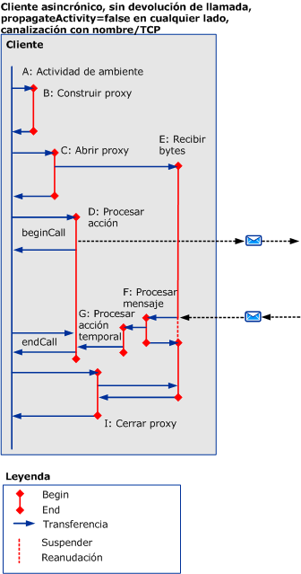
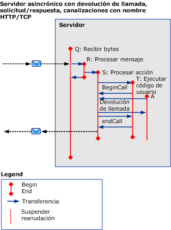

# Escenarios asincr&#243;nicos en los que se usa HTTP, TCP o canalizaciones con nombre
En este tema se describen las actividades y transferencias para diferentes escenarios asincrónicos de solicitud\-respuesta, con solicitudes de varios subprocesos, utilizando HTTP, TCP o canalización con nombre.  
  
## Solicitud\-respuesta asincrónica sin errores  
 En esta sección se describen las actividades y transferencias para un escenario asincrónico de solicitud\-respuesta válido, con clientes de varios subprocesos.  
  
 La actividad de llamador finaliza cuando `beginCall` vuelve, y `endCall` vuelve.Si se llama a una devolución de llamada, la devolución de llamada vuelve.  
  
 La actividad llamada finaliza cuando `beginCall` vuelve, `endCall` vuelve o cuando la devolución de llamada vuelve si fue llamada desde esa actividad.  
  
### Cliente asincrónico sin devolución de llamada  
  
#### La propagación está habilitada en ambos lados, utilizando HTTP  
   
  
 Figura 1.Cliente asincrónico, sin devolución de llamada, `propagateActivity`\=`true` en ambos lados, HTTP  
  
 Si `propagateActivity`\=`true`, ProcessMessage indica a qué actividad ProcessAction debe transferirse.  
  
 Para los escenarios basados en HTTP, ReceiveBytes se invoca en el primer mensaje para enviar y existe para la duración de la solicitud.  
  
#### La propagación está deshabilitada en cualquier lado, utilizando HTTP  
 Si `propagateActivity`\=`false` en cualquier lado, ProcessMessage no indica a qué actividad ProcessAction debe transferirse.Por consiguiente, se invoca una nueva actividad ProcessAction temporal con un nuevo id.Cuando la respuesta asincrónica coincide con la solicitud en el código ServiceModel, el id. de actividad se puede recuperar del contexto local.La actividad ProcessAction actual se puede transferir a con ese id.  
  
   
  
 Figura 2.Cliente asincrónico, sin devolución de llamada, `propagateActivity`\=`false` en cualquier lado, HTTP  
  
 Para los escenarios basados en HTTP, ReceiveBytes se invoca en el primer mensaje para enviar y existe para la duración de la solicitud.  
  
 Se crea una actividad ActionProcess en un cliente asincrónico cuando `propagateActivity`\=`false` en el llamador o destinatario y cuando el mensaje de respuesta no incluye un encabezado de acción.  
  
#### La propagación está habilitada en ambos lados, utilizando TCP o canalización con nombre  
   
  
 Figura 3.Cliente asincrónico, sin devolución de llamada, `propagateActivity`\=`true` en ambos lados, canalización con nombre\/TCP  
  
 Para una canalización con nombre o escenario basado en TCP, ReceiveBytes se invoca cuando se abre el cliente, y existe para la duración de la conexión.  
  
 Similar a la Figura 1, si `propagateActivity`\=`true`, ProcessMessage indica a qué actividad ProcessAction debe transferirse.  
  
#### La propagación está deshabilitada en cualquier lado, utilizando TCP o canalización con nombre  
 Para una canalización con nombre o escenario basado en TCP, ReceiveBytes se invoca cuando se abre el cliente, y existe para la duración de la conexión.  
  
 Similar a Fig.2, si `propagateActivity`\=`false` en cualquier lado, ProcessMessage no indica a qué actividad ProcessAction debe transferirse.Por consiguiente, se invoca una nueva actividad ProcessAction temporal con un nuevo id.Cuando la respuesta asincrónica coincide con la solicitud en el código ServiceModel, el id. de actividad se puede recuperar del contexto local.La actividad ProcessAction actual se puede transferir a con ese id.  
  
   
  
 Figura 4.Cliente asincrónico, sin devolución de llamada, `propagateActivity`\=`false` en cualquier lado, canalización con nombre\/TCP  
  
### Cliente asincrónico con devolución de llamada  
 Este escenario agrega las actividades G y A', para la devolución de llamada y `endCall`y sus transferencias dentro\/fuera.  
  
 Esta sección solo muestra cómo utilizar HTTP con `propragateActivity`\=`true`.Sin embargo, las actividades adicionales y transferencias también se aplican a los otros casos \(es decir, `propagateActivity`\=`false`, utilizando TCP o canalización con nombre\).  
  
 La devolución de llamada crea una nueva actividad \(G\) cuando el cliente llama al código de usuario para notificar que los resultados están listos.A continuación, el código de usuario llama a `endCall` dentro de la devolución de llamada \(como se muestra en la figura 5\) o fuera de la devolución de llamada \(figura 6\).Puesto que no se sabe desde qué actividad de usuario se está llamando a `endCall`, esta actividad se identifica como `A’`.Es posible que A' puede ser idéntico o diferente de A.  
  
   
  
 Figura 5.Cliente asincrónico con devolución de llamada, `endCall` en la devolución de llamada  
  
   
  
 Figura 6.Cliente asincrónico con devolución de llamada, `endCall` fuera de la devolución de llamada  
  
### Servidor asincrónico con devolución de llamada  
   
  
 Figura 7.Servidor asincrónico con devolución de llamada  
  
 La pila del canal llama al cliente al recibir el mensaje: las trazas para este procesamiento se emiten en la propia actividad ProcessRequest.  
  
## Solicitud\-respuesta asincrónica con errores  
 Los errores del mensaje de error se reciben durante `endCall`.De lo contrario, las actividades y transferencias son similares a los escenarios anteriores.  
  
## Unidireccional asincrónico con o sin errores  
 No se devuelve ninguna respuesta o error al cliente.