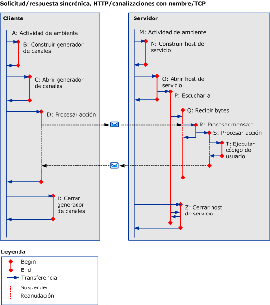

# Escenarios sincrónicos en los que se utiliza HTTP, TCP o canalizaciones con nombre
En este tema se describen las actividades y transferencias para diferentes escenarios sincrónicos de solicitud/respuesta, con un cliente de un único subproceso, utilizando HTTP, TCP o canalización con nombre. Vea [escenarios asincrónicos utiliza HTTP, TCP o canalizaciones con nombre](../../../../../docs/framework/wcf/diagnostics/tracing/asynchronous-scenarios-using-http-tcp-or-named-pipe.md) para obtener más información sobre las solicitudes de varios subprocesos.  
  
## Solicitud/respuesta sincrónica sin errores  
 En esta sección se describen las actividades y transferencias para un escenario válido sincrónico de solicitud/respuesta, con cliente de un único subproceso.  
  
### Cliente  
  
#### Establecer la comunicación con el extremo de servicio  
 Un cliente se construye y se abre. Para cada uno de estos pasos, la actividad ambiente (A) se transfiere a un "Cliente de construcción" (B) y "Abrir cliente" (C) actividad respectivamente. Por cada actividad a la que se transfiere, la actividad ambiente se suspende hasta que se devuelve una transferencia, es decir, hasta que se ejecuta el código de ServiceModel.  
  
#### Realizar una solicitud al punto de conexión de servicio  
 La actividad ambiente se transfiere a una actividad "ProcessAction" (D). Dentro de esta actividad, se envía un mensaje de solicitud y se recibe un mensaje de respuesta. La actividad finaliza cuando el control vuelve al código de usuario. Dado que se trata de una solicitud sincrónica, la actividad ambiente se suspende hasta que el control vuelve.  
  
#### Cerrar la comunicación con el extremo de servicio  
 La actividad de cierre (I) del cliente se crea a partir de la actividad ambiente. Esto es idéntico a nuevo y abrir.  
  
### Servidor  
  
#### Configurar un host de servicio  
 Las actividades nuevas y de abrir (N y O) del ServiceHost se crean a partir de la actividad ambiente (M).  
  
 Una actividad de escucha (P) se crea abriendo un ServiceHost para cada escucha. La actividad de la escucha espera a recibir y procesar los datos.  
  
#### Recibir los datos en la conexión  
 Cuando los datos llegan en la conexión, se crea una actividad "ReceiveBytes" Si aún no existe (Q) para procesar los datos recibidos. Esta actividad se puede reutilizar para varios mensajes dentro de una conexión o cola.  
  
 La actividad ReceiveBytes inicia una actividad ProcessMessage (R) si tiene bastantes datos para formar un mensaje de acción SOAP.  
  
 En actividad R, se procesan los encabezados del mensaje y se comprueba el encabezado de activityID. Si este encabezado está presente, el id. de actividad se establece en la actividad ProcessAction; de lo contrario, se crea un nuevo id.  
  
 Se crea la actividad ProcessAction (S) y se transfiere cuando se procesa la llamada. Esta actividad finaliza cuando todo el procesamiento relacionado con el mensaje entrante se completa, incluidos la ejecución del código de usuario (T) y el envío del mensaje de respuesta si es aplicable.  
  
#### Cerrar un host de servicio  
 La actividad de cierre del ServiceHost (Z) se crea a partir de la actividad ambiente.  
  
   
  
 En \<A: name >, `A` es un símbolo de método abreviado que describe la actividad en el texto anterior y en la tabla 3. `Name` es un nombre abreviado de la actividad.  
  
 Si `propagateActivity` = `true`, acción de proceso en el cliente y el servicio tiene el mismo identificador de actividad.  
  
## Solicitud/respuesta sincrónica con Errores  
 La única diferencia con el escenario anterior es que un mensaje de error SOAP se devuelve como un mensaje de respuesta. Si `propagateActivity` = `true`, el identificador de actividad del mensaje de solicitud se agrega al mensaje de error SOAP.  
  
## Unidireccional sincrónico sin errores  
 La única diferencia con el primer escenario es que ningún mensaje se devuelve al servidor. Para los protocolos basados en HTTP, un estado (valid o error) se devuelve todavía al cliente. Esto es porque HTTP es el único protocolo con un semántica de solicitud-respuesta que forma parte de la pila del protocolo [!INCLUDE[indigo2](../../../../../includes/indigo2-md.md)]. Dado que el procesamiento del TCP se oculta de [!INCLUDE[indigo2](../../../../../includes/indigo2-md.md)], ninguna confirmación se envía al cliente.  
  
## Unidireccional sincrónico con errores  
 Si un error se produce procesando el mensaje (Q o más allá), ninguna notificación se devuelve al cliente. Esto es idéntico al escenario "Unidireccional sincrónico sin errores". No debería utilizar un escenario unidireccional si desea recibir un mensaje de error.  
  
## Dúplex  
 La diferencia con los escenarios anteriores es que el cliente actúa como un servicio, en el que crea las actividades ReceiveBytes y ProcessMessage, similares a los escenarios asincrónicos.
