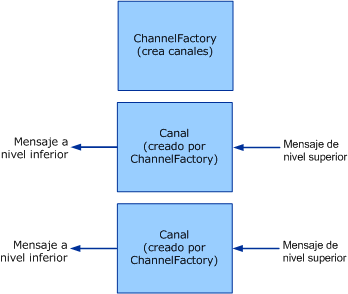

# <a name="client-channel-factories-and-channels"></a>Cliente: generadores de canales y canales
Este tema describe la creación de generadores de canales y de canales.  
  
## <a name="channel-factories-and-channels"></a>Generadores de canales y canales  
 Los generadores de canales son responsables de la creación de canales. Los canales creados por los generadores de canales se utilizan para enviar mensajes. Estos canales son responsables de obtener el mensaje de la capa anterior, realizando cualquier procesamiento necesario, y, a continuación, de enviar el mensaje a la capa inferior. El siguiente gráfico ilustra este proceso.  
  
   
Un generador de canales crea canales.  
  
 Cuando se cierran, los generadores de canales son responsables de cerrar cualquier canal creado por ellos que aún no se haya cerrado. Tenga en cuenta que, en el ejemplo, el modelo es asimétrico debido a que cuando se cierra un agente de escucha del canal solo detiene la aceptación de nuevos canales, pero mantiene abiertos los canales existentes de modo que pueden continuar recibiendo mensajes.  
  
 WCF proporciona aplicaciones auxiliares de clase base para este proceso. (Para un diagrama de las clases auxiliares de canal tratadas en este tema, consulte [información general del modelo de canal](../../../../docs/framework/wcf/extending/channel-model-overview.md).)  
  
-   El <xref:System.ServiceModel.Channels.CommunicationObject> la clase implementa <xref:System.ServiceModel.ICommunicationObject> y aplica la máquina de Estados que se describe en el paso 2 de [desarrollar canales](../../../../docs/framework/wcf/extending/developing-channels.md).  
  
-   El <xref:System.ServiceModel.Channels.ChannelManagerBase> la clase implementa <xref:System.ServiceModel.Channels.CommunicationObject> y proporciona una clase base unificada para <xref:System.ServiceModel.Channels.ChannelFactoryBase?displayProperty=nameWithType> y <xref:System.ServiceModel.Channels.ChannelListenerBase?displayProperty=nameWithType>. La clase <xref:System.ServiceModel.Channels.ChannelManagerBase> trabaja junto con <xref:System.ServiceModel.Channels.ChannelBase>, que es una clase base que implementa <xref:System.ServiceModel.Channels.IChannel>.
  
-   El <xref:System.ServiceModel.Channels.ChannelFactoryBase> la clase implementa <xref:System.ServiceModel.Channels.ChannelManagerBase> y <xref:System.ServiceModel.Channels.IChannelFactory> y consolida el `CreateChannel` sobrecargas en una `OnCreateChannel` método abstracto.
  
-   El <xref:System.ServiceModel.Channels.ChannelListenerBase> la clase implementa <xref:System.ServiceModel.Channels.IChannelListener>. Se encarga de la administración de estados básica. 
  
 En la siguiente explicación se basa en el [transporte: UDP](../../../../docs/framework/wcf/samples/transport-udp.md) ejemplo.  
  
### <a name="creating-a-channel-factory"></a>Creación de un generador de canales  
 La clase `UdpChannelFactory` se deriva de la clase <xref:System.ServiceModel.Channels.ChannelFactoryBase>. El ejemplo invalida <xref:System.ServiceModel.Channels.ChannelFactoryBase.GetProperty%2A> para proporcionar acceso a la versión del mensaje del codificador de mensajes. El ejemplo también invalida <xref:System.ServiceModel.Channels.ChannelFactoryBase.OnClose%2A> para anular nuestra instancia de <xref:System.ServiceModel.Channels.BufferManager> cuando se realizan las transiciones del equipo de estados.  
  
#### <a name="the-udp-output-channel"></a>Canal de salida UDP  
 La clase `UdpOutputChannel` implementa la interfaz <xref:System.ServiceModel.Channels.IOutputChannel>. El constructor valida los argumentos y construye un objeto de destino <xref:System.Net.EndPoint> basado en la <xref:System.ServiceModel.EndpointAddress> a la que se pasa.  
  
 La invalidación de <xref:System.ServiceModel.Channels.CommunicationObject.OnOpen%2A> crea un socket que se utiliza para enviar los mensajes a <xref:System.Net.EndPoint>.  
  
 ```csharp 
this.socket = new Socket(  
this.remoteEndPoint.AddressFamily,
   SocketType.Dgram,
   ProtocolType.Udp
);  
```  

 El canal puede cerrarse de forma correcta o incorrecta. Si el canal se cierra correctamente, el socket se cierra y se realiza una llamada al método `OnClose` de la clase base. Si se inicia una excepción, la infraestructura llama a `Abort` para garantizar que se limpia el canal.  
  
```csharp  
this.socket.Close();  
base.OnClose(timeout);  
```  
  
 Implemente `Send()` y `BeginSend()` / `EndSend()`. De este modo se divide en dos secciones principales. Primero se serializa el mensaje en una matriz de bytes:  
  
```csharp  
ArraySegment<byte> messageBuffer = EncodeMessage(message);  
```  
  
 A continuación, se envían los datos resultantes en la conexión:  
  
```csharp  
this.socket.SendTo(  
  messageBuffer.Array,   
  messageBuffer.Offset,   
  messageBuffer.Count,   
  SocketFlags.None,   
  this.remoteEndPoint  
);  
```  
  
## <a name="see-also"></a>Vea también  
 [Desarrollo de canales](../../../../docs/framework/wcf/extending/developing-channels.md)
