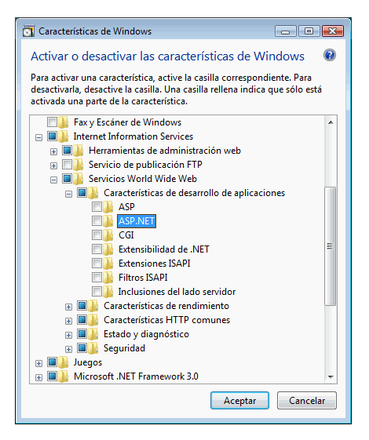

# Configuraci&#243;n de Internet Information Services 7.0 para Windows Communication Foundation
Internet Information Services \(IIS\) 7.0 tiene un diseño modular que le permite instalar de forma selectiva los componentes necesarios.Este diseño está basado en la nueva tecnología de componentización por manifiesto introducida en [!INCLUDE[wv](../../../../includes/wv-md.md)].Hay más de 40 componentes de características independientes de [!INCLUDE[iisver](../../../../includes/iisver-md.md)] que se pueden instalar independientemente.Esto permite a los profesionales de TI personalizar la instalación con facilidad según sea necesario.Este tema trata sobre cómo configurar [!INCLUDE[iisver](../../../../includes/iisver-md.md)] para el uso con [!INCLUDE[indigo1](../../../../includes/indigo1-md.md)] y determinar qué componentes son necesarios.  
  
## Instalación mínima: instalación de WAS  
 La instalación mínima del paquete [!INCLUDE[iisver](../../../../includes/iisver-md.md)] completo es instalar el Servicio de activación de proceso de Windows \(WAS\).WAS es una característica independiente y es la única de [!INCLUDE[iisver](../../../../includes/iisver-md.md)] que está disponible para todos los sistemas operativos [!INCLUDE[wv](../../../../includes/wv-md.md)] \(Home Basic, Home Premium, Business y Ultimate y Enterprise\).  
  
 En el Panel de control, haga clic en **Programas** y, a continuación, haga clic en **Activar o desactivar las características de Windows**, que aparece en **Programas y características**, el componente WAS se muestra en la lista como aparece en la siguiente ilustración.  
  
   
  
 Esta característica tiene los siguientes componentes secundarios:  
  
-   Entorno de .NET  
  
-   API de configuración  
  
-   Modelo de proceso  
  
 Si selecciona el nodo raíz de WAS, solo se comprueba el nodo secundario **Modelo de proceso** de forma predeterminada.Tenga en cuenta que con esta instalación solo está instalando WAS, porque no se ofrece ninguna compatibilidad para un servidor web.  
  
 Para que [!INCLUDE[indigo2](../../../../includes/indigo2-md.md)] o cualquier aplicación [!INCLUDE[vstecasp](../../../../includes/vstecasp-md.md)] funcione, marque la casilla **Entorno de .NET**.Esto significa que son necesarios todos los componentes de WAS para que [!INCLUDE[indigo2](../../../../includes/indigo2-md.md)] y [!INCLUDE[vstecasp](../../../../includes/vstecasp-md.md)] funcionen bien.Estos se comprueban automáticamente cuando instala cualquiera de esos componentes.  
  
## IIS 7.0: instalación predeterminada  
 Al marcar la característica **Internet Information Services**, también se marcan automáticamente algunos de los subnodos, como muestra la siguiente ilustración.  
  
   
  
 Ésta es la instalación predeterminada de [!INCLUDE[iisver](../../../../includes/iisver-md.md)].Con esta instalación, puede utilizar [!INCLUDE[iisver](../../../../includes/iisver-md.md)] para prestar servicio al contenido estático \(como páginas HTML y otro contenido\).Sin embargo, no puede ejecutar [!INCLUDE[vstecasp](../../../../includes/vstecasp-md.md)], ni aplicaciones CGI ni servicios [!INCLUDE[indigo2](../../../../includes/indigo2-md.md)] del host.  
  
## IIS 7.0: instalación con compatibilidad para ASP.NET  
 Debe instalar [!INCLUDE[vstecasp](../../../../includes/vstecasp-md.md)] para realizar el trabajo [!INCLUDE[vstecasp](../../../../includes/vstecasp-md.md)] en IIS 7.0.Después de marcar **ASP.NET**, su pantalla debe tener un aspecto similar al de la siguiente ilustración.  
  
   
  
 Se trata del entorno mínimo para que [!INCLUDE[indigo2](../../../../includes/indigo2-md.md)] y las aplicaciones [!INCLUDE[vstecasp](../../../../includes/vstecasp-md.md)] funcionen en [!INCLUDE[iisver](../../../../includes/iisver-md.md)].  
  
## IIS 7.0: instalación con componentes de compatibilidad de IIS 6.0  
 Al instalar [!INCLUDE[iisver](../../../../includes/iisver-md.md)] en un sistema con Visual Studio 2005 o algún otro script o herramienta de automatización \(como Adsutil.vbs\) que configura aplicaciones virtuales que utilizan la API de metabase [!INCLUDE[iis601](../../../../includes/iis601-md.md)], asegúrese de que marca la opción **Herramientas de scripting** de [!INCLUDE[iis601](../../../../includes/iis601-md.md)].Esto marca de manera automática el resto de subnodos de **Compatibilidad con la administración de**[!INCLUDE[iis601](../../../../includes/iis601-md.md)].La ilustración siguiente muestra la pantalla después de realizar esta acción.  
  
   
  
 Con esta instalación, tiene todo lo necesario para utilizar las características [!INCLUDE[iisver](../../../../includes/iisver-md.md)], [!INCLUDE[vstecasp](../../../../includes/vstecasp-md.md)] y [!INCLUDE[indigo2](../../../../includes/indigo2-md.md)], así como ejemplos disponibles en Internet.  
  
## Límites de la solicitud  
 En [!INCLUDE[wv](../../../../includes/wv-md.md)] con IIS 7, se ha cambiado el valor predeterminado de los parámetros `maxUri` y `maxQueryStringSize`.De manera predeterminada, la solicitud de filtrado en IIS 7.0 admite una longitud de dirección URL de 4096 caracteres y una longitud de cadena de consulta de 2048 caracteres.Para cambiar estos valores predeterminados, agregue el siguiente XML al archivo App.config:  
  
 `<system.webServer>`  
  
 `<security>`  
  
 `<requestFiltering>`  
  
 `<requestLimits maxUrl=”8192” maxQueryString=”8192” />`  
  
 `</requestFiltering>`  
  
 `</security>`  
  
 `</system.webServer>`  
  
## Vea también  
 [Arquitectura de activación de WAS](../../../../docs/framework/wcf/feature-details/was-activation-architecture.md)   
 [Configuración de WAS para su uso con WCF](../../../../docs/framework/wcf/feature-details/configuring-the-wpa--service-for-use-with-wcf.md)   
 [Cómo instalar y configurar los componentes de activación de WFC](../../../../docs/framework/wcf/feature-details/how-to-install-and-configure-wcf-activation-components.md)   
 [Características de hospedaje de Windows Server App Fabric](http://go.microsoft.com/fwlink/?LinkId=201276)