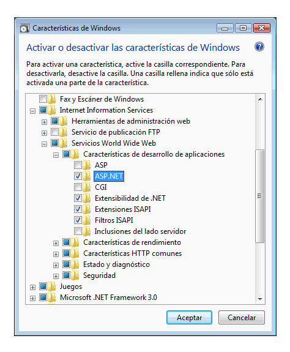

# Configuración de Internet Information Services 7.0 para Windows Communication Foundation

Internet Information Services (IIS) 7.0 tiene un diseño modular que le permite instalar de forma selectiva los componentes necesarios. Este diseño está basado en la nueva tecnología de componentización por manifiesto introducida en [!INCLUDE[wv](../../../../includes/wv-md.md)]. Hay más de 40 componentes de características independientes de IIS 7.0 que se pueden instalar independientemente. Esto permite a los profesionales de TI personalizar la instalación con facilidad según sea necesario. En este tema se describe cómo configurar IIS 7.0 para su uso con Windows Communication Foundation (WCF) y determinar qué componentes son necesarios.

## Instalación mínima: instalación de WAS
 La instalación mínima de todo el paquete de IIS 7.0 es instalar el servicio de activación de procesos de Windows (WAS). Se ha es una característica independiente y es la única característica de IIS 7.0 con la que está disponible para todos los [!INCLUDE[wv](../../../../includes/wv-md.md)] los sistemas operativos (Home Basic, Home Premium, Business y Ultimate y Enterprise).

 En el Panel de Control, haga clic en **programas** y, a continuación, haga clic en **o desactivar las características de Windows Active** que aparece en **programas y características**, el componente WAS se muestra en el lista como se muestra en la siguiente ilustración.

 

 Esta característica tiene los siguientes componentes secundarios:

-   Entorno de .NET

-   API de configuración

-   Modelo de proceso

 Si se selecciona el nodo raíz de WAS, solo el **modelo de proceso** subnodo está activada de forma predeterminada. Tenga en cuenta que con esta instalación solo está instalando WAS, porque no se ofrece ninguna compatibilidad para un servidor web.

 Para realizar cualquier trabajo de la aplicación ASP.NET o de WCF, compruebe el **entorno .NET** casilla de verificación. Esto significa que todos los componentes de WAS son necesarios para hacer que WCF y ASP.NET funcionan bien. Estos se comprueban automáticamente cuando instala cualquiera de esos componentes.

## IIS 7.0: instalación predeterminada
 Comprobando la **Internet Information Services** característica, algunos de los nodos secundarios se comprueban automáticamente tal como se muestra en la siguiente ilustración.

 

 Se trata de la instalación predeterminada de IIS 7.0. Con esta instalación, puede utilizar IIS 7.0 para contenido estático de servicio (por ejemplo, páginas HTML y otro contenido). Sin embargo, no se puede ejecutar las aplicaciones ASP.NET o CGI u hospedar servicios WCF.

## IIS 7.0: instalación con compatibilidad para ASP.NET
 Debe instalar ASP.NET para que ASP.NET funcione en IIS 7.0. Después de comprobar **ASP.NET**, la pantalla debería parecerse a la siguiente ilustración.

 

 Este es el entorno mínimo para que las aplicaciones WCF y ASP.NET funcionan en IIS 7.0.

## IIS 7.0: instalación con componentes de compatibilidad de IIS 6.0
 Cuando se instala IIS 7.0 en un sistema con Visual Studio 2005 o algunos otros scripts de automatización o las herramientas (como Adsutil.vbs) que configura aplicaciones virtuales que usan la API de Metabase de IIS 6.0, asegúrese de que comprueba el IIS 6.0 **herramientas de Scripting**. Esto comprueba automáticamente los demás nodos secundarios de IIS 6.0 **compatibilidad con la administración**. La siguiente ilustración muestra la pantalla después de ello:

 

 Con esta instalación, tiene todo lo necesario para usar características de IIS 7.0, ASP.NET y WCF y ejemplos disponibles en la Web.

## Límites de la solicitud
 En [!INCLUDE[wv](../../../../includes/wv-md.md)] con IIS 7, se ha cambiado el valor predeterminado de los parámetros `maxUri` y `maxQueryStringSize`. De manera predeterminada, la solicitud de filtrado en IIS 7.0 admite una longitud de dirección URL de 4096 caracteres y una longitud de cadena de consulta de 2048 caracteres. Para cambiar estos valores predeterminados, agregue el siguiente XML al archivo App.config:

 `<system.webServer>`

 `<security>`

 `<requestFiltering>`

 `<requestLimits maxUrl="8192" maxQueryString="8192" />`

 `</requestFiltering>`

 `</security>`

 `</system.webServer>`

## Vea también

- [Arquitectura de activación de WAS](../../../../docs/framework/wcf/feature-details/was-activation-architecture.md)
- [Configuración de WAS para su uso con WCF](../../../../docs/framework/wcf/feature-details/configuring-the-wpa--service-for-use-with-wcf.md)
- [Instalación y configuración de los componentes de activación de WFC](../../../../docs/framework/wcf/feature-details/how-to-install-and-configure-wcf-activation-components.md)
- [Características de hospedaje de Windows Server App Fabric](https://go.microsoft.com/fwlink/?LinkId=201276)
