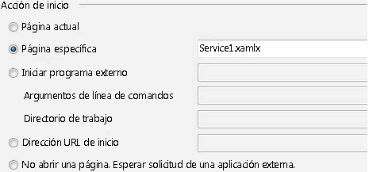
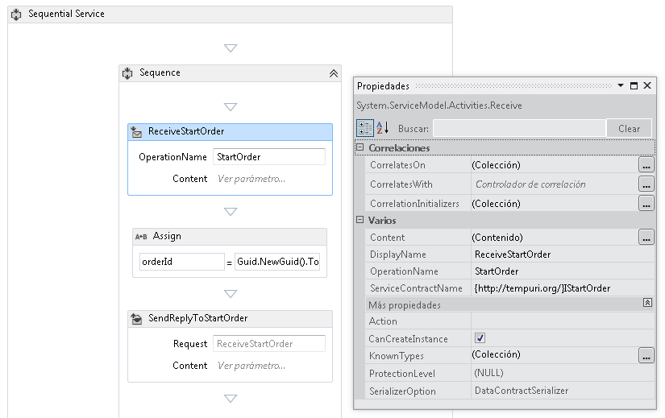
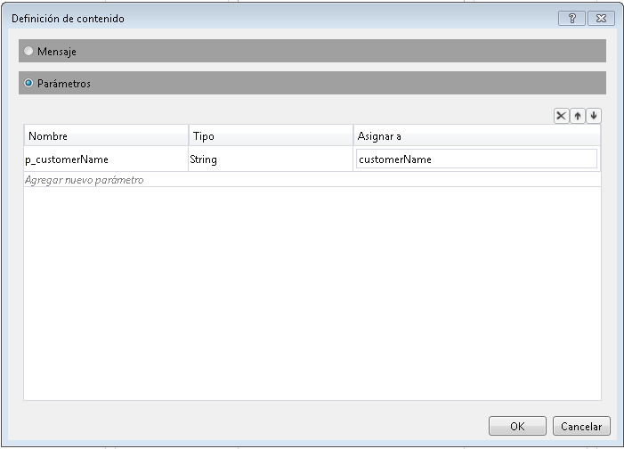
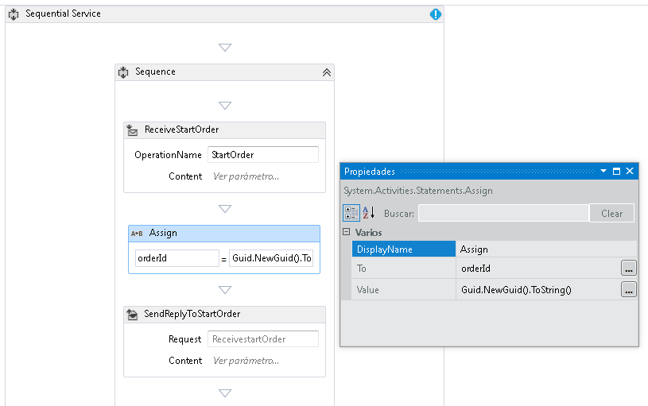
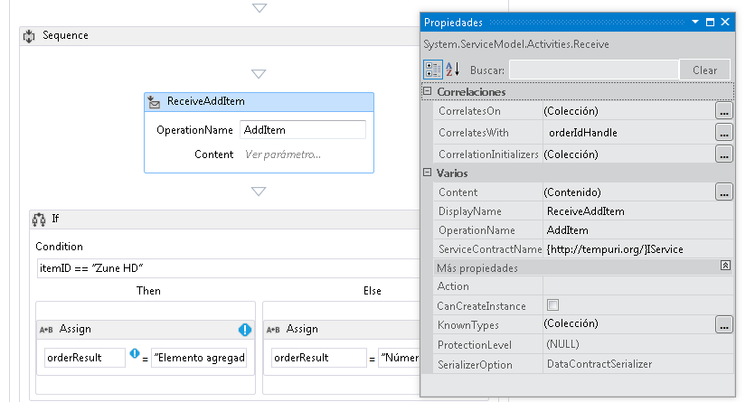
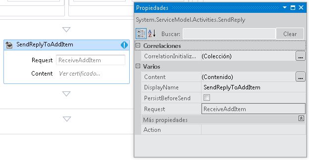

# Crear un servicio de flujo de trabajo de larga ejecuci&#243;n
En este tema se describe cómo crear un servicio de flujo de trabajo de larga ejecución.  Los servicios de flujo de trabajo de larga ejecución se pueden ejecutar durante períodos de tiempo prolongados.  En algún momento, el flujo de trabajo se puede inactivar a la espera de recibir información adicional.  En este caso, el flujo de trabajo se conserva en una base de datos SQL y se quita de la memoria.  Cuando esté disponible la información adicional, la instancia de flujo de trabajo se vuelve a cargar en la memoria y continua ejecutándose.  En este escenario, el usuario implementa un sistema de pedidos muy simplificado.  El cliente envía un mensaje inicial al servicio de flujo de trabajo para que inicie el pedido.  Devuelve un identificador de pedido al cliente.  En este momento el servicio de flujo de trabajo espera otro mensaje del cliente y pasa al estado inactivo, y se conserva en una base de datos SQL Server.  Cuando el cliente envía el siguiente mensaje para pedir un elemento, el servicio de flujo de trabajo se vuelve a cargar en memoria y finaliza el procesamiento del pedido.  En el ejemplo de código devuelve una cadena que indica que el elemento se ha agregado al pedido.  No se pretende que el ejemplo de código sea una aplicación real de la tecnología, sino más bien un ejemplo sencillo que ilustre servicios de flujo de trabajo de ejecución prolongada. En este tema se presupone que sabe cómo crear proyectos y soluciones de [!INCLUDE[vs_current_long](../../../../includes/vs-current-long-md.md)].  
  
## Requisitos previos  
 Debe tener instalado el siguiente software para usar este tutorial:  
  
1.  Microsoft SQL Server 2008  
  
2.  [!INCLUDE[vs_current_long](../../../../includes/vs-current-long-md.md)]  
  
3.  Microsoft [!INCLUDE[netfx_current_long](../../../../includes/netfx-current-long-md.md)]  
  
4.  Estar familiarizado con WCF, así como con [!INCLUDE[vs_current_long](../../../../includes/vs-current-long-md.md)] y saber crear proyectos y soluciones.  
  
### Para configurar la base de datos SQL  
  
1.  Para conservar las instancias del servicio de flujo de trabajo debe tener instalado Microsoft SQL Server y configurar una base de datos con el fin de almacenar las instancias de flujo de trabajo persistentes.  Haga clic en el botón **Iniciar**, seleccione **Todos los programas**, **Microsoft SQL Server 2008** y **Microsoft SQL Management Studio** para ejecutar Microsoft SQL Management Studio.  
  
2.  Haga clic en el botón **Conectar** para iniciar sesión en la instancia de SQL Server  
  
3.  Haga clic con el botón secundario en **Bases de datos** en la vista de árbol y seleccione **Nueva base de datos** para crear una nueva base de datos denominada `SQLPersistenceStore`.  
  
4.  Ejecute el archivo de script SqlWorkflowInstanceStoreSchema.sql ubicado en el directorio C:\\Windows\\Microsoft.NET\\Framework\\v4.0\\SQL\\es en la base de datos SQLPersistenceStore para configurar los esquemas de base de datos necesarios.  
  
5.  Ejecute el archivo de script SqlWorkflowInstanceStoreLogic.sql ubicado en el directorio C:\\Windows\\Microsoft.NET\\Framework\\v4.0\\SQL\\es en la base de datos SQLPersistenceStore para configurar la lógica de base de datos necesaria.  
  
### Para crear el servicio de flujo de trabajo hospedado en web  
  
1.  Cree una solución de [!INCLUDE[vs_current_long](../../../../includes/vs-current-long-md.md)] vacía y asígnele el nombre `OrderProcessing`.  
  
2.  Agregue un nuevo proyecto de aplicación de servicio de flujo de trabajo de [!INCLUDE[indigo2](../../../../includes/indigo2-md.md)] denominado `OrderService` a la solución.  
  
3.  En el cuadro de diálogo de propiedades del proyecto, seleccione la pestaña **Web**.  
  
    1.  Seleccione **Página específica** debajo de **Acción de inicio** y especifique `Service1.xamlx`.  
  
           
  
    2.  Seleccione **Usar servidor web de IIS local** debajo de **Servidores**.  
  
           
  
        > [!WARNING]
        >  Debe ejecutar [!INCLUDE[vs_current_long](../../../../includes/vs-current-long-md.md)] en el modo de administrador para llevar a cabo esta configuración.  
  
         Estos dos pasos configuran el proyecto de servicio de flujo de trabajo que IIS va a hospedar.  
  
4.  Abra `Service1.xamlx` si aún no está abierto y elimine las actividades **ReceiveRequest** y **SendResponse** existentes.  
  
5.  Seleccione la actividad **Servicio secuencial**, haga clic en el vínculo **Variables** y agregue las variables que se muestran en la siguiente ilustración.  De esta forma, se agregan algunas variables que se usarán posteriormente en el servicio de flujo de trabajo.  
  
    > [!NOTE]
    >  Si CorrelationHandle no está en la lista desplegable Tipo de variable, seleccione **Buscar tipos** en la lista desplegable.  Escriba CorrelationHandle en el cuadro **Nombre de tipo**, seleccione CorrelationHandle en el cuadro de lista y haga clic en **Aceptar**.  
  
       
  
6.  Arrastre y coloque una plantilla de la actividad **ReceiveAndSendReply** en la actividad **Servicio secuencial**.  Este conjunto de actividades recibirá un mensaje de un cliente y devolverá un respuesta.  
  
    1.  Seleccione la actividad **Receive** y establezca las propiedades resaltadas en la siguiente ilustración.  
  
           
  
         La propiedad DisplayName establece el nombre mostrado para la actividad Receive en el diseñador.  Las propiedades ServiceContractName y OperationName especifican el nombre del contrato de servicio y la operación que implementa la actividad Receive.  [!INCLUDE[crabout](../../../../includes/crabout-md.md)] cómo se usan los contratos en los servicios de flujo de trabajo, consulte [Utilizar contratos en flujo de trabajo](../../../../docs/framework/wcf/feature-details/using-contracts-in-workflow.md).  
  
    2.  Haga clic en el vínculo **Definir** de la actividad **ReceiveStartOrder** y establezca las propiedades que se muestran en la siguiente ilustración.  Observe que el botón de radio **Parámetros** está seleccionado y que un parámetro denominado `p_customerName` está enlazado a la variable `customerName`.  De esta forma, se configura la actividad **Receive** para recibir algunos datos y enlazarlos a variables locales.  
  
           
  
    3.  Seleccione la actividad **SendReplyToReceive** y establezca la propiedad resaltada que se muestra en la siguiente ilustración.  
  
           
  
    4.  Haga clic en el vínculo **Definir** de la actividad **SendReplyToStartOrder** y establezca las propiedades que se muestran en la siguiente ilustración.  Observe que el botón de radio **Parámetros** está seleccionado y que un parámetro denominado `p_orderId` está enlazado a la variable `orderId`.  Esta configuración especifica que la actividad SendReplyToStartOrder ejecutará un valor de tipo de cadena en el autor de la llamada.  
  
           
  
        > [!NOTE]
    5.  Arrastre y coloque una actividad Assign entre las actividades **Receive** y **SendReply**, y establezca las propiedades que se muestran en la siguiente ilustración:  
  
           
  
         De esta forma, se crea un identificador de nuevo pedido y se coloca el valor en la variable orderId.  
  
    6.  Seleccione la actividad **ReplyToStartOrder**.  En la ventana Propiedades, haga clic en el botón de puntos suspensivos de **CorrelationInitializers**.  Seleccione el vínculo **Agregar inicializador**, escriba `orderIdHandle` en el cuadro de texto Inicializador, seleccione el inicializador de correlación de consultas para el tipo de correlación y seleccione p\_orderId en el cuadro desplegable Consultas XPATH.  Esta configuración se muestra en la siguiente ilustración.  Haga clic en **Aceptar**.  De esta forma, se inicializa una correlación entre el cliente y esta instancia del servicio de flujo de trabajo.  Cuando se reciba un mensaje con este identificador de pedido, se enruta a esta instancia del servicio de flujo de trabajo.  
  
           
  
7.  Arrastre y coloque otra actividad **ReceiveAndSendReply** al final del flujo de trabajo \(fuera de la **Secuencia** que contiene las primeras actividades **Receive** y **SendReply**\).  De esta forma, se recibirá el segundo mensaje enviado por el cliente y se responderá al mismo.  
  
    1.  Seleccione la **Secuencia** que contenga las actividades **Receive** y **SendReply** que se acaban de crear y haga clic en el botón **Variables**.  Agregue la variable resaltada en la siguiente ilustración:  
  
           
  
    2.  Seleccione la actividad **Receive** y establezca las propiedades que se muestran en la siguiente ilustración:  
  
           
  
    3.  Haga clic en el vínculo **Definir** de la actividad **ReceiveAddItem** y agregue los parámetros mostrados en la siguiente ilustración. De esta forma, se configura la actividad de recepción para aceptar dos parámetros: el identificador de pedido y el identificador del elemento que se pide.  
  
           
  
    4.  Haga clic en el botón se puntos suspensivos de **CorrelateOn** y escriba `orderIdHandle`.  En **Consultas XPath**, haga clic en la flecha desplegable y seleccione `p_orderId`.  De esta forma, se configura la correlación de la segunda actividad de recepción.  [!INCLUDE[crabout](../../../../includes/crabout-md.md)] la correlación, consulte [Correlación](../../../../docs/framework/wcf/feature-details/correlation.md).  
  
           
  
    5.  Arrastre y coloque una actividad **If** inmediatamente detrás de la actividad **ReceiveAddItem**.  Esta actividad actúa como instrucción If.  
  
        1.  Establezca la propiedad **Condition** en `itemId==”Zune HD” (itemId=”Zune HD” for Visual Basic)`  
  
        2.  Arrastre y coloque una actividad **Assign** en la sección **Then** y otra en la sección **Else**. Establezca las propiedades de las actividades **Assign** como se muestra en la siguiente ilustración.  
  
               
  
             Si el valor de la condición es `true`, se ejecutará la sección **Then**.  Si el valor de la condición es `false`, se ejecuta la sección **Else**.  
  
        3.  Seleccione la actividad **SendReplyToReceive** y establezca la propiedad **DisplayName** que se muestra en la siguiente ilustración.  
  
               
  
        4.  Haga clic en el vínculo **Definir** de la actividad **SetReplyToAddItem** y configúrelo como se muestra en la siguiente ilustración.  De esta forma, se configura la actividad **SendReplyToAddItem** para devolver el valor de la variable `orderResult`.  
  
               
  
8.  Abra el archivo web.config y agregue los siguientes elementos en la sección \<behavior\> para habilitar la persistencia del flujo de trabajo.  
  
    ```xml  
    <sqlWorkflowInstanceStore connectionString="Data Source=your-machine\SQLExpress;Initial Catalog=SQLPersistenceStore;Integrated Security=True;Asynchronous Processing=True" instanceEncodingOption="None" instanceCompletionAction="DeleteAll" instanceLockedExceptionAction="BasicRetry" hostLockRenewalPeriod="00:00:30" runnableInstancesDetectionPeriod="00:00:02" />  
              <workflowIdle timeToUnload="0"/>  
  
    ```  
  
    > [!WARNING]
    >  Asegúrese de reemplazar el nombre del host y de la instancia de SQL Server en el fragmento de código anterior.  
  
9. Compile la solución.  
  
### Para crear una aplicación cliente que llame al servicio de flujo de trabajo  
  
1.  Agregue un nuevo proyecto de aplicación de consola denominado `OrderClient` a la solución.  
  
2.  Agregue referencias a los siguientes ensamblados al proyecto `OrderClient`  
  
    1.  System.ServiceModel.dll  
  
    2.  System.ServiceModel.Activities.dll  
  
3.  Agregue una referencia de servicio al servicio de flujo de trabajo y especifique `OrderService` como el espacio de nombres.  
  
4.  En el método `Main()` del proyecto de cliente, agregue el siguiente código:  
  
    ```  
    static void Main(string[] args)  
    {  
       // Send initial message to start the workflow service  
       Console.WriteLine("Sending start message");  
       StartOrderClient startProxy = new StartOrderClient();  
       string orderId = startProxy.StartOrder("Kim Abercrombie");  
  
       // The workflow service is now waiting for the second message to be sent  
       Console.WriteLine("Workflow service is idle...");  
       Console.WriteLine("Press [ENTER] to send an add item message to reactivate the workflow service...");  
       Console.ReadLine();  
  
       // Send the second message  
       Console.WriteLine("Sending add item message");  
       AddItemClient addProxy = new AddItemClient();  
       AddItem item = new AddItem();  
       item.p_itemId = "Zune HD";  
       item.p_orderId = orderId;  
  
       string orderResult = addProxy.AddItem(item);  
       Console.WriteLine("Service returned: " + orderResult);  
    }  
  
    ```  
  
5.  Compile la solución y ejecute la aplicación `OrderClient`.  El cliente mostrará un texto similar al siguiente:  
  
    ```Output  
  
                  Enviar iniciar mensajes.  
    El servicio de flujo de trabajo está inactivo...  Presione [ENTRAR] para enviar y agregar un mensaje de elemento para reactivar el servicio de flujo de trabajo...    
    ```  
  
6.  Para comprobar que se ha conservado el servicio de flujo de trabajo, inicie SQL Server Management Studio yendo al menú **Inicio** y seleccionando **Todos los programas**, **Microsoft SQL Server 2008**, **SQL Server Management Studio**.  
  
    1.  En el panel de la izquierda expanda **Bases de datos**, **SQLPersistenceStore**, **Vistas**, haga clic con el botón secundario en **System.Activities.DurableInstancing.Instances** y seleccione **Seleccionar las primeras 1000 filas**.  En el panel **Resultados** compruebe que aparezca una instancia como mínimo.  Puede que haya otras instancia de ejecuciones previas si se produjo una excepción durante la ejecución.  Puede eliminar filas existentes si hace clic con el botón secundario en **System.Activities.DurableInstancing.Instances**, selecciona **Editar las primeras 200 filas**, presiona el botón **Ejecutar**, selecciona todas las filas del panel de resultados y selecciona **eliminar**.  Para comprobar que la instancia que se muestra en la base de datos es la instancia de la aplicación creada, compruebe que la vista de instancias esté vacía antes de ejecutar el cliente.  Una vez que se ejecute el cliente, vuelva a ejecutar la consulta \(Seleccionar las primeras 1000 filas\) y compruebe que se haya agregado una nueva instancia.  
  
7.  Presione Entrar para enviar y agregar un mensaje de elemento al servicio de flujo de trabajo.  El cliente mostrará un texto similar al siguiente:  
  
    ```Output  
  
                  Enviar agregar mensaje del elemento  
    Servicio devuelto: elemento agregado al orden  
    Presione cualquier tecla para continuar .  .  .    
    ```  
  
## Vea también  
 [Servicios de flujo de trabajo](../../../../docs/framework/wcf/feature-details/workflow-services.md)