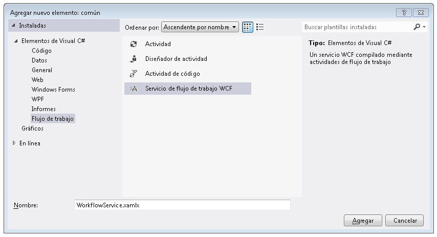
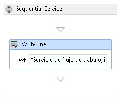
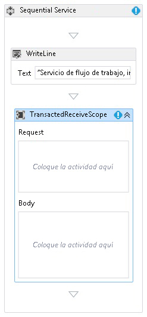
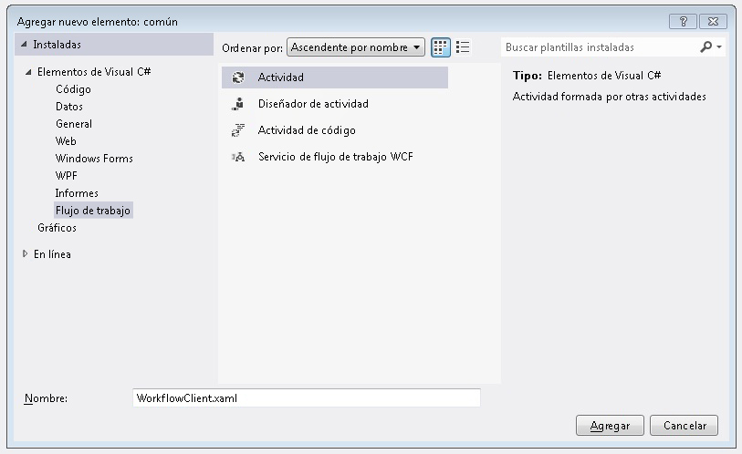
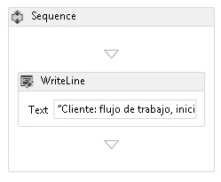
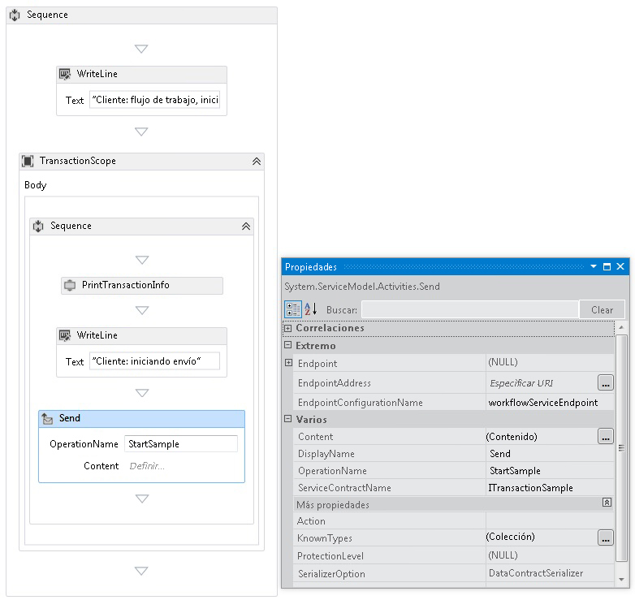

# Flujo de las transacciones en los servicios de flujo de trabajo
Los servicios y clientes de flujo de trabajo pueden participar en las transacciones.Para que una operación de servicio se convierta en parte de una transacción de ambiente, coloque una actividad de <xref:System.ServiceModel.Activities.Receive> dentro de una actividad de <xref:System.ServiceModel.Activities.TransactedReceiveScope>.En cualquier llamada realizada por un objeto <xref:System.ServiceModel.Activities.Send> o una actividad de <xref:System.ServiceModel.Activities.SendReply> dentro de <xref:System.ServiceModel.Activities.TransactedReceiveScope> también se realizará dentro de la transacción de ambiente.Una aplicación cliente del flujo de trabajo puede crear una transacción de ambiente utilizando la actividad de <xref:System.Activities.Statements.TransactionScope> y operaciones de servicio de llamada que usen la transacción de ambiente.Este tema sirve de guía para crear un servicio de flujo de trabajo y un cliente de flujo de trabajo que participan en transacciones.  
  
> [!WARNING]
>  Si una instancia del servicio de flujo de trabajo se carga dentro de una transacción y el flujo de trabajo contiene una actividad <xref:System.Activities.Statements.Persist>, la instancia de flujo de trabajo no responderá hasta que se agote el tiempo de espera de la transacción.  
  
> [!IMPORTANT]
>  Siempre que use un objeto <xref:System.ServiceModel.Activities.TransactedReceiveScope> se recomienda que coloque todas las recepciones en el flujo de trabajo dentro de actividades <xref:System.ServiceModel.Activities.TransactedReceiveScope>.  
  
> [!IMPORTANT]
>  Cuando se usa el objeto <xref:System.ServiceModel.Activities.TransactedReceiveScope> y los mensajes llegan en el orden incorrecto, el flujo de trabajo se anulará al intentar entregar el primer mensaje que lo indique.Debe asegurarse de que el flujo de trabajo siempre está en un punto de detención coherente cuando el flujo de trabajo está inactivo.De este modo, podrá reiniciar el flujo de trabajo a partir de un punto de persistencia anterior si el flujo de trabajo se anula.  
  
### Crear una biblioteca compartida  
  
1.  Cree una nueva solución de Visual Studio vacía.  
  
2.  Agregue un nuevo proyecto de biblioteca de clases denominado `Common`.Agregue referencias a los ensamblados siguientes:  
  
    -   System.Activities.dll  
  
    -   System.ServiceModel.dll  
  
    -   System.ServiceModel.Activities.dll  
  
    -   System.Transactions.dll  
  
3.  Agregue una nueva clase denominada `PrintTransactionInfo` al proyecto `Common`.Esta clase se deriva de <xref:System.Activities.NativeActivity> y sobrecarga el método <xref:System.Activities.NativeActivity.Execute%2A>.  
  
    ```  
    using System;  
    using System;  
    using System.Activities;  
    using System.Transactions;  
  
    namespace Common  
    {  
        public class PrintTransactionInfo : NativeActivity  
        {  
            protected override void Execute(NativeActivityContext context)  
            {  
                RuntimeTransactionHandle rth = context.Properties.Find(typeof(RuntimeTransactionHandle).FullName) as RuntimeTransactionHandle;  
  
                if (rth == null)  
                {  
                    Console.WriteLine("There is no ambient RuntimeTransactionHandle");  
                }  
  
                Transaction t = rth.GetCurrentTransaction(context);  
  
                if (t == null)  
                {  
                    Console.WriteLine("There is no ambient transaction");  
                }  
                else  
                {  
                    Console.WriteLine("Transaction: {0} is {1}", t.TransactionInformation.DistributedIdentifier, t.TransactionInformation.Status);  
                }  
            }  
        }  
  
    }  
  
    ```  
  
     Esta es una actividad nativa que muestra información acerca de la transacción de ambiente y se utiliza en ambos flujos de trabajo, de cliente y de servicio, que se usan en este tema.Compile la solución para hacer que esta actividad esté disponible en la sección **Común** del **Cuadro de herramientas**.  
  
### Implementar el servicio de flujo de trabajo  
  
1.  Agregue un nuevo Servicio de flujo de trabajo de [!INCLUDE[indigo2](../../../../includes/indigo2-md.md)], denominado `WorkflowService`, al proyecto `Common`.Para ello, haga clic con el botón secundario en el proyecto `Common`, seleccione **Agregar**, **Nuevo elemento...**, seleccione **Flujo de trabajo** en **Plantillas instaladas** y seleccione **Servicio de flujo de trabajo de WCF**.  
  
       
  
2.  Elimine las actividades `SendResponse` y `ReceiveRequest` predeterminadas.  
  
3.  Arrastre y coloque una actividad de <xref:System.Activities.Statements.WriteLine> en la actividad de `Sequential Service`.Establezca la propiedad de texto en `"Workflow Service starting ..."` como se muestra en el siguiente ejemplo.  
  
       
  
4.  Arrastre y coloque una actividad <xref:System.ServiceModel.Activities.TransactedReceiveScope> después de la actividad de <xref:System.Activities.Statements.WriteLine>.La actividad de <xref:System.ServiceModel.Activities.TransactedReceiveScope> se puede encontrar en la sección **Mensajería** del **Cuadro de herramientas**.La actividad de <xref:System.ServiceModel.Activities.TransactedReceiveScope> está compuesta por dos secciones **Solicitud** y **Cuerpo**.La sección **Solicitud** contiene la actividad de <xref:System.ServiceModel.Activities.Receive>.La sección **Body** contiene las actividades que se ejecutan dentro de una transacción una vez recibido un mensaje.  
  
       
  
5.  Seleccione la actividad <xref:System.ServiceModel.Activities.TransactedReceiveScope> y haga clic en el botón **Variables**.Agregue las variables siguientes.  
  
       
  
    > [!NOTE]
    >  Puede eliminar la variable de datos que está allí de forma predeterminada.También puede utilizar la variable de controlador existente.  
  
6.  Arrastre y coloque una actividad de <xref:System.ServiceModel.Activities.Receive> dentro de la sección **Solicitud** de la actividad de <xref:System.ServiceModel.Activities.TransactedReceiveScope>.Establezca las siguientes propiedades:  
  
    |Propiedad|Valor|  
    |---------------|-----------|  
    |CanCreateInstance|True \(activar la casilla\)|  
    |OperationName|StartSample|  
    |ServiceContractName|ITransactionSample|  
  
     El flujo de trabajo debería ser similar a este:  
  
       
  
7.  Haga clic en el vínculo **Definir...** en la actividad de <xref:System.ServiceModel.Activities.Receive> y realice la siguiente configuración:  
  
       
  
8.  Arrastre y coloque una actividad de <xref:System.Activities.Statements.Sequence> en la sección Cuerpo de <xref:System.ServiceModel.Activities.TransactedReceiveScope>.Dentro de la actividad de <xref:System.Activities.Statements.Sequence>, arrastre las dos actividades de <xref:System.Activities.Statements.WriteLine> y establezca las propiedades <xref:System.Activities.Statements.WriteLine.Text%2A> como se muestra en la siguiente tabla.  
  
    |Actividad|Valor|  
    |---------------|-----------|  
    |Primera propiedad WriteLine|“Servicio: recepción completada”|  
    |Segunda propiedad WriteLine|"Servicio: recibido \= " \+ requestMessage|  
  
     El flujo de trabajo ahora debería ser similar a este:  
  
       
  
9. Arrastre y coloque la actividad de `PrintTransactionInfo` después de la segunda actividad de <xref:System.Activities.Statements.WriteLine> en la sección **Cuerpo** de la actividad de <xref:System.ServiceModel.Activities.TransactedReceiveScope>.  
  
       
  
10. Arrastre y coloque una actividad de <xref:System.Activities.Statements.Assign> después de la actividad de `PrintTransactionInfo` y establezca sus propiedades según la siguiente tabla.  
  
    |Propiedad|Valor|  
    |---------------|-----------|  
    |To|replyMessage|  
    |Valor|"Servicio: enviando respuesta."|  
  
11. Arrastre y coloque una actividad de <xref:System.Activities.Statements.WriteLine> después de la actividad de <xref:System.Activities.Statements.Assign> y establezca su propiedad <xref:System.Activities.Statements.WriteLine.Text%2A> en "Servicio: iniciar respuesta".  
  
     El flujo de trabajo ahora debería ser similar a este:  
  
       
  
12. Haga clic con el botón secundario en la actividad de <xref:System.ServiceModel.Activities.Receive>, seleccione **Crear SendReply** y péguela después de la última actividad de <xref:System.Activities.Statements.WriteLine>.Haga clic en el vínculo **Definir...** en la actividad de `SendReplyToReceive` y realice la siguiente configuración.  
  
       
  
13. Arrastre y coloque una actividad de <xref:System.Activities.Statements.WriteLine> después de la actividad de `SendReplyToReceive` y establezca su propiedad <xref:System.Activities.Statements.WriteLine.Text%2A> en "Servicio: respuesta enviada".  
  
14. Arrastre y coloque una actividad de <xref:System.Activities.Statements.WriteLine> en la parte inferior del flujo de trabajo y establezca su propiedad <xref:System.Activities.Statements.WriteLine.Text%2A> en "Servicio: el flujo de trabajo finaliza, presione Entrar para salir".  
  
     El flujo de trabajo del servicio completado debería ser similar a:  
  
       
  
### Implementar el cliente de flujo de trabajo  
  
1.  Agregue una nueva aplicación Flujo de trabajo WCF, denominada `WorkflowClient`, al proyecto `Common`.Para ello, haga clic con el botón secundario en el proyecto `Common`, seleccione **Agregar**, **Nuevo elemento...**, seleccione **Flujo de trabajo** en **Plantillas instaladas** y seleccione **Actividad**.  
  
       
  
2.  Arrastre y coloque una actividad <xref:System.Activities.Statements.Sequence> en la superficie de diseño.  
  
3.  Dentro de la actividad <xref:System.Activities.Statements.Sequence>, arrastre y coloque una actividad de <xref:System.Activities.Statements.WriteLine> y establezca su propiedad <xref:System.Activities.Statements.WriteLine.Text%2A> en `"Client: Workflow starting"`.El flujo de trabajo ahora debería ser similar a este:  
  
       
  
4.  Arrastre y coloque una actividad de <xref:System.Activities.Statements.TransactionScope> después de la actividad de <xref:System.Activities.Statements.WriteLine>.Seleccione la actividad de <xref:System.Activities.Statements.TransactionScope>, haga clic en el botón Variables y agregue las siguientes variables.  
  
       
  
5.  Arrastre y coloque una actividad de <xref:System.Activities.Statements.Sequence> en el cuerpo de la actividad de <xref:System.Activities.Statements.TransactionScope>.  
  
6.  Arrastre y coloque una actividad de `PrintTransactionInfo` dentro de <xref:System.Activities.Statements.Sequence>.  
  
7.  Arrastre y coloque una actividad de <xref:System.Activities.Statements.WriteLine> después de la actividad de `PrintTransactionInfo` y establezca su propiedad <xref:System.Activities.Statements.WriteLine.Text%2A> en "Cliente: comenzando envío".El flujo de trabajo ahora debería ser similar a este:  
  
       
  
8.  Arrastre y coloque una actividad de <xref:System.ServiceModel.Activities.Send> después de la actividad de <xref:System.Activities.Statements.Assign> y establezca las siguientes propiedades:  
  
    |Propiedad|Valor|  
    |---------------|-----------|  
    |EndpointConfigurationName|workflowServiceEndpoint|  
    |OperationName|StartSample|  
    |ServiceContractName|ITransactionSample|  
  
     El flujo de trabajo ahora debería ser similar a este:  
  
       
  
9. Haga clic en el vínculo **Definir...** y realice la siguiente configuración:  
  
       
  
10. Haga clic con el botón secundario en la actividad de <xref:System.ServiceModel.Activities.Send> y seleccione **Crear ReceiveReply**.La actividad de <xref:System.ServiceModel.Activities.ReceiveReply> se colocará automáticamente después de la actividad de <xref:System.ServiceModel.Activities.Send>.  
  
11. Haga clic en el vínculo Definir…en la actividad ReceiveReplyForSend y realice la siguiente configuración:  
  
       
  
12. Arrastre y coloque una actividad de <xref:System.Activities.Statements.WriteLine> entre las actividades de <xref:System.ServiceModel.Activities.Send> y <xref:System.ServiceModel.Activities.ReceiveReply>, y establezca su propiedad <xref:System.Activities.Statements.WriteLine.Text%2A> en "Cliente: envío completado".  
  
13. Arrastre y coloque una actividad de <xref:System.Activities.Statements.WriteLine> después de la actividad de <xref:System.ServiceModel.Activities.ReceiveReply> y establezca su propiedad <xref:System.Activities.Statements.WriteLine.Text%2A> en "Cliente: respuesta recibida \= " \+ replyMessage  
  
14. Arrastre y coloque una actividad de `PrintTransactionInfo` después de la actividad de <xref:System.Activities.Statements.WriteLine>.  
  
15. Arrastre y coloque una actividad de <xref:System.Activities.Statements.WriteLine> al final del flujo de trabajo y establezca su propiedad <xref:System.Activities.Statements.WriteLine.Text%2A> en "El flujo de cliente finaliza". El flujo de trabajo del cliente completado debería parecerse al del siguiente diagrama.  
  
       
  
16. Compile la solución.  
  
### Crear la aplicación de servicio  
  
1.  Agregue un nuevo proyecto Aplicación de consola denominado `Service` a la solución.Agregue referencias a los ensamblados siguientes:  
  
    1.  System.Activities.dll  
  
    2.  System.ServiceModel.dll  
  
    3.  System.ServiceModel.Activities.dll  
  
2.  Abra el archivo Program.cs generado y el siguiente código:  
  
    ```  
    static void Main()  
          {  
              Console.WriteLine("Building the server.");  
              using (WorkflowServiceHost host = new WorkflowServiceHost(new DeclarativeServiceWorkflow(), new Uri("net.tcp://localhost:8000/TransactedReceiveService/Declarative")))  
              {                
                  //Start the server  
                  host.Open();  
                  Console.WriteLine("Service started.");  
  
                  Console.WriteLine();  
                  Console.ReadLine();  
                  //Shutdown  
                  host.Close();  
              };         
          }  
  
    ```  
  
3.  Agregue el archivo app.config siguiente al proyecto.  
  
    ```xml  
    <?xml version="1.0" encoding="utf-8" ?>  
    <!-- Copyright © Microsoft Corporation.  All rights reserved. -->  
    <configuration>  
        <system.serviceModel>  
            <bindings>  
                <netTcpBinding>  
                    <binding transactionFlow="true" />  
                </netTcpBinding>  
            </bindings>  
        </system.serviceModel>  
    </configuration>  
  
    ```  
  
### Crear la aplicación cliente  
  
1.  Agregue un nuevo proyecto Aplicación de consola denominado `Client` a la solución.Agregue una referencia a System.Activities.dll.  
  
2.  Abra el archivo Program.cs y agregue el siguiente código.  
  
    ```  
    class Program  
        {  
  
            private static AutoResetEvent syncEvent = new AutoResetEvent(false);  
  
            static void Main(string[] args)  
            {  
                //Build client  
                Console.WriteLine("Building the client.");  
                WorkflowApplication client = new WorkflowApplication(new DeclarativeClientWorkflow());  
                client.Completed = Program.Completed;  
                client.Aborted = Program.Aborted;  
                client.OnUnhandledException = Program.OnUnhandledException;  
  
                //Wait for service to start  
                Console.WriteLine("Press ENTER once service is started.");  
                Console.ReadLine();  
  
                //Start the client              
                Console.WriteLine("Starting the client.");  
                client.Run();  
                syncEvent.WaitOne();  
  
                //Sample complete  
                Console.WriteLine();  
                Console.WriteLine("Client complete. Press ENTER to exit.");  
                Console.ReadLine();  
            }  
  
            private static void Completed(WorkflowApplicationCompletedEventArgs e)  
            {  
                Program.syncEvent.Set();  
            }  
  
            private static void Aborted(WorkflowApplicationAbortedEventArgs e)  
            {  
                Console.WriteLine("Client Aborted: {0}", e.Reason);  
                Program.syncEvent.Set();  
            }  
  
            private static UnhandledExceptionAction OnUnhandledException(WorkflowApplicationUnhandledExceptionEventArgs e)  
            {  
                Console.WriteLine("Client had an unhandled exception: {0}", e.UnhandledException);  
                return UnhandledExceptionAction.Cancel;  
            }  
        }  
  
    ```  
  
## Vea también  
 [Servicios de flujo de trabajo](../../../../docs/framework/wcf/feature-details/workflow-services.md)   
 [Información general sobre las transacciones de Windows Communication Foundation](../../../../docs/framework/wcf/feature-details/transactions-overview.md)   
 [Uso de TransactedReceiveScope](../../../../docs/framework/windows-workflow-foundation/samples/use-of-transactedreceivescope.md)