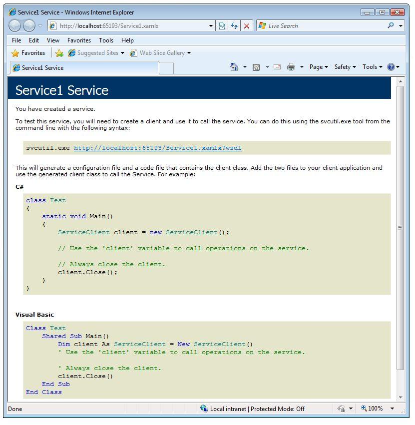
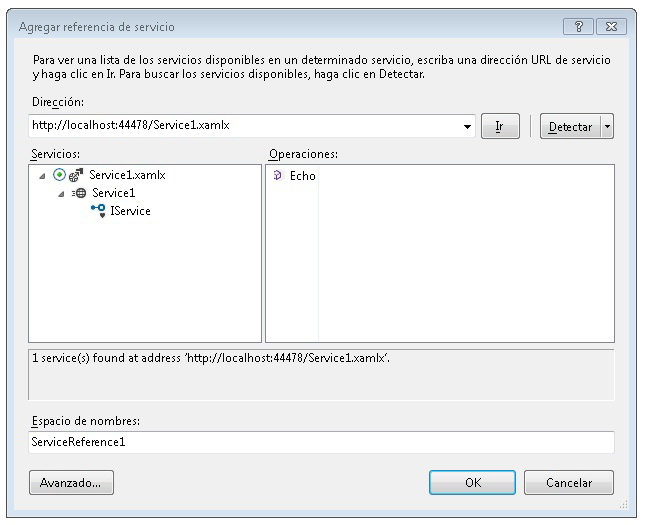

# C&#243;mo: Tener acceso a un servicio desde una aplicaci&#243;n de flujo de trabajo
En este tema, se describe cómo llamar a un servicio de flujo de trabajo desde una aplicación de consola de flujo de trabajo.Depende de la finalización del tópico [Cómo: Crear un servicio de flujo de trabajo con actividades de mensajería](../../../../docs/framework/wcf/feature-details/how-to-create-a-workflow-service-with-messaging-activities.md).Aunque este tema describe cómo llamar a un servicio de flujo de trabajo desde una aplicación de flujo de trabajo, se pueden usar los mismos métodos para llamar a cualquier servicio de [!INCLUDE[indigo1](../../../../includes/indigo1-md.md)] desde una aplicación de flujo de trabajo.  
  
### Creación de un proyecto de aplicación de consola de flujo de trabajo  
  
1.  Inicie [!INCLUDE[vs_current_long](../../../../includes/vs-current-long-md.md)].  
  
2.  Cargue el proyecto MyWFService que creó en el tema [Cómo: Crear un servicio de flujo de trabajo con actividades de mensajería](../../../../docs/framework/wcf/feature-details/how-to-create-a-workflow-service-with-messaging-activities.md).  
  
3.  En el **Explorador de soluciones**, haga clic con el botón secundario del mouse en la solución **MyWFService**, después haga clic en **Agregar** y, a continuación, en **Nuevo proyecto**.Seleccione **Flujo de trabajo** en **Plantillas instaladas** y **Aplicación de consola de flujo de trabajo** en la lista de tipos de proyectos.Denomine el MyWFClient del proyecto y use la ubicación predeterminada tal y como se muestra en la siguiente ilustración.  
  
       
  
     Haga clic en el botón **Aceptar** para descartar el cuadro de diálogo **Agregar nuevo proyecto**.  
  
4.  Una vez creado el proyecto, el archivo Workflow1.xaml se abre en el diseñador.Haga clic en la pestaña **Cuadro de herramientas** para abrir el cuadro de herramientas si aún no está abierto, y haga clic en el pin para mantener abierta la ventana del cuadro de herramientas.  
  
5.  Presione Ctrl \+ F5 para compilar y ejecutar el servicio.Como antes, se inicia el servidor de desarrollo de ASP.NET e Internet Explorer muestra la página de ayuda de WCF.Observe el URI de esta página, ya que deberá usarlo en el paso siguiente.  
  
       
  
6.  En el **Explorador de soluciones**, haga clic con el botón secundario en el proyecto **MyWFClient** y seleccione **Agregar referencia de servicio**.Haga clic en el botón **Detectar** para buscar la solución actual de cualquier servicio.Haga clic en el triángulo situado junto a Service1.xamlx en la lista de servicios.Haga clic en el triángulo situado junto a Service1 para hacer una lista de los contratos implementados por el servicio Service1.Expanda el nodo **Service1** en la lista **Servicios**.La operación de eco aparece en la lista **Operaciones**, tal y como se muestra en la siguiente ilustración.  
  
       
  
     Mantenga el espacio de nombres predeterminado y haga clic en **Aceptar** para descartar el cuadro de diálogo **Agregar referencia de servicio**.Se muestra el siguiente cuadro de diálogo.  
  
       
  
     Haga clic en **Aceptar** para descartar el cuadro de diálogo.Después, presione CTRL\+MAYÚS\+B para compilar la solución.Observe en el cuadro de herramientas la adición de una nueva sección llamada **MyWFClient.ServiceReference1.Activities**.Expanda esta sección y observe la actividad de eco agregada como se muestra en la siguiente ilustración.  
  
       
  
7.  Arrastre y coloque una actividad <xref:System.ServiceModel.Activities.Sequence> en la superficie del diseñador.Se encuentra en la sección **Flujo de control** del cuadro de herramientas.  
  
8.  Con la actividad <xref:System.ServiceModel.Activities.Sequence> en foco, haga clic en el vínculo **Variables** y agregue una variable de cadena `inString`.Dé un valor predeterminado a la variable de `"Hola a todos"`, así como una variable de cadena `outString`, tal y como se muestra en el siguiente diagrama.  
  
       
  
9. Arrastre y coloque una actividad **Echo** en <xref:System.ServiceModel.Activities.Sequence>.En la ventana Propiedades, enlace el argumento \_string a la variable `inString` y el argumento `out_string` a la variable de outString, tal y como se muestra en la siguiente ilustración.Esto pasa el valor de la variable `inString` a la operación y, a continuación, toma el valor devuelto y lo coloca en la variable `outString`.  
  
       
  
10. Arrastre y coloque una actividad **WriteLine** debajo de la actividad **Echo** para mostrar la cadena devuelta por la llamada de servicio.La actividad **WriteLine** se encuentra en el nodo **Primitivas** del cuadro de herramientas.Enlace el argumento **Text** de la actividad **WriteLine** a la variable `outString` escribiendo `outString` en el cuadro de texto de la actividad **WriteLine**.El flujo de trabajo debería tener el mismo aspecto que la siguiente ilustración.  
  
       
  
11. Haga clic con el botón secundario en la solución MyWFService y seleccione **Establecer proyectos de inicio ....**Seleccione el botón de radio **Proyectos de inicio múltiples** y seleccione **Iniciar** para cada proyecto en la columna **Acción**, tal y como se muestra en la siguiente ilustración.  
  
       
  
12. Presione Ctrl \+ F5 para iniciar el servicio y el cliente.El servidor de desarrollo de ASP.NET hospeda el servicio, Internet Explorer muestra la página de ayuda WCF y la aplicación de flujo de trabajo del cliente se inicia en una ventana de la consola y muestra la cadena devuelta del servicio \("Hola a todos"\).  
  
## Vea también  
 [Servicios de flujo de trabajo](../../../../docs/framework/wcf/feature-details/workflow-services.md)   
 [Cómo: Crear un servicio de flujo de trabajo con actividades de mensajería](../../../../docs/framework/wcf/feature-details/how-to-create-a-workflow-service-with-messaging-activities.md)   
 [Usar un servicio WCF desde un flujo de trabajo en un proyecto web](http://go.microsoft.com/fwlink/?LinkId=207725)