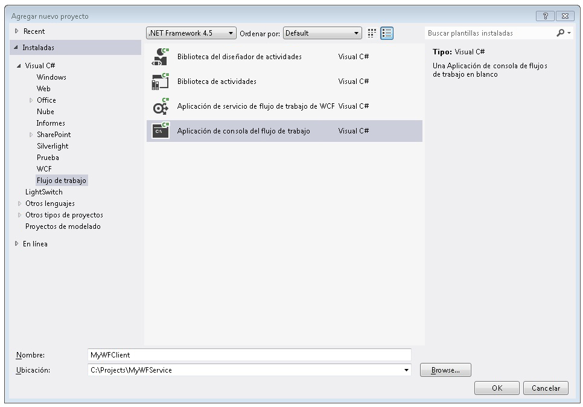

# Cómo: Tener acceso a un servicio desde una aplicación de flujo de trabajo
En este tema, se describe cómo llamar a un servicio de flujo de trabajo desde una aplicación de consola de flujo de trabajo. Depende de la finalización de la [Cómo: crear un servicio de flujo de trabajo con actividades de mensajería](../../../../docs/framework/wcf/feature-details/how-to-create-a-workflow-service-with-messaging-activities.md) tema. Aunque este tema describe cómo llamar a un servicio de flujo de trabajo desde una aplicación de flujo de trabajo, los mismos métodos pueden usarse para llamar a cualquier servicio de Windows Communication Foundation (WCF) desde una aplicación de flujo de trabajo.  
  
### Creación de un proyecto de aplicación de consola de flujo de trabajo  
  
1.  Inicie [!INCLUDE[vs_current_long](../../../../includes/vs-current-long-md.md)].  
  
2.  Cargar el proyecto MyWFService que creó en el [Cómo: crear un servicio de flujo de trabajo con actividades de mensajería](../../../../docs/framework/wcf/feature-details/how-to-create-a-workflow-service-with-messaging-activities.md) tema.  
  
3.  Haga clic con el **MyWFService** solución en el **el Explorador de soluciones** y seleccione **agregar**, **nuevo proyecto**. Seleccione **flujo de trabajo** en el **plantillas instaladas** y **aplicación de consola de flujos de trabajo** de la lista de tipos de proyecto. Denomine el MyWFClient del proyecto y use la ubicación predeterminada tal y como se muestra en la siguiente ilustración.  
  
       
  
     Haga clic en el **Aceptar** botón para descartar la **cuadro de diálogo Agregar nuevo proyecto**.  
  
4.  Una vez creado el proyecto, el archivo Workflow1.xaml se abre en el diseñador. Haga clic en el **cuadro de herramientas** ficha para abrir el cuadro de herramientas, si no está ya abierto y haga clic en el PIN para mantener abierta la ventana de cuadro de herramientas.  
  
5.  Presione Ctrl + F5 para compilar y ejecutar el servicio. Como antes, se inicia el servidor de desarrollo de ASP.NET e Internet Explorer muestra la página de ayuda de WCF. Observe el URI de esta página, ya que deberá usarlo en el paso siguiente.  
  
       
  
6.  Haga clic con el **MyWFClient** del proyecto en el **el Explorador de soluciones** y seleccione **Agregar referencia de servicio**. Haga clic en el **Discover** botón para buscar la solución actual para cualquier servicio. Haga clic en el triángulo situado junto a Service1.xamlx en la lista de servicios. Haga clic en el triángulo situado junto a Service1 para hacer una lista de los contratos implementados por el servicio Service1. Expanda el **Service1** nodo en el **servicios** lista. La operación de eco se muestra en el **Operations** lista tal como se muestra en la siguiente ilustración.  
  
       
  
     Mantener el espacio de nombres predeterminado y haga clic en **Aceptar** para descartar la **Agregar referencia de servicio** cuadro de diálogo. Se muestra el siguiente cuadro de diálogo.  
  
       
  
     Haga clic en **Aceptar** para descartar el cuadro de diálogo. Después, presione CTRL+MAYÚS+B para compilar la solución. Observe que en el cuadro de herramientas se ha agregado una nueva sección denominada **MyWFClient.ServiceReference1.Activities**. Expanda esta sección y observe la actividad de eco agregada como se muestra en la siguiente ilustración.  
  
       
  
7.  Arrastre y coloque una <!--zz <xref:System.ServiceModel.Activities.Sequence>--> `System.ServiceModel.Activities.Sequence` actividad en la superficie del diseñador. Está bajo la **flujo de Control** sección del cuadro de herramientas.  
  
8.  Con el <!--zz <xref:System.ServiceModel.Activities.Sequence>--> `System.ServiceModel.Activities.Sequence` actividad en el foco, haga clic en el **Variables** vincular y agregue una variable de cadena denominada `inString`. Asigne a la variable un valor predeterminado de `"Hello, world"` , así como una variable de cadena denominada `outString` tal como se muestra en el diagrama siguiente.  
  
       
  
9. Arrastre y coloque una **Echo** actividad en el <!--zz <xref:System.ServiceModel.Activities.Sequence>--> `System.ServiceModel.Activities.Sequence`. En la ventana Propiedades, enlace el `inMsg` argumento pasado a la `inString` variable y la `outMsg` argumento pasado a la `outString` variable tal y como se muestra en la siguiente ilustración. Esto pasa el valor de la variable `inString` a la operación y, a continuación, toma el valor devuelto y lo coloca en la variable `outString`.  
  
       
  
10. Arrastre y coloque una **WriteLine** actividad debajo la **Echo** actividad para mostrar la cadena devuelta por la llamada al servicio. El **WriteLine** actividad se encuentra en la **primitivas** nodo en el cuadro de herramientas. Enlazar el **texto** argumento de la **WriteLine** actividad para la `outString` variable escribiendo `outString` en el cuadro de texto de la **WriteLine** actividad. El flujo de trabajo debería tener el mismo aspecto que la siguiente ilustración.  
  
       
  
11. Haga clic en la solución MyWFService y seleccione **Establecer proyectos de inicio...** . Seleccione el **proyectos de inicio múltiples** botón de radio y seleccione **iniciar** para cada proyecto en el **acción** columna tal y como se muestra en la siguiente ilustración.  
  
       
  
12. Presione Ctrl + F5 para iniciar el servicio y el cliente. El servidor de desarrollo de ASP.NET hospeda el servicio, Internet Explorer muestra la página de ayuda WCF y la aplicación de flujo de trabajo de cliente se inicia en una ventana de consola y muestra la cadena devuelta del servicio ("Hello, world").  
  
## Vea también  
 [Servicios de flujo de trabajo](../../../../docs/framework/wcf/feature-details/workflow-services.md)  
 [Creación de un servicio de flujo de trabajo con actividades de mensajería](../../../../docs/framework/wcf/feature-details/how-to-create-a-workflow-service-with-messaging-activities.md)  
 [Utilizar un servicio WCF desde un flujo de trabajo en un proyecto Web](http://go.microsoft.com/fwlink/?LinkId=207725)
