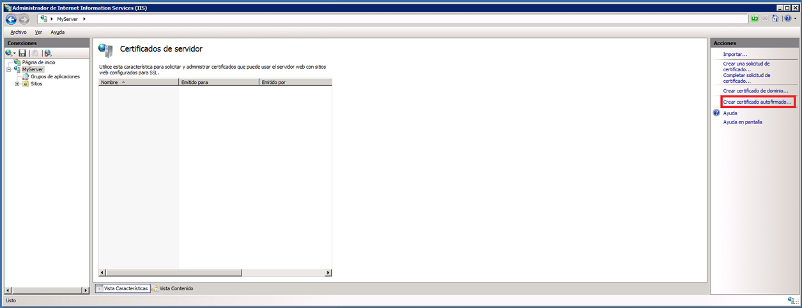
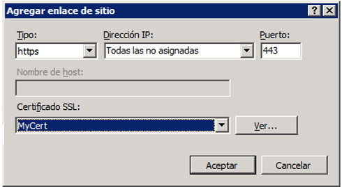

# <a name="how-to-configure-an-iis-hosted-wcf-service-with-ssl"></a>Configurar un servicio WCF hospedado en IIS con SSL
En este tema se describe cómo configurar un servicio de WCF hospedado en IIS para usar la seguridad de transporte HTTP. La seguridad de transporte HTTP necesita registrar un certificado SSL con IIS. Si no tiene un certificado SSL puede usar IIS para generar un certificado de prueba. Después debe agregar un enlace SSL al sitio web y configurar las propiedades de autenticación del sitio web. Finalmente se debe configurar el servicio de WCF para usar HTTPS.  
  
### <a name="creating-a-self-signed-certificate"></a>Crear un certificado autofirmado  
  
1.  Abra el Administrador de Internet Information Services (inetmgr.exe) y seleccione el nombre de equipo en la vista de árbol izquierda. En la parte derecha de la pantalla, seleccione Certificados de servidor  
  
       
  
2.  En la ventana de certificados de servidor, haga clic en el **crear certificado autofirmado...** Vínculo.  
  
       
  
3.  Escriba un nombre descriptivo para el certificado autofirmado y haga clic en **Aceptar**.  
  
       
  
     Ahora se muestran los detalles del certificado autofirmado recién creado en el **certificados de servidor** ventana.  
  
       
  
     El certificado generado se instala en el almacén de entidades de certificación raíz de confianza.  
  
### <a name="add-ssl-binding"></a>Agregar enlace SSL  
  
1.  Todavía en el Administrador de Internet Information Services, expanda el **sitios** carpeta y, a continuación, el **sitio Web predeterminado** carpeta en la vista de árbol en el lado izquierdo de la pantalla.  
  
2.  Haga clic en el **enlaces...** Vínculo de la **acciones** sección en la parte superior derecha de la ventana.  
  
       
  
3.  En la ventana enlaces de sitio, haga clic en el **agregar** botón.  
  
       
  
4.  En el **Agregar enlace de sitio** cuadro de diálogo, seleccione https para el tipo y el nombre descriptivo del certificado autofirmado que acaba de crear.  
  
       
  
### <a name="configure-virtual-directory-for-ssl"></a>Configurar el directorio virtual para SSL  
  
1.  En el Administrador de Internet Information Services, seleccione el directorio virtual que contiene el servicio seguro de WCF.  
  
2.  En el panel central de la ventana, seleccione **configuración de SSL** en la sección IIS.  
  
       
  
3.  En el panel de configuración de SSL, seleccione la **requerir SSL** casilla de verificación y haga clic en el **aplicar** vincular en el **acciones** sección en el lado derecho de la pantalla.  
  
       
  
### <a name="configure-wcf-service-for-http-transport-security"></a>Configurar el servicio WCF para la seguridad de transporte HTTP  
  
1.  En el archivo web.config del servicio de WCF, configure el enlace HTTP para usar seguridad de transporte como se muestra en el siguiente código XML.  
  
    ```xml  
    <bindings>  
          <basicHttpBinding>  
            <binding name="secureHttpBinding">  
              <security mode="Transport">  
                <transport clientCredentialType="None"/>  
              </security>  
            </binding>  
          </basicHttpBinding>  
    </bindings>  
    ```  
  
2.  Especifique el servicio y el punto de conexión del servicio tal y como se muestra en el siguiente código XML.  
  
    ```xml  
    <services>  
          <service name="MySecureWCFService.Service1">  
            <endpoint address=""  
                      binding="basicHttpBinding"  
                      bindingConfiguration="secureHttpBinding"  
                      contract="MySecureWCFService.IService1"/>  
  
            <endpoint address="mex"  
                      binding="mexHttpsBinding"  
                      contract="IMetadataExchange" />  
          </service>  
    </services>  
    ```  
  
## <a name="example"></a>Ejemplo  
 A continuación se muestra un ejemplo completo de un archivo web.config para un servicio de WCF mediante la seguridad de transporte HTTP  
  
```xml  
<?xml version="1.0"?>  
<configuration>  
  
  <system.web>  
    <compilation debug="true" targetFramework="4.0" />  
  </system.web>  
  <system.serviceModel>  
    <services>  
      <service name="MySecureWCFService.Service1">  
        <endpoint address=""  
                  binding="basicHttpBinding"  
                  bindingConfiguration="secureHttpBinding"  
                  contract="MySecureWCFService.IService1"/>  
  
        <endpoint address="mex"  
                  binding="mexHttpsBinding"  
                  contract="IMetadataExchange" />  
      </service>  
    </services>  
    <bindings>  
      <basicHttpBinding>  
        <binding name="secureHttpBinding">  
          <security mode="Transport">  
            <transport clientCredentialType="None"/>  
          </security>  
        </binding>  
      </basicHttpBinding>  
    </bindings>  
    <behaviors>  
      <serviceBehaviors>  
        <behavior>  
          <!-- To avoid disclosing metadata information, set the value below to false and remove the metadata endpoint above before deployment -->  
          <serviceMetadata httpsGetEnabled="true"/>  
          <!-- To receive exception details in faults for debugging purposes, set the value below to true.  Set to false before deployment to avoid disclosing exception information -->  
          <serviceDebug includeExceptionDetailInFaults="false"/>  
        </behavior>  
      </serviceBehaviors>  
    </behaviors>  
    <serviceHostingEnvironment multipleSiteBindingsEnabled="true" />  
  </system.serviceModel>  
  <system.webServer>  
    <modules runAllManagedModulesForAllRequests="true"/>  
  </system.webServer>  
  
</configuration>  
```  
  
## <a name="see-also"></a>Vea también  
 [Hospedaje en Internet Information Services](../../../../docs/framework/wcf/feature-details/hosting-in-internet-information-services.md)  
 [Instrucciones de hospedaje de Internet Information Services](../../../../docs/framework/wcf/samples/internet-information-service-hosting-instructions.md)  
 [Procedimientos recomendados de hospedaje de Internet Information Services](../../../../docs/framework/wcf/feature-details/internet-information-services-hosting-best-practices.md)  
 [Hospedaje de IIS mediante código en línea](../../../../docs/framework/wcf/samples/iis-hosting-using-inline-code.md)
