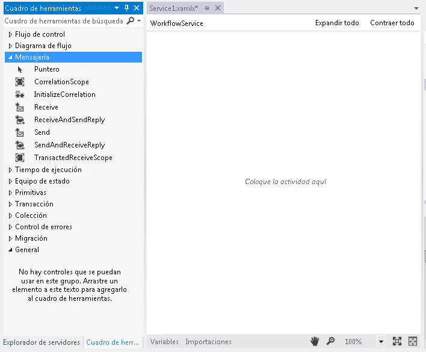
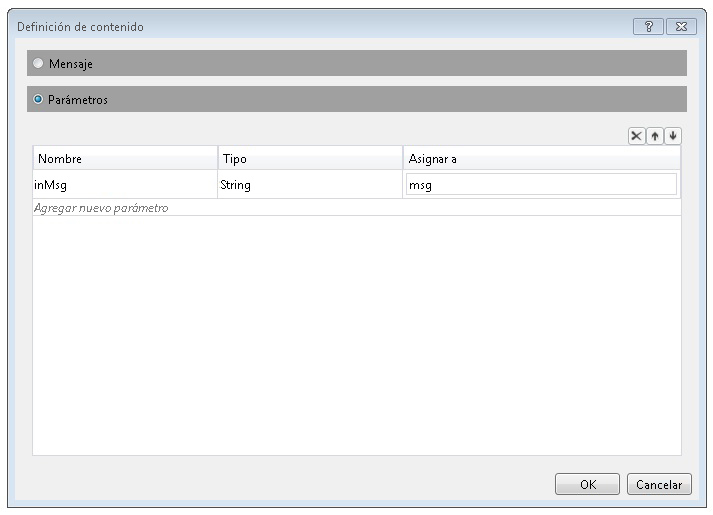

# Procedimiento Crear un servicio de flujo de trabajo con actividades de mensajería
En este tema, se describe cómo crear un servicio de flujo de trabajo simple mediante actividades de mensajería. Este tema se centra en los sistemas de creación de un servicio de flujo de trabajo compuesto solo por actividades de mensajería. En un servicio real, el flujo de trabajo contiene muchas otras actividades. El servicio implementa una operación denominada Eco, que toma una cadena y la devuelve al autor de la llamada. Este tema es el primero en una serie de dos temas. El siguiente tema [How To: Obtener acceso a un servicio desde un flujo de trabajo de aplicación](../../../../docs/framework/wcf/feature-details/how-to-access-a-service-from-a-workflow-application.md) describe cómo crear una aplicación de flujo de trabajo que se puede llamar al servicio creado en este tema.  
  
### Para crear un proyecto de servicio de flujo de trabajo  
  
1.  Start Visual Studio 2012.  
  
2.  Haga clic en el **archivo** menú, seleccione **New**y, a continuación, **proyecto** para mostrar el **cuadro de diálogo nuevo proyecto**. Seleccione **flujo de trabajo** en la lista de plantillas instaladas y **aplicación de servicio de flujo de trabajo de WCF** en la lista de tipos de proyecto. Denomine el proyecto `MyWFService` y usar la ubicación predeterminada como se muestra en la siguiente ilustración.  
  
     Haga clic en el **Aceptar** botón para descartar el **cuadro de diálogo nuevo proyecto**.  
  
3.  Cuando se crea el proyecto, el archivo Service1.xamlx se abre en el diseñador tal y como se muestra en la siguiente ilustración.  
  
       
  
     Haga clic en la actividad etiquetada como **servicio secuencial** y seleccione **eliminar**.  
  
### Para implementar el servicio de flujo de trabajo  
  
1.  Seleccione el **cuadro de herramientas** ficha en el lado izquierdo de la pantalla para mostrar el cuadro de herramientas y haga clic en la chincheta para mantener abierta la ventana. Expanda el **mensajería** sección del cuadro de herramientas para mostrar las actividades de mensajería y las plantillas de actividad de mensajería, tal como se muestra en la siguiente ilustración.  
  
       
  
2.  Arrastre y coloque un **ReceiveAndSendReply** plantilla en el Diseñador de flujo de trabajo. Esto crea un <xref:System.Activities.Statements.Sequence> actividad con un **recepción** actividad seguido por un <xref:System.ServiceModel.Activities.SendReply> actividad tal como se muestra en la siguiente ilustración.  
  
       
  
     Tenga en cuenta que la propiedad <xref:System.ServiceModel.Activities.SendReply> de la actividad <xref:System.ServiceModel.Activities.SendReply.Request%2A> está establecida en `Receive`, el nombre de la actividad <xref:System.ServiceModel.Activities.Receive> a la que responde la actividad <xref:System.ServiceModel.Activities.SendReply>.  
  
3.  En el <xref:System.ServiceModel.Activities.Receive> tipo de actividad `Echo` en el cuadro de texto denominado **OperationName**. Esto define el nombre de la operación que implementa el servicio.  
  
       
  
4.  Con el <xref:System.ServiceModel.Activities.Receive> actividad seleccionada, abra la ventana Propiedades si no está abierto, haga clic en el **vista** menú y seleccionando **ventana propiedades**. En el **ventana propiedades** desplácese hacia abajo hasta que vea **CanCreateInstance** y haga clic en la casilla de verificación, tal como se muestra en la siguiente ilustración. Esta opción permite que el host de servicio de flujo de trabajo cree una nueva instancia del servicio, si es necesario, cuando se recibe un mensaje.  
  
       
  
5.  Seleccione el <xref:System.Activities.Statements.Sequence> actividad y haga clic en el **Variables** botón en la esquina inferior izquierda del diseñador. Esto muestra el editor de variables. Haga clic en el **crear Variable** vínculo para agregar una variable para almacenar la cadena enviada a la operación. Nombre de la variable `msg` y establezca su **Variable** escriba en cadena, como se muestra en la siguiente ilustración.  
  
       
  
     Haga clic en el **Variables** botón otra vez para cerrar el editor de variables.  
  
6.  Haga clic en el **definir...** vínculo de la **contenido** cuadro de texto en el <xref:System.ServiceModel.Activities.Receive> actividad para mostrar el **definición de contenido** cuadro de diálogo. Seleccione el **parámetros** botón de radio, haga clic en el **Agregar nuevo parámetro** vincular, escriba `inMsg` en el **nombre** cuadro de texto, seleccione **cadena**en el **tipo** desplegable en el cuadro de lista y escriba `msg` en el **asignar a** cuadro de texto, como se muestra en la siguiente ilustración.  
  
       
  
     Esto especifica que la actividad de recepción recibe el parámetro de cadena y que los datos se enlazan a la variable `msg`. Haga clic en **Aceptar** para cerrar el **definición de contenido** cuadro de diálogo.  
  
7.  Haga clic en el **definir...**  vincular en el **contenido** cuadro el <xref:System.ServiceModel.Activities.SendReply> actividad para mostrar el **definición de contenido** cuadro de diálogo. Seleccione el **parámetros** botón de radio, haga clic en el **Agregar nuevo parámetro** vincular, escriba `outMsg` en el **nombre** cuadro de texto, seleccione **cadena**en el **tipo** cuadro de lista desplegable, y `msg` en el **valor** cuadro de texto, como se muestra en la siguiente ilustración.  
  
       
  
     Esto especifica que la actividad <xref:System.ServiceModel.Activities.SendReply> envía un mensaje o un tipo de contrato de mensaje y esos datos están enlazados a la variable `msg`. Dado que ésta es una actividad <xref:System.ServiceModel.Activities.SendReply>, esto significa que los datos de `msg` se usan para rellenar el mensaje que la actividad devuelve al cliente. Haga clic en **Aceptar** para cerrar el **definición de contenido** cuadro de diálogo.  
  
8.  Guarde y compile la solución haciendo clic en el **compilar** menú y seleccionando **compilar solución**.  
  
## Configuración del proyecto de servicio de flujo de trabajo  
 El servicio del flujo de trabajo ha finalizado. En esta sección, se explica cómo configurar la solución de servicio de flujo de trabajo para facilitar el hospedaje y la ejecución. Esta solución usa el servidor de desarrollo de ASP.NET para hospedar el servicio.  
  
#### Para establecer opciones de inicio de proyecto  
  
1.  En el **el Explorador de soluciones**, haga clic en **MyWFService** y seleccione **propiedades** para mostrar el **las propiedades del proyecto** cuadro de diálogo.  
  
2.  Seleccione el **Web** pestaña y seleccione **página específica** en **acción de inicio** y escriba `Service1.xamlx` en el cuadro de texto, como se muestra en la siguiente ilustración.  
  
       
  
     Esto hospeda el servicio definido en Service1.xamlx en el servidor de desarrollo de ASP.NET.  
  
3.  Presione Ctrl + F5 para iniciar el servicio. El icono del servidor de desarrollo de ASP.NET se muestra en el lado inferior derecho del escritorio, tal y como se muestra en la siguiente imagen.  
  
       
  
     Además, Internet Explorer muestra la página de ayuda del servicio WCF para el servicio.  
  
       
  
4.  Continúe con el [Cómo: Obtener acceso a un servicio desde un flujo de trabajo de aplicación](../../../../docs/framework/wcf/feature-details/how-to-access-a-service-from-a-workflow-application.md) tema para crear un cliente de flujo de trabajo que llama a este servicio.  
  
## Vea también
- [Servicios de flujo de trabajo](../../../../docs/framework/wcf/feature-details/workflow-services.md)
- [Hospedaje de información general de servicios de flujo de trabajo](../../../../docs/framework/wcf/feature-details/hosting-workflow-services-overview.md)
- [Actividades de mensajería](../../../../docs/framework/wcf/feature-details/messaging-activities.md)
