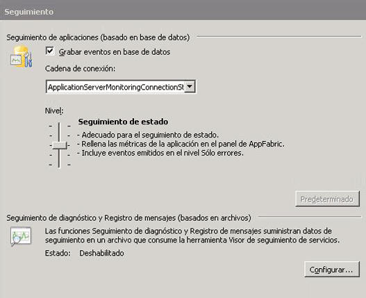
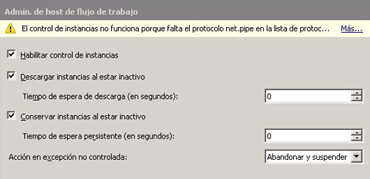
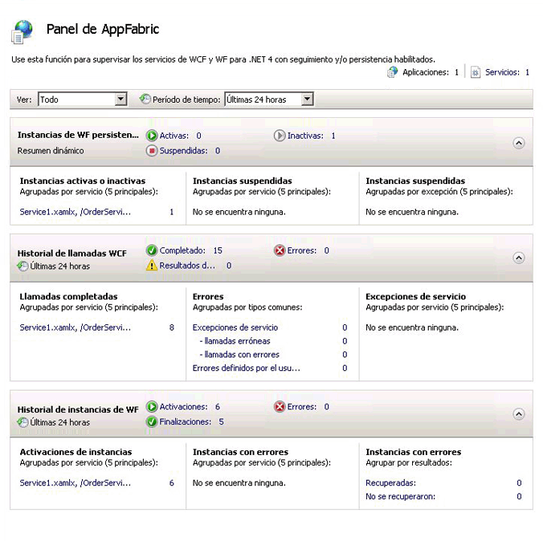

# C&#243;mo: Hospedar un servicio de flujo de trabajo con Windows Server App Fabric
Hospedar servicios de flujo de trabajo en App Fabric es parecido al hospedaje en IIS\/WAS.Las herramientas que proporciona App Fabric para implementar, supervisar y administrar los servicios de flujo de trabajo son la única diferencia.En este tema se usa el servicio de flujo de trabajo creado en el tema [Crear un servicio de flujo de trabajo de larga ejecución](../../../../docs/framework/wcf/feature-details/creating-a-long-running-workflow-service.md),que le guiará por el proceso de creación de un servicio de flujo de trabajo.En este tema se explicará cómo hospedar el servicio de flujo de trabajo usando App Fabric.[!INCLUDE[crabout](../../../../includes/crabout-md.md)] Windows Server App Fabric, vea la [Documentación de Windows Server AppFabric](http://go.microsoft.com/fwlink/?LinkID=193037&clcid=0x409).Antes de completar los pasos siguientes asegúrese de que tiene instalado Windows Server App Fabric.Para ello, abra Internet Information Services \(inetmgr.exe\), haga clic en el nombre del servidor en la vista **Conexiones**, haga clic en Sitios y en **Sitio web predeterminado**.A la derecha de la pantalla debe ver una sección denominada **App Fabric**.Si no ve esta sección \(estará en la parte superior del panel derecho\), no tiene App Fabric instalado.[!INCLUDE[crabout](../../../../includes/crabout-md.md)] cómo instalar Windows Server App Fabric, vea [Instalación de Windows Server App Fabric](http://go.microsoft.com/fwlink/?LinkId=193136).  
  
### Crear un servicio de flujo de trabajo simple  
  
1.  Abra [!INCLUDE[vs_current_long](../../../../includes/vs-current-long-md.md)] y cargue la solución OrderProcessing creada en el tema [Crear un servicio de flujo de trabajo de larga ejecución](../../../../docs/framework/wcf/feature-details/creating-a-long-running-workflow-service.md).  
  
2.  Haga clic con el botón secundario en el proyecto **OrderService**, seleccione **Propiedades** y, a continuación, la pestaña **Web**.  
  
3.  En la sección **Acción de inicio** de la página de propiedades, seleccione **Página específica** y escriba Service1.xamlx en el cuadro de edición.  
  
4.  En la sección **Servidores** de la página de propiedades, seleccione **Usar servidor web de IIS local** y escriba la siguiente dirección URL: `http://localhost/OrderService`.  
  
5.  Haga clic en el botón **Crear directorio virtual**.De esta forma, se creará un nuevo directorio virtual y se configurará el proyecto para copiar los archivos necesarios en el directorio virtual cuando se compile el proyecto.O bien, podría copiar manualmente los archivos .xamlx y web.config, así como las DLL necesarias en el directorio virtual.  
  
### Configurar un servicio de flujo de trabajo hospedado en Windows Server App Fabric  
  
1.  Abra el Administrador de Internet Information Services \(inetmgr.exe\).  
  
2.  Navegue al directorio virtual OrderService del panel **Conexiones**.  
  
3.  Haga clic con el botón secundario en OrderService y seleccione **Administrar servicios de WCF y WF**, **Configurar**.Se muestra el cuadro de diálogo **Configurar WCF y WF para la aplicación**.  
  
4.  Seleccione la pestaña **General** para mostrar información general sobre la aplicación como se muestra en la siguiente captura de pantalla.  
  
       
  
5.  Seleccione la pestaña **Supervisión**.Se muestran diversas configuraciones de supervisión como se ve en la siguiente captura de pantalla.  
  
       
  
     [!INCLUDE[crabout](../../../../includes/crabout-md.md)] cómo configurar la supervisión del servicio de flujo de trabajo en App Fabric, vea [Configuración del seguimiento](http://go.microsoft.com/fwlink/?LinkId=193153).  
  
6.  Seleccione la pestaña **Persistencia de flujo de trabajo**.De esta forma, puede configurar la aplicación para usar el proveedor de persistencia predeterminado de App Fabric como se muestra en la siguiente captura de pantalla.  
  
       
  
     [!INCLUDE[crabout](../../../../includes/crabout-md.md)] cómo configurar la persistencia del flujo de trabajo en Windows Server App Fabric, vea [Configuración de la persistencia de flujo de trabajo](http://go.microsoft.com/fwlink/?LinkId=193148).  
  
7.  Seleccione la pestaña **Administración de host de flujo de trabajo**.De esta forma, puede especificar cuándo se deben descargar y conservar las instancias de servicio de flujo de trabajo inactivas como se muestra en la siguiente captura de pantalla.  
  
       
  
     [!INCLUDE[crabout](../../../../includes/crabout-md.md)] la configuración de la administración de host de flujo de trabajo, vea [Configuración de la administración de host de flujo de trabajo en AppFabric](http://go.microsoft.com/fwlink/?LinkId=193151).  
  
8.  Seleccione la pestaña **Inicio automático**.De esta forma, puede especificar la configuración de inicio automático para los servicios de flujo de trabajo como se muestra en la siguiente captura de pantalla.  
  
       
  
     [!INCLUDE[crabout](../../../../includes/crabout-md.md)] cómo configurar Inicio automático, vea [Configuración del inicio automático con App Fabric](http://go.microsoft.com/fwlink/?LinkId=193150).  
  
9. Seleccione la pestaña **Límite**.De esta forma, puede especificar la configuración de límite para el servicio de flujo de trabajo como se muestra en la siguiente captura de pantalla.  
  
       
  
     [!INCLUDE[crabout](../../../../includes/crabout-md.md)] cómo configurar el límite, vea [Configuración de limitación de peticiones con App Fabric](http://go.microsoft.com/fwlink/?LinkId=193149).  
  
10. Seleccione la pestaña **Seguridad**.De esta forma, puede especificar la configuración de seguridad para la aplicación como se muestra en la siguiente captura de pantalla.  
  
       
  
     [!INCLUDE[crabout](../../../../includes/crabout-md.md)] cómo configurar la seguridad con Windows Server App Fabric, vea [Configuración de la seguridad con App Fabric](http://go.microsoft.com/fwlink/?LinkId=193152).  
  
### Usar Windows Server App Fabric  
  
1.  Compile la solución para copiar los archivos necesarios en el directorio virtual.  
  
2.  Haga clic con el botón secundario en el proyecto OrderClient y seleccione **Depurar**, **Iniciar nueva instancia** para iniciar la aplicación cliente.  
  
3.  El cliente se ejecutará y Visual Studio mostrará un cuadro de diálogo **Adjuntar advertencia de seguridad**, haga clic en el botón **No adjuntar**.De esta forma, se indica a Visual Studio que no se adjunte al proceso IIS para la depuración.  
  
4.  La aplicación cliente inmediatamente llamará al servicio de flujo de trabajo y, a continuación, esperará.El servicio de flujo de trabajo se quedará inactivo y se conservará.Puede comprobarlo si inicia Internet Information Services \(inetmgr.exe\), navega a OrderService en el panel Conexiones y lo selecciona.A continuación, haga clic en el icono Panel de AppFabric del panel derecho.En Instancias de WF persistentes verá que hay una instancia del servicio de flujo de trabajo persistente como se muestra en la siguiente captura de pantalla.  
  
       
  
     El **Historial de instancias de WF** muestra información sobre el servicio de flujo de trabajo, por ejemplo, el número activaciones de servicio de flujo de trabajo, el número de instancias de servicio de flujo de trabajo completadas y el número de instancias de flujo de trabajo con errores.En instancias Activas o Inactivas aparecerá un vínculo, si se hace clic en él, se mostrará más información sobre las instancias del flujo de trabajo inactivas como se muestra en la siguiente captura de pantalla.  
  
       
  
     Para obtener más información sobre las características de Windows Server App Fabric y sobre su uso, vea [Características de hospedaje de Windows Server AppFabric](http://go.microsoft.com/fwlink/?LinkID=193143&clcid=0x409).  
  
## Vea también  
 [Crear un servicio de flujo de trabajo de larga ejecución](../../../../docs/framework/wcf/feature-details/creating-a-long-running-workflow-service.md)   
 [Características de hospedaje de Windows Server App Fabric](http://go.microsoft.com/fwlink/?LinkId=193143)   
 [Instalación de Windows Server AppFabric](http://go.microsoft.com/fwlink/?LinkId=193136)   
 [Documentación de Windows Server App Fabric](http://go.microsoft.com/fwlink/?LinkID=193037&clcid=0x409)