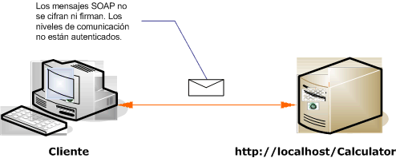

# Cliente y servicio de Internet no protegidos
La ilustración siguiente muestra un ejemplo de un cliente y servicio público, no seguro [!INCLUDE[indigo1](../../../../includes/indigo1-md.md)].  
  
   
  
|Característica|Descripción|  
|--------------------|-----------------|  
|Modo de seguridad|Ninguno|  
|Transporte|HTTP|  
|Enlaces|<xref:System.ServiceModel.BasicHttpBinding> en código o el elemento [\<basicHttpBinding\>](../../../../docs/framework/configure-apps/file-schema/wcf/basichttpbinding.md) en configuración.|  
|Interoperabilidad|Con clientes de servicios Web existentes y servicios|  
|Autenticación|None|  
|Integridad|None|  
|Confidencialidad|None|  
  
## Servicio  
 El código y la configuración siguientes están diseñados para ejecutarse de forma independiente.Siga uno de los procedimientos siguientes:  
  
-   Cree un servicio independiente mediante el código sin configuración.  
  
-   Cree un servicio con la configuración proporcionada, pero sin definir ningún extremo.  
  
### Código  
 El siguiente código muestra cómo crear extremo sin seguridad.De forma predeterminada, <xref:System.ServiceModel.BasicHttpBinding> tiene el modo de seguridad establecido en <xref:System.ServiceModel.BasicHttpSecurityMode>.  
  
 [!code-csharp[C_UnsecuredService#1](../../../../samples/snippets/csharp/VS_Snippets_CFX/c_unsecuredservice/cs/source.cs#1)]
 [!code-vb[C_UnsecuredService#1](../../../../samples/snippets/visualbasic/VS_Snippets_CFX/c_unsecuredservice/vb/source.vb#1)]  
  
### Configuración del servicio  
 El código siguiente configura el mismo extremo mediante la configuración.  
  
```  
<?xml version="1.0" encoding="utf-8"?>  
<configuration>  
  <system.serviceModel>  
    <behaviors />  
    <services>  
      <service behaviorConfiguration="" name="ServiceModel.Calculator">  
        <endpoint address="http://localhost/Calculator"   
                  binding="basicHttpBinding"  
                  bindingConfiguration="Basic_Unsecured"   
                  name="BasicHttp_ICalculator"  
                  contract="ServiceModel.ICalculator" />  
      </service>  
    </services>  
    <bindings>  
      <basicHttpBinding>  
        <binding name="Basic_Unsecured" />  
      </basicHttpBinding>  
    </bindings>  
    <client />  
  </system.serviceModel>  
</configuration>  
```  
  
## Cliente  
 El código y la configuración siguientes están diseñados para ejecutarse de manera independiente.Realice uno de los procedimientos siguientes:  
  
-   Cree un cliente independiente mediante el código \(y el código de cliente\).  
  
-   Cree un cliente que no defina direcciones de extremo.En su lugar, utilice el constructor de cliente que adopta el nombre de configuración como un argumento.Por ejemplo:  
  
     [!code-csharp[C_SecurityScenarios#0](../../../../samples/snippets/csharp/VS_Snippets_CFX/c_securityscenarios/cs/source.cs#0)]
     [!code-vb[C_SecurityScenarios#0](../../../../samples/snippets/visualbasic/VS_Snippets_CFX/c_securityscenarios/vb/source.vb#0)]  
  
### Código  
 El código siguiente muestra un cliente [!INCLUDE[indigo2](../../../../includes/indigo2-md.md)] básico que tiene acceso a un extremo no seguro.  
  
 [!code-csharp[C_UnsecuredClient#1](../../../../samples/snippets/csharp/VS_Snippets_CFX/c_unsecuredclient/cs/source.cs#1)]
 [!code-vb[C_UnsecuredClient#1](../../../../samples/snippets/visualbasic/VS_Snippets_CFX/c_unsecuredclient/vb/source.vb#1)]  
  
### Configuración del cliente  
 El siguiente código configura el cliente.  
  
```  
<?xml version="1.0" encoding="utf-8"?>  
<configuration>  
  <system.serviceModel>  
    <bindings>  
      <basicHttpBinding>  
        <binding name="BasicHttpBinding_ICalculator" >  
          <security mode="None">  
          </security>  
        </binding>  
      </basicHttpBinding>  
    </bindings>  
    <client>  
      <endpoint address="http://localhost/Calculator/Unsecured"  
          binding="basicHttpBinding"   
          bindingConfiguration="BasicHttpBinding_ICalculator"  
          contract="ICalculator"   
          name="BasicHttpBinding_ICalculator" />  
    </client>  
  </system.serviceModel>  
</configuration>  
```  
  
## Vea también  
 [Escenarios de seguridad comunes](../../../../docs/framework/wcf/feature-details/common-security-scenarios.md)   
 [Información general sobre seguridad](../../../../docs/framework/wcf/feature-details/security-overview.md)   
 [Modelo de seguridad para Windows Server App Fabric](http://go.microsoft.com/fwlink/?LinkID=201279&clcid=0x409)