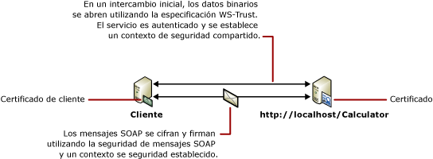

# Seguridad de mensajes con un cliente de certificado
El escenario siguiente muestra un servicio y cliente [!INCLUDE[indigo1](../../../../includes/indigo1-md.md)] protegidos utilizando el modo de seguridad de mensajes.Tanto el cliente como el servicio se autentican con certificados.[!INCLUDE[crdefault](../../../../includes/crdefault-md.md)][Seguridad distribuida de aplicaciones](../../../../docs/framework/wcf/feature-details/distributed-application-security.md).  
  
 Para obtener una aplicación de ejemplo, vea [Certificado de seguridad de mensaje](../../../../docs/framework/wcf/samples/message-security-certificate.md).  
  
   
  
|Característica|Descripción|  
|--------------------|-----------------|  
|Modo de seguridad|Mensaje|  
|Interoperabilidad|Solo [!INCLUDE[indigo2](../../../../includes/indigo2-md.md)]|  
|Autenticación \(servidor\)|Con el certificado del servicio|  
|Autenticación \(cliente\)|Con el certificado del cliente|  
|Integridad|Sí|  
|Confidencialidad|Sí|  
|Transporte|HTTP|  
|Enlaces|<xref:System.ServiceModel.WSHttpBinding>|  
  
## Servicio  
 El código y la configuración siguientes están diseñados para ejecutarse de forma independiente.Siga uno de los procedimientos siguientes:  
  
-   Cree un servicio independiente mediante el código sin configuración.  
  
-   Cree un servicio con la configuración proporcionada, pero sin definir ningún extremo.  
  
### Código  
 El código siguiente muestra cómo crear un extremo de servicio que utilice la seguridad del mensaje para establecer un contexto seguro.  
  
 [!code-csharp[C_SecurityScenarios#10](../../../../samples/snippets/csharp/VS_Snippets_CFX/c_securityscenarios/cs/source.cs#10)]
 [!code-vb[C_SecurityScenarios#10](../../../../samples/snippets/visualbasic/VS_Snippets_CFX/c_securityscenarios/vb/source.vb#10)]  
  
### Configuración  
 En lugar del código, se puede utilizar la siguiente configuración.  
  
```  
<?xml version="1.0" encoding="utf-8"?>  
<configuration>  
  <system.serviceModel>  
    <behaviors>  
      <serviceBehaviors>  
        <behavior name="ServiceCredentialsBehavior">  
          <serviceCredentials>  
            <serviceCertificate findValue="Contoso.com"  
                                x509FindType="FindBySubjectName" />  
          </serviceCredentials>  
        </behavior>  
      </serviceBehaviors>  
    </behaviors>  
    <services>  
      <service behaviorConfiguration="ServiceCredentialsBehavior"   
               name="ServiceModel.Calculator">  
        <endpoint address="http://localhost/Calculator"   
                  binding="wsHttpBinding"  
                  bindingConfiguration="MessageAndCerficiateClient"   
                  name="SecuredByClientCertificate"  
                  contract="ServiceModel.ICalculator" />  
      </service>  
    </services>  
    <bindings>  
      <wsHttpBinding>  
        <binding name="WSHttpBinding_ICalculator">  
          <security mode="Message">  
            <message clientCredentialType="Certificate" />  
          </security>  
        </binding>  
      </wsHttpBinding>  
    </bindings>  
    <client />  
  </system.serviceModel>  
</configuration>  
```  
  
## Cliente  
 El código y la configuración siguientes están diseñados para ejecutarse de manera independiente.Realice uno de los procedimientos siguientes:  
  
-   Cree un cliente independiente mediante el código \(y el código de cliente\).  
  
-   Cree un cliente que no defina direcciones de extremo.En su lugar, utilice el constructor de cliente que adopta el nombre de configuración como un argumento.Por ejemplo:  
  
     [!code-csharp[C_SecurityScenarios#0](../../../../samples/snippets/csharp/VS_Snippets_CFX/c_securityscenarios/cs/source.cs#0)]
     [!code-vb[C_SecurityScenarios#0](../../../../samples/snippets/visualbasic/VS_Snippets_CFX/c_securityscenarios/vb/source.vb#0)]  
  
### Código  
 El siguiente código crea el cliente.El enlace es para la seguridad del modo de mensaje y el tipo de credencial de cliente está establecido en `Certificate`.  
  
 [!code-csharp[C_SecurityScenarios#17](../../../../samples/snippets/csharp/VS_Snippets_CFX/c_securityscenarios/cs/source.cs#17)]
 [!code-vb[C_SecurityScenarios#17](../../../../samples/snippets/visualbasic/VS_Snippets_CFX/c_securityscenarios/vb/source.vb#17)]  
  
### Configuración  
 La configuración siguiente especifica el certificado de cliente mediante un comportamiento del extremo.Para obtener más información sobre los certificados, vea [Trabajar con certificados](../../../../docs/framework/wcf/feature-details/working-with-certificates.md).El código también usa un elemento \<`identity`\> para especificar un Sistema de nombres de dominio \(DNS\) de la identidad del servidor esperada.[!INCLUDE[crabout](../../../../includes/crabout-md.md)] la identidad, consulte [Identidad del servicio y autenticación](../../../../docs/framework/wcf/feature-details/service-identity-and-authentication.md).  
  
```  
<?xml version="1.0" encoding="utf-8"?>  
<configuration>  
  <system.serviceModel>  
    <behaviors>  
      <endpointBehaviors>  
        <behavior name="endpointCredentialsBehavior">  
          <clientCredentials>  
            <clientCertificate findValue="Cohowinery.com"   
               storeLocation="LocalMachine"  
              x509FindType="FindBySubjectName" />  
          </clientCredentials>  
        </behavior>  
      </endpointBehaviors>  
    </behaviors>  
    <bindings>  
      <wsHttpBinding>  
        <binding name="WSHttpBinding_ICalculator" >  
          <security mode="Message">  
            <message clientCredentialType="Certificate" />  
          </security>  
        </binding>  
      </wsHttpBinding>  
    </bindings>  
    <client>  
      <endpoint address="http://machineName/Calculator"   
                behaviorConfiguration="endpointCredentialsBehavior"  
                binding="wsHttpBinding"  
                bindingConfiguration="WSHttpBinding_ICalculator"  
                contract="ICalculator"  
                name="WSHttpBinding_ICalculator">  
        <identity>  
          <dns value="Contoso.com" />  
        </identity>  
      </endpoint>  
    </client>  
  </system.serviceModel>  
</configuration>  
```  
  
## Vea también  
 [Información general sobre seguridad](../../../../docs/framework/wcf/feature-details/security-overview.md)   
 [Identidad del servicio y autenticación](../../../../docs/framework/wcf/feature-details/service-identity-and-authentication.md)   
 [Trabajar con certificados](../../../../docs/framework/wcf/feature-details/working-with-certificates.md)   
 [Modelo de seguridad para Windows Server App Fabric](http://go.microsoft.com/fwlink/?LinkID=201279&clcid=0x409)