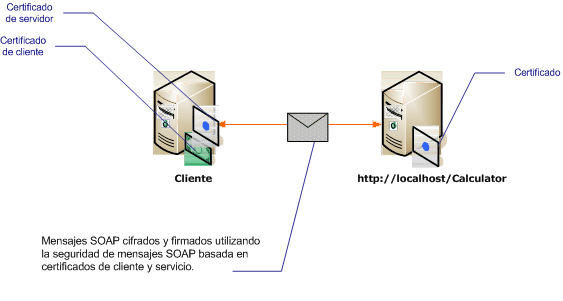

# <a name="message-security-with-mutual-certificates"></a>Seguridad de mensajes con certificados mutuos
El escenario siguiente muestra un servicio de Windows Communication Foundation (WCF) y el cliente protegido utilizando el modo de seguridad de mensajes. El cliente y el servicio se autentican con certificados.  
  
 Este escenario es interoperable porque utiliza WS-Security con el perfil de token de certificado X.509.  
  
> [!NOTE]
>  Este escenario no realiza negociación del certificado del servicio. El certificado del servicio debe ser proporcionado de antemano al cliente de cualquier comunicación. El certificado de servidor se puede distribuir con la aplicación o puede ser proporcionado en una comunicación fuera de banda.  
  
   
  
|Característica|Descripción|  
|--------------------|-----------------|  
|Modo de seguridad|Mensaje|  
|Interoperabilidad|Sí, clientes y servicios compatibles con WS-Security y el perfil de token de certificado X.509.|  
|Autenticación|Autenticación mutua del servidor y el cliente.|  
|Integridad|Sí|  
|Confidencialidad|Sí|  
|Transporte|HTTP|  
|Enlaces|<xref:System.ServiceModel.WSHttpBinding>|  
  
## <a name="service"></a>Servicio  
 El código y la configuración siguientes están diseñados para ejecutarse de forma independiente. Realice una de las siguientes acciones:  
  
-   Cree un servicio independiente mediante el código sin configuración.  
  
-   Cree un servicio mediante la configuración proporcionada, pero sin definir ningún extremo.  
  
### <a name="code"></a>Código  
 El código siguiente muestra cómo crear un extremo de servicio que utilice la seguridad del mensaje. El servicio exige a un certificado que se autentique.  
  
 [!code-csharp[C_SecurityScenarios#13](../../../../samples/snippets/csharp/VS_Snippets_CFX/c_securityscenarios/cs/source.cs#13)]
 [!code-vb[C_SecurityScenarios#13](../../../../samples/snippets/visualbasic/VS_Snippets_CFX/c_securityscenarios/vb/source.vb#13)]  
  
### <a name="configuration"></a>Configuración  
 La configuración siguiente se puede utilizar en lugar del código para crear el mismo servicio.  
  
```xml  
<?xml version="1.0" encoding="utf-8"?>  
<configuration>  
  <system.serviceModel>  
    <behaviors>  
      <serviceBehaviors>  
        <behavior name="serviceCredentialBehavior">  
          <serviceCredentials>  
            <serviceCertificate findValue="Contoso.com"   
                                storeLocation="LocalMachine"  
                                storeName="My"   
                                x509FindType="FindBySubjectName" />  
          </serviceCredentials>  
        </behavior>  
      </serviceBehaviors>  
    </behaviors>  
    <services>  
      <service behaviorConfiguration="serviceCredentialBehavior"   
               name="ServiceModel.Calculator">  
        <endpoint address="http://localhost/Calculator"   
                  binding="wsHttpBinding"  
                  bindingConfiguration="InteropCertificateBinding"  
                  name="WSHttpBinding_ICalculator"  
                  contract="ServiceModel.ICalculator" />  
      </service>  
    </services>  
    <bindings>  
      <wsHttpBinding>  
        <binding name="InteropCertificateBinding">  
          <security mode="Message">  
            <message clientCredentialType="Certificate"  
                     negotiateServiceCredential="false"  
                     establishSecurityContext="false" />  
          </security>  
        </binding>  
      </wsHttpBinding>  
    </bindings>  
    <client />  
  </system.serviceModel>  
</configuration>  
```  
  
## <a name="client"></a>Cliente  
 El código y la configuración siguientes están diseñados para ejecutarse de forma independiente. Realice una de las siguientes acciones:  
  
-   Cree un cliente independiente mediante el código (y el código de cliente).  
  
-   Cree un cliente que no defina direcciones de extremo. En su lugar, utilice el constructor de cliente que adopta el nombre de configuración como un argumento. Por ejemplo:  
  
     [!code-csharp[C_SecurityScenarios#0](../../../../samples/snippets/csharp/VS_Snippets_CFX/c_securityscenarios/cs/source.cs#0)]
     [!code-vb[C_SecurityScenarios#0](../../../../samples/snippets/visualbasic/VS_Snippets_CFX/c_securityscenarios/vb/source.vb#0)]  
  
### <a name="code"></a>Código  
 El siguiente código crea el cliente. El modo de seguridad se establece en mensaje, y el tipo de credencial de cliente se establece en certificado.  
  
 [!code-csharp[C_SecurityScenarios#20](../../../../samples/snippets/csharp/VS_Snippets_CFX/c_securityscenarios/cs/source.cs#20)]
 [!code-vb[C_SecurityScenarios#20](../../../../samples/snippets/visualbasic/VS_Snippets_CFX/c_securityscenarios/vb/source.vb#20)]  
  
### <a name="configuration"></a>Configuración  
 Lo siguiente configura el cliente. Se debe especificar un certificado de cliente mediante el [ \<clientCertificate >](../../../../docs/framework/configure-apps/file-schema/wcf/clientcertificate-of-clientcredentials-element.md). Además, el certificado del servicio se especifica utilizando el [ \<defaultCertificate >](../../../../docs/framework/configure-apps/file-schema/wcf/defaultcertificate-element.md).  
  
```xml  
<?xml version="1.0" encoding="utf-8"?>  
<configuration>  
  <system.serviceModel>  
    <behaviors>  
      <endpointBehaviors>  
        <behavior name="ClientCredentialsBehavior">  
          <clientCredentials>  
            <clientCertificate findValue="Cohowinery.com"   
                 storeLocation="CurrentUser"  
                 storeName="My"  
                 x509FindType="FindBySubjectName" />  
            <serviceCertificate>  
              <defaultCertificate findValue="Contoso.com"   
                                  storeLocation="CurrentUser"  
                                  storeName="TrustedPeople"  
                                  x509FindType="FindBySubjectName" />  
            </serviceCertificate>  
          </clientCredentials>  
        </behavior>  
      </endpointBehaviors>  
    </behaviors>  
    <bindings>  
      <wsHttpBinding>  
        <binding name="WSHttpBinding_ICalculator" >  
          <security mode="Message">  
            <message clientCredentialType="Certificate"   
                     negotiateServiceCredential="false"  
                     establishSecurityContext="false" />  
          </security>  
        </binding>  
      </wsHttpBinding>  
    </bindings>  
    <client>  
      <endpoint address="http://machineName/Calculator"   
                behaviorConfiguration="ClientCredentialsBehavior"  
                binding="wsHttpBinding"   
                bindingConfiguration="WSHttpBinding_ICalculator"  
                contract="ICalculator"  
                name="WSHttpBinding_ICalculator">  
        <identity>  
          <certificate encodedValue="Encoded_Value_Not_Shown" />  
        </identity>  
      </endpoint>  
    </client>  
  </system.serviceModel>  
</configuration>  
```  
  
## <a name="see-also"></a>Vea también  
 [Información general sobre seguridad](../../../../docs/framework/wcf/feature-details/security-overview.md)  
 [Modelo de seguridad de Windows Server AppFabric](https://go.microsoft.com/fwlink/?LinkID=201279&clcid=0x409)  
 [Cómo: crear e instalar certificados temporales en WCF para la seguridad de transporte durante el desarrollo](https://go.microsoft.com/fwlink/?LinkId=244264)
