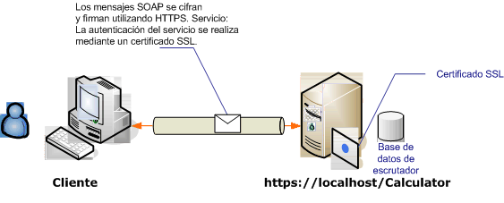

# Seguridad del transporte con clientes an&#243;nimos
Este escenario de [!INCLUDE[indigo1](../../../../includes/indigo1-md.md)] utiliza la seguridad del transporte \(HTTPS\) para garantizar la confidencialidad y la integridad.El servidor debe autenticarse con un certificado de Capa de sockets seguros \(SSL\) y los clientes deben confiar en el certificado del servidor.Ningún mecanismo autentica el cliente y es, por lo tanto, anónimo.  
  
 Para obtener una aplicación de ejemplo, consulte [Seguridad de transporte WS](../../../../docs/framework/wcf/samples/ws-transport-security.md).[!INCLUDE[crabout](../../../../includes/crabout-md.md)] la seguridad del transporte, vea [Información general de la seguridad del transporte](../../../../docs/framework/wcf/feature-details/transport-security-overview.md).  
  
 [!INCLUDE[crabout](../../../../includes/crabout-md.md)] cómo usar un certificado con un servicio, vea [Trabajar con certificados](../../../../docs/framework/wcf/feature-details/working-with-certificates.md) y [Cómo: Configurar un puerto con un certificado SSL](../../../../docs/framework/wcf/feature-details/how-to-configure-a-port-with-an-ssl-certificate.md).  
  
   
  
|Característica|Descripción|  
|--------------------|-----------------|  
|Modo de seguridad|Transporte|  
|Interoperabilidad|Con servicios y clientes Web existentes|  
|Autenticación \(servidor\)<br /><br /> Autenticación \(cliente\)|Sí<br /><br /> Nivel de aplicación \(no se admite [!INCLUDE[indigo2](../../../../includes/indigo2-md.md)]\)|  
|Integridad|Sí|  
|Confidencialidad|Sí|  
|Transport|HTTPS|  
|Enlaces|<xref:System.ServiceModel.WsHttpBinding>|  
  
## Servicio  
 El código y la configuración siguientes están diseñados para ejecutarse de forma independiente.Siga uno de los procedimientos siguientes:  
  
-   Cree un servicio independiente mediante el código sin configuración.  
  
-   Cree un servicio con la configuración proporcionada, pero sin definir ningún extremo.  
  
### Código  
 El código siguiente muestra cómo crear un extremo mediante la seguridad del transporte:  
  
 [!code-csharp[c_SecurityScenarios#5](../../../../samples/snippets/csharp/VS_Snippets_CFX/c_securityscenarios/cs/source.cs#5)]
 [!code-vb[c_SecurityScenarios#5](../../../../samples/snippets/visualbasic/VS_Snippets_CFX/c_securityscenarios/vb/source.vb#5)]  
  
### Configuración  
 El código siguiente configura el mismo extremo mediante la configuración.Ningún mecanismo autentica el cliente y es, por lo tanto, anónimo.  
  
```  
<?xml version="1.0" encoding="utf-8"?>  
<configuration>  
  <system.serviceModel>  
    <services>  
      <service name="ServiceModel.Calculator">  
        <endpoint address="http://localhost/Calculator"   
                  binding="wsHttpBinding"  
                  bindingConfiguration="WSHttpBinding_ICalculator"   
                  name="SecuredByTransportEndpoint"  
                  contract="ServiceModel.ICalculator" />  
      </service>  
    </services>  
    <bindings>  
      <wsHttpBinding>  
        <binding name="WSHttpBinding_ICalculator">  
          <security mode="Transport">  
            <transport clientCredentialType="None" />  
          </security>  
        </binding>  
      </wsHttpBinding>  
    </bindings>  
    <client />  
  </system.serviceModel>  
</configuration>  
```  
  
## Cliente  
 El código y la configuración siguientes están diseñados para ejecutarse de manera independiente.Realice uno de los procedimientos siguientes:  
  
-   Cree un cliente independiente mediante el código \(y el código de cliente\).  
  
-   Cree un cliente que no defina direcciones de extremo.En su lugar, utilice el constructor de cliente que adopta el nombre de configuración como un argumento.Por ejemplo:  
  
     [!code-csharp[C_SecurityScenarios#0](../../../../samples/snippets/csharp/VS_Snippets_CFX/c_securityscenarios/cs/source.cs#0)]
     [!code-vb[C_SecurityScenarios#0](../../../../samples/snippets/visualbasic/VS_Snippets_CFX/c_securityscenarios/vb/source.vb#0)]  
  
### Código  
 [!code-csharp[c_SecurityScenarios#6](../../../../samples/snippets/csharp/VS_Snippets_CFX/c_securityscenarios/cs/source.cs#6)]
 [!code-vb[c_SecurityScenarios#6](../../../../samples/snippets/visualbasic/VS_Snippets_CFX/c_securityscenarios/vb/source.vb#6)]  
  
### Configuración  
 Se puede usar la configuración siguiente en lugar del código para configurar el servicio.  
  
```  
<configuration>  
  <system.serviceModel>  
    <bindings>  
      <wsHttpBinding>  
        <binding name="WSHttpBinding_ICalculator" >  
          <security mode="Transport">  
            <transport clientCredentialType="None" />  
          </security>  
        </binding>  
      </wsHttpBinding>  
    </bindings>  
    <client>  
      <endpoint address="https://machineName/Calculator"   
                binding="wsHttpBinding"  
                bindingConfiguration="WSHttpBinding_ICalculator"   
                contract="ICalculator"  
                name="WSHttpBinding_ICalculator" />  
    </client>  
  </system.serviceModel>  
</configuration>  
```  
  
## Vea también  
 [Información general sobre seguridad](../../../../docs/framework/wcf/feature-details/security-overview.md)   
 [Seguridad de transporte WS](../../../../docs/framework/wcf/samples/ws-transport-security.md)   
 [Información general de la seguridad del transporte](../../../../docs/framework/wcf/feature-details/transport-security-overview.md)   
 [Modelo de seguridad para Windows Server App Fabric](http://go.microsoft.com/fwlink/?LinkID=201279&clcid=0x409)