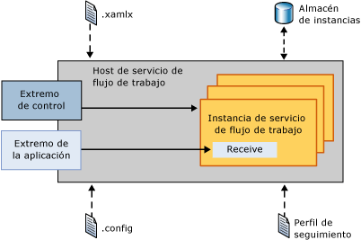
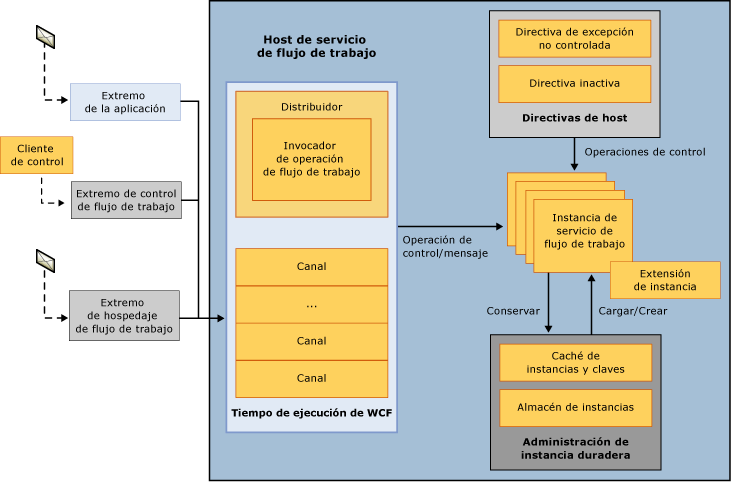

# Información interna de extensiones del host de servicio de flujo de trabajo
La clase <xref:System.ServiceModel.WorkflowServiceHost> proporciona un host para los servicios de flujo de trabajo. Es responsable de escuchar los mensajes entrantes y enrutarlos a la instancia del servicio de flujo de trabajo adecuada, controlar la descarga y persistencia de los flujos de trabajo inactivos, etc. En este tema se describe cómo procesa la clase WorkflowServiceHost los mensajes entrantes.  
  
## Información general de WorkflowServiceHost  
 La clase <xref:System.ServiceModel.WorkflowServiceHost> se usa para hospedar los servicios de flujo de trabajo. Escucha los mensajes entrantes y los enruta a la instancia de servicio adecuada. De esta forma, se crean nuevas instancias o se cargan instancias existentes desde un almacenamiento duradero según convenga.  En el siguiente diagrama se muestra el funcionamiento de la clase <xref:System.ServiceModel.WorkflowServiceHost> en un nivel alto.  
  
   
  
 Este diagrama muestra que la clase <xref:System.ServiceModel.WorkflowServiceHost> carga definiciones de servicio de flujo de trabajo desde archivos .xamlx e información de configuración a partir de un archivo de configuración. También carga la configuración de seguimiento del perfil de seguimiento. <xref:System.ServiceModel.WorkflowServiceHost> expone un extremo de control de flujo de trabajo que le permite enviar operaciones de control a instancias de flujo de trabajo.  Para obtener más información, consulte [extremo de Control de flujo de trabajo](../../../../docs/framework/wcf/feature-details/workflow-control-endpoint.md) y [ejemplo de extremo de administración de flujo de trabajo](../../../../docs/framework/windows-workflow-foundation/samples/workflow-management-endpoint-sample.md).  
  
 La clase <xref:System.ServiceModel.WorkflowServiceHost> también expone los extremos de la aplicación que escuchan los mensajes de aplicación entrantes. Cuando un mensaje entrante llega, se envía a la instancia de servicio de flujo de trabajo adecuada, si está cargada actualmente. Si es necesario se crea una nueva instancia de flujo de trabajo. O bien, si se ha conservado una instancia existente, se carga desde el almacén de persistencia.  
  
## Detalles de WorkflowServiceHost  
 En el siguiente diagrama se muestra cómo controla la clase <xref:System.ServiceModel.WorkflowServiceHost> los mensajes de forma un poco más detallada.  
  
   
  
 Este diagrama muestra tres puntos de conexión distintos: un punto de conexión de la aplicación, un punto de conexión de control de flujo de trabajo y un punto de conexión de hospedaje de flujo de trabajo. El extremo de aplicación recibe los mensajes que se enlazan para una instancia de flujo de trabajo específica. El extremo de control de instancia de flujo de trabajo escucha las operaciones de control. El extremo de hospedaje de flujo de control escucha mensajes que pueden provocar que la clase <xref:System.ServiceModel.WorkflowServiceHost> cargue y ejecute flujos de trabajo no pertenecientes al servicio. Como se muestra en el diagrama, se procesan todos los mensajes a través del tiempo de ejecución de WCF.  La limitación de instancia de servicio de flujo de trabajo se logra mediante el uso de la propiedad <xref:System.ServiceModel.Description.ServiceThrottlingBehavior.MaxConcurrentInstances%2A>. Esta propiedad limitará el número de instancias de servicio de flujo de trabajo simultáneas. Se pondrán en cola las solicitudes adicionales de nuevas instancias de servicio de flujo de trabajo o las solicitudes para activar instancias de flujo de trabajo persistentes cuando se supere este límite. Las solicitudes puestas en cola se procesan en el orden FIFO independientemente de si son para una nueva instancia o para un instancia persistente en ejecución. Se carga la información de directivas de host y se determina cómo se tratan las excepciones no controladas, cómo se descargan los servicios de flujo de trabajo inactivos y cómo se conservan. [!INCLUDE[crabout](../../../../includes/crabout-md.md)]Consulte estos temas [Cómo: configurar flujo de trabajo no controlada comportamiento de excepción con WorkflowServiceHost](../../../../docs/framework/wcf/feature-details/config-workflow-unhandled-exception-workflowservicehost.md) y [Cómo: configurar comportamiento inactivo con WorkflowServiceHost](../../../../docs/framework/wcf/feature-details/how-to-configure-idle-behavior-with-workflowservicehost.md). Las instancias de flujo de trabajo se conservan de acuerdo con las directivas de host y se recargan según convenga. Para obtener más información acerca de la persistencia de flujo de trabajo, consulte: [Cómo: configurar la persistencia con WorkflowServiceHost](../../../../docs/framework/wcf/feature-details/how-to-configure-persistence-with-workflowservicehost.md), [crear un servicio de flujo de trabajo de larga duración](../../../../docs/framework/wcf/feature-details/creating-a-long-running-workflow-service.md), y [persistencia de flujo de trabajo ](../../../../docs/framework/windows-workflow-foundation/workflow-persistence.md).  
  
 En la siguiente ilustración se muestra cómo se llama a WorkflowServiceHost.Open.  
  
   
  
 Se carga el flujo de trabajo desde XAML y se crea el árbol de actividad. <xref:System.ServiceModel.WorkflowServiceHost> recorre el árbol de actividad y crea la descripción del servicio. La configuración se aplica al host. Finalmente, el host empieza a escuchar los mensajes entrantes.  
  
 En la siguiente ilustración se muestra lo que hace la clase <xref:System.ServiceModel.WorkflowServiceHost> cuando recibe un mensaje enlazado para una actividad Receive con el valor de CanCreateInstance establecido en `true`.  
  
   
  
 El mensaje llega y lo procesa la pila del canal WCF. Se comprueban los límites y se ejecutan las consultas de correlación. Si el mensaje se enlaza para una instancia existente, el mensaje se entrega. Si se debe crear una nueva instancia, se comprueba la propiedad CanCreateInstance de la actividad Receive. Si su valor se establece en true, se crea una nueva instancia y se entrega el mensaje.  
  
 En la siguiente ilustración se muestra lo que hace la clase <xref:System.ServiceModel.WorkflowServiceHost> cuando recibe un mensaje enlazado para una actividad Receive con el valor de CanCreateInstance establecido en false.  
  
   
  
 El mensaje llega y lo procesa la pila del canal WCF. Se comprueban los límites y se ejecutan las consultas de correlación. El mensaje se enlaza para una instancia existente, puesto que el valor de CanCreateInstance es false, con el fin de que la instancia se cargue desde el almacén de persistencia, se reanude el marcador y se ejecute el flujo de trabajo.  
  
> [!WARNING]
>  Se producirá un error de apertura en el host de servicio de flujo de trabajo si se configura SQL Server para escuchar solo en el protocolo NamedPipe.  
  
## Vea también  
 [Servicios de flujo de trabajo](../../../../docs/framework/wcf/feature-details/workflow-services.md)  
 [Hospedaje de servicios de flujo de trabajo](../../../../docs/framework/wcf/feature-details/hosting-workflow-services.md)  
 [Punto de conexión de control de flujo de trabajo](../../../../docs/framework/wcf/feature-details/workflow-control-endpoint.md)  
 [Ejemplo de punto de conexión de administración de flujo de trabajo](../../../../docs/framework/windows-workflow-foundation/samples/workflow-management-endpoint-sample.md)  
 [Configuración del comportamiento de excepción no controlada del flujo de trabajo con WorkflowServiceHost](../../../../docs/framework/wcf/feature-details/config-workflow-unhandled-exception-workflowservicehost.md)  
 [Creación de un servicio de flujo de trabajo de larga ejecución](../../../../docs/framework/wcf/feature-details/creating-a-long-running-workflow-service.md)  
 [Persistencia del flujo de trabajo](../../../../docs/framework/windows-workflow-foundation/workflow-persistence.md)
