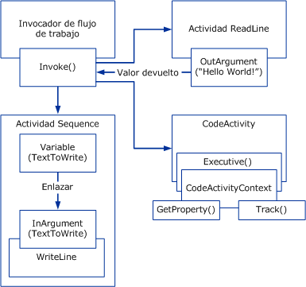

# Información general de Windows Workflow
Un flujo de trabajo es un conjunto de unidades elementales llamadas *actividades* que se almacenan como un modelo que describe un proceso real. Los flujos de trabajo proporcionan una manera de describir el orden de ejecución y las relaciones de dependencia entre las partes de trabajo de ejecución corta o prolongada. Este trabajo pasa a través del modelo desde el principio hasta al final y las actividades pueden ser ejecutadas por personas o por funciones de sistema.  
  
## Motor de tiempo de ejecución del flujo de trabajo  
 Las instancias de flujo de trabajo en ejecución se crean y se mantienen por medio de un motor de tiempo de ejecución en curso con el que el proceso de host interactúa a través de alguna de las clases siguientes:  
  
-   Una clase <xref:System.Activities.WorkflowInvoker>, que invoca el flujo de trabajo como si se tratara de un método.  
  
-   Una clase <xref:System.Activities.WorkflowApplication> para el control explícito de la ejecución de una única instancia de flujo de trabajo.  
  
-   Una clase <xref:System.ServiceModel.WorkflowServiceHost> para las interacciones basadas en mensajes en escenarios de varias instancias.  
  
 Cada una de estas clases ajusta el tiempo de ejecución de la actividad principal, representado como una clase <xref:System.Activities.ActivityInstance> responsable de la ejecución de la actividad. Puede haber varios objetos <xref:System.Activities.ActivityInstance> ejecutándose simultáneamente dentro de un dominio de aplicación.  
  
 Los tres objetos de interacción de host anteriores se crean a partir de un árbol de actividades al que se hace referencia como programa de flujo de trabajo. Con estos tipos o un host personalizado que se ajusta <xref:System.Activities.ActivityInstance>, flujos de trabajo se pueden ejecutar dentro de cualquier proceso de Windows, incluidas las aplicaciones de consola, aplicaciones basadas en formularios, servicios de Windows, [!INCLUDE[vstecasp](../../../includes/vstecasp-md.md)] sitios Web y Windows Communication Foundation () Servicios WCF).  
  
   
Componentes de flujo de trabajo del proceso de host  
  
## Interacción entre los componentes de flujo de trabajo  
 El siguiente diagrama muestra cómo los componentes de flujo de trabajo interactúan unos con otros.  
  
   
  
 En el diagrama anterior, el método <xref:System.Activities.WorkflowInvoker.Invoke%2A> de la clase <xref:System.Activities.WorkflowInvoker> se usa para invocar varias instancias de flujo de trabajo. <xref:System.Activities.WorkflowInvoker> se usa para los flujos de trabajo ligeros que no necesitan la administración desde el host; los flujos de trabajo que necesitan la administración desde el host (como la reanudación de <xref:System.Activities.Bookmark>) se deben ejecutar mediante <xref:System.Activities.WorkflowApplication.Run%2A> en su lugar. Antes de invocar una nueva instancia de flujo de trabajo no es necesario esperar a que se complete la instancia de flujo de trabajo en ejecución. El motor de tiempo de ejecución permite ejecutar varias instancias de flujo de trabajo simultáneamente.  Los flujos de trabajo invocados son los siguientes:  
  
-   Una actividad <xref:System.Activities.Statements.Sequence> que contiene una actividad secundaria <xref:System.Activities.Statements.WriteLine>. Una <xref:System.Activities.Variable> de la actividad primaria se enlaza a un <xref:System.Activities.InArgument> de la actividad secundaria. Para obtener más información acerca de las variables, argumentos y el enlace, consulte [Variables y argumentos](../../../docs/framework/windows-workflow-foundation/variables-and-arguments.md).  
  
-   Una actividad personalizada llamada `ReadLine`. Un argumento <xref:System.Activities.OutArgument> de la actividad `ReadLine` se devuelve al método <xref:System.Activities.WorkflowInvoker.Invoke%2A> de llamada.  
  
-   Una actividad personalizada que se deriva de la clase abstracta <xref:System.Activities.CodeActivity>. <xref:System.Activities.CodeActivity> puede tener acceso a características del tiempo de ejecución (como el seguimiento y las propiedades) usando el <xref:System.Activities.CodeActivityContext> que está disponible como parámetro del método <xref:System.Activities.CodeActivity.Execute%2A>. Para obtener más información acerca de estas características de tiempo de ejecución, consulte [seguimiento y traza del flujo de trabajo](../../../docs/framework/windows-workflow-foundation/workflow-tracking-and-tracing.md) y [las propiedades de ejecución de flujo de trabajo](../../../docs/framework/windows-workflow-foundation/workflow-execution-properties.md).  
  
## Vea también  
 [¿BizTalk Server 2006 o WF? Elegir la herramienta de flujo de trabajo adecuada para su proyecto](https://go.microsoft.com/fwlink/?LinkId=154901)
