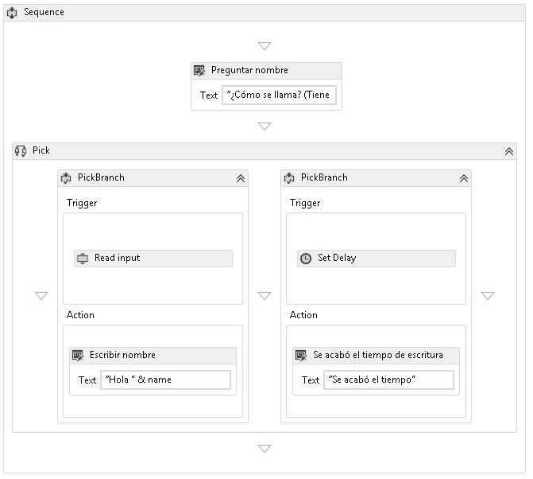

# <a name="pick-activity"></a>Actividad Pick
La actividad <xref:System.Activities.Statements.Pick> simplifica el modelado de un conjunto de desencadenadores de eventos seguido por sus controladores correspondientes.  Una actividad <xref:System.Activities.Statements.Pick> contiene una colección de actividades <xref:System.Activities.Statements.PickBranch>, donde cada <xref:System.Activities.Statements.PickBranch> es un emparejamiento entre las actividades <xref:System.Activities.Statements.PickBranch.Trigger%2A> y <xref:System.Activities.Statements.PickBranch.Action%2A>.  En el momento de la ejecución, los desencadenadores de todas las bifurcaciones se ejecutan en paralelo.  Cuando se completa un desencadenador, se ejecuta la acción correspondiente a continuación y se cancelan el resto de desencadenadores.  El comportamiento de la actividad [!INCLUDE[netfx_current_short](../../../includes/netfx-current-short-md.md)] de <xref:System.Activities.Statements.Pick> es similar a la actividad [!INCLUDE[netfx35_short](../../../includes/netfx35-short-md.md)] de <xref:System.Workflow.Activities.ListenActivity>.  
  
 La siguiente captura de pantalla del ejemplo de SDK [Uso de la actividad Pick](../../../docs/framework/windows-workflow-foundation/samples/using-the-pick-activity.md) muestra una actividad Pick con dos bifurcaciones.  Una bifurcación tiene un desencadenador denominado **Read input**, una actividad personalizada que lee la entrada de la línea de comandos. La segunda bifurcación tiene un desencadenador de actividad <xref:System.Activities.Statements.Delay>. Si el **Leer entrada** actividad recibe los datos antes de la <xref:System.Activities.Statements.Delay> finaliza la actividad, <xref:System.Activities.Statements.Delay> retraso se cancelará y se escribirá un saludo en la consola.  De lo contrario, si la actividad **Read input** no recibe los datos en el tiempo asignado, se cancelará y se escribirá un mensaje de tiempo de espera en la consola.  Se trata de un patrón común que se usa para agregar un tiempo de espera a una acción.  
  
   
  
## <a name="best-practices"></a>Procedimientos recomendados  
 Al usar Pick, la bifurcación que se ejecuta es la bifurcación cuyo desencadenador se completa primero.  Por definición, todos los desencadenadores se ejecutan en paralelo; de hecho, un desencadenador puede haber ejecutado la mayoría de la lógica antes de que se cancele al finalizar el otro desencadenador.  Con esta perspectiva, una instrucción general que seguir cuando se usa la actividad Pick es tratar el desencadenador como si representara un único evento y poner tan poca lógica como sea posible en él.  Lo ideal es que el desencadenador contenga la lógica suficiente para recibir un evento y que todo el procesamiento de ese evento debería ir a la acción de la bifurcación.  Este método minimiza la cantidad de superposición entre la ejecución de los desencadenadores.  Por ejemplo, considere un <xref:System.Activities.Statements.Pick> con dos desencadenadores, donde cada uno contiene una actividad <xref:System.ServiceModel.Activities.Receive> seguida por una lógica adicional.  Si la lógica adicional introduce un punto inactivo, existe la posibilidad de que ambas actividades <xref:System.ServiceModel.Activities.Receive> se completen correctamente.  Un desencadenador se completará totalmente, mientras que otro se completará parcialmente.  En algunos escenarios, el hecho de aceptar un mensaje y después completar parcialmente el procesamiento es inaceptable.  Por consiguiente, al usar actividades de mensajería integradas de WF como <xref:System.ServiceModel.Activities.Receive> y <xref:System.ServiceModel.Activities.SendReply>, mientras que <xref:System.ServiceModel.Activities.Receive> se usa normalmente en el desencadenador, <xref:System.ServiceModel.Activities.SendReply> y otra lógica deberían ponerse en acción siempre que sea posible.  
  
## <a name="using-the-pick-activity-in-the-designer"></a>Usar la actividad Pick en el diseñador  
 Para usar Pick en el diseñador, busque **Pick** y **PickBranch** en el cuadro de herramientas.  Arrastre y coloque **Pick** en el lienzo.  De forma predeterminada, una nueva actividad **Pick** en el diseñador contendrá dos bifurcaciones.  Para agregar bifurcaciones adicionales, arrastre la actividad **PickBranch** y colóquela junto a las bifurcaciones existentes. Las actividades se pueden colocar en la actividad **Pick** en el área **Trigger** o el área **Action** de cualquier **PickBranch**.  
  
## <a name="using-the-pick-activity-in-code"></a>Usar la actividad Pick en el código  
 La actividad <xref:System.Activities.Statements.Pick> se usa rellenando la colección de <xref:System.Activities.Statements.Pick.Branches%2A> con actividades <xref:System.Activities.Statements.PickBranch>. Cada una de las actividades <xref:System.Activities.Statements.PickBranch> tiene una propiedad <xref:System.Activities.Statements.PickBranch.Trigger%2A> de tipo <xref:System.Activities.Activity>. Cuando la actividad especificada ha terminado de ejecutarse, se ejecuta <xref:System.Activities.Statements.PickBranch.Action%2A>.  
  
 El siguiente ejemplo de código muestra cómo usar una actividad <xref:System.Activities.Statements.Pick> para implementar un tiempo de espera para una actividad que lee una línea de la consola.  
  
```csharp  
Sequence body = new Sequence()  
{  
    Variables = { name },  
    Activities =   
   {  
       new System.Activities.Statements.Pick  
        {  
           Branches =   
           {  
               new PickBranch  
               {  
                   Trigger = new ReadLine  
                   {  
                      Result = name,  
                      BookmarkName = "name"  
                   },  
                   Action = new WriteLine   
                   {   
                       Text = ExpressionServices.Convert<string>(ctx => "Hello " +   
                           name.Get(ctx))   
                   }  
               },  
               new PickBranch  
               {  
                   Trigger = new Delay  
                   {  
                      Duration = new TimeSpan(0, 0, 5)  
                   },  
                   Action = new WriteLine  
                   {  
                      Text = "Time is up."  
                   }  
               }  
           }  
       }  
   }  
};  
```  
  
```xaml  
<Sequence xmlns="http://schemas.microsoft.com/netfx/2009/xaml/activities" xmlns:x="http://schemas.microsoft.com/winfx/2006/xaml">  
  <Sequence.Variables>  
    <Variable x:TypeArguments="x:String" Name="username" />  
  </Sequence.Variables>  
  <Pick>  
    <PickBranch>  
      <PickBranch.Trigger>  
        <ReadLine BookmarkName="name" Result="username" />  
      </PickBranch.Trigger>  
      <WriteLine>[String.Concat("Hello ", username)]</WriteLine>  
    </PickBranch>  
    <PickBranch>  
      <PickBranch.Trigger>  
        <Delay>00:00:05</Delay>  
      </PickBranch.Trigger>  
      <WriteLine>Time is up.</WriteLine>  
    </PickBranch>  
  </Pick>  
</Sequence>  
```
