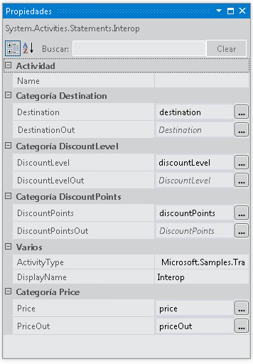

# Interoperabilidad con un conjunto de reglas 3.5
En este ejemplo se muestra el uso de la actividad <xref:System.Activities.Statements.Interop> para integrar con una actividad personalizada en [!INCLUDE[netfx35_short](../../../../includes/netfx35-short-md.md)] utilizando <xref:System.Workflow.Activities.Policy> y reglas.  Pasa los datos a la actividad personalizada enlazando las variables [!INCLUDE[netfx_current_long](../../../../includes/netfx-current-long-md.md)] a las propiedades de dependencia expuestas por la actividad personalizada.  
  
## Requisitos  
  
1.  [!INCLUDE[vs_current_long](../../../../includes/vs-current-long-md.md)]  
  
2.  [!INCLUDE[netfx_current_long](../../../../includes/netfx-current-long-md.md)]  
  
3.  [!INCLUDE[netfx35_long](../../../../includes/netfx35-long-md.md)]  
  
## Demostraciones  
 La actividad <xref:System.Activities.Statements.Interop>, la actividad <xref:System.Workflow.Activities.Policy> en [!INCLUDE[netfx35_short](../../../../includes/netfx35-short-md.md)] con propiedades de dependencia  
  
## Explicación  
 En el ejemplo se muestra uno de los escenarios de integración para integrar con una actividad de [!INCLUDE[netfx35_short](../../../../includes/netfx35-short-md.md)].  En este ejemplo se incluye una actividad personalizada de [!INCLUDE[netfx35_short](../../../../includes/netfx35-short-md.md)] que invoca una actividad <xref:System.Workflow.Activities.Policy>.  
  
## TravelRuleLibrary  
 Al abrir TravelRuleSet.cs en el diseñador, se muestra una actividad secuencial personalizada que contiene una actividad Policy de la siguiente forma  
  
   
  
 Haga doble clic en la actividad de directiva **DiscountPolicy** para examinar las reglas.  Aparece el editor de reglas para mostrar las reglas.  
  
   
  
 Haga clic con el botón secundario en la actividad **DiscountPolicy** y seleccione la opción **Ver código** para examinar el código C\# lateral que va con esta actividad.  Observe el valor de propiedad de dependencia para `DiscountLevel`.  Es equivalente a un <xref:System.Activities.Argument> en [!INCLUDE[netfx_current_short](../../../../includes/netfx-current-short-md.md)].  
  
```  
public static DependencyProperty DiscountLevelProperty = DependencyProperty.Register("DiscountLevel", typeof(int), typeof(TravelRuleSet));  
  
[DescriptionAttribute("DiscountLevel")]  
[CategoryAttribute("DiscountLevel Category")]  
[BrowsableAttribute(true)]  
[DesignerSerializationVisibilityAttribute(DesignerSerializationVisibility.Visible)]  
public int DiscountLevel  
{  
   get  
   {  
return ((int)base.GetValue(TravelRuleSet.DiscountLevelProperty)));  
   }  
   set  
   {  
base.SetValue(TravelRuleSet.DiscountLevelProperty, value);  
   }  
}  
```  
  
## InteropWith35RuleSet  
 Es un proyecto de flujo de trabajo secuencial de [!INCLUDE[netfx_current_short](../../../../includes/netfx-current-short-md.md)] que utiliza la actividad <xref:System.Activities.Statements.Interop> para integrar con el conjunto de reglas personalizado creado en el proyecto TravelRuleLibrary.  Las variables se crean en el nivel superior de <xref:System.Activities.Statements.Sequence> como sigue.  
  
   
  
   
  
 Por último, la actividad <xref:System.Activities.Statements.Interop> se utiliza para integrar con TravelRuleSet.  Las variables que se declararon anteriormente en <xref:System.Activities.Statements.Sequence> se utilizan para enlazar a las propiedades de dependencia.  
  
   
  
   
  
   
  
> [!IMPORTANT]
>  Puede que los ejemplos ya estén instalados en su equipo.  Compruebe el siguiente directorio \(predeterminado\) antes de continuar.  
>   
>  `<InstallDrive>:\WF_WCF_Samples`  
>   
>  Si este directorio no existe, vaya a la página de [ejemplos de Windows Communication Foundation \(WCF\) y Windows Workflow Foundation \(WF\) para .NET Framework 4](http://go.microsoft.com/fwlink/?LinkId=150780) para descargar todos los ejemplos de [!INCLUDE[indigo1](../../../../includes/indigo1-md.md)] y [!INCLUDE[wf1](../../../../includes/wf1-md.md)].  Este ejemplo se encuentra en el siguiente directorio.  
>   
>  `<InstallDrive>:\WF_WCF_Samples\WF\Basic\Built-InActivities\InteropWith35RuleSet`