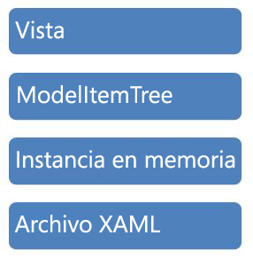

# Programar el &#225;rbol de elementos de modelo
En este ejemplo se muestra cómo navegar hasta el árbol <xref:System.Activities.Presentation.Model.ModelItem> utilizando el enlace de datos declarativo de la vista de árbol de [!INCLUDE[avalon1](../../../../includes/avalon1-md.md)].  
  
## Detalles del ejemplo  
 El árbol <xref:System.Activities.Presentation.Model.ModelItem> es la abstracción que usa la infraestructura de [!INCLUDE[wfd1](../../../../includes/wfd1-md.md)] para exponer los datos sobre la instancia subyacente que se está editando.La siguiente ilustración describe los diferentes niveles de infraestructura dentro de [!INCLUDE[wfd2](../../../../includes/wfd2-md.md)].  
  
   
  
 Un objeto <xref:System.Activities.Presentation.Model.ModelItem> consta de un puntero al valor subyacente, así como de una colección de objetos <xref:System.Activities.Presentation.Model.ModelProperty>.Un objeto <xref:System.Activities.Presentation.Model.ModelProperty> a su vez consta de datos como el nombre y tipo de la propiedad, y un puntero al valor que, a su vez, es otro objeto <xref:System.Activities.Presentation.Model.ModelItem>.Se utiliza un convertidor de valores para manipular algunos de los objetos <xref:System.Activities.Presentation.Model.ModelItem> que devuelve <xref:System.Activities.Presentation.Model.ModelProperty> para que aparezcan correctamente en la vista de árbol.A continuación, el ejemplo muestra cómo programar de manera imperativa en el árbol <xref:System.Activities.Presentation.Model.ModelItem> utilizando la sintaxis imperativa, tal y como se puede ver en el siguiente ejemplo.  
  
```csharp  
ModelItem mi = wd.Context.Services.GetService<ModelService>().Root;  
ModelProperty mp = mi.Properties["Activities"];  
mp.Collection.Add(new Persist());  
ModelItem justAdded = mp.Collection.Last();  
justAdded.Properties["DisplayName"].SetValue("new name");  
  
```  
  
#### Para utilizar este ejemplo  
  
1.  Abra la solución ProgrammingModelItemTree.sln en [!INCLUDE[vs2010](../../../../includes/vs2010-md.md)].  
  
2.  En el menú **Compilar**, seleccione **Compilar solución** para compilarla.  
  
3.  Presione F5 para ejecutar la aplicación.A continuación se muestra el formulario de [!INCLUDE[avalon2](../../../../includes/avalon2-md.md)].  
  
4.  Haga clic en el botón **Load WF** para cargar la actividad <xref:System.Activities.Presentation.Model.ModelItem> y enlazarla a la vista de árbol.  
  
5.  Al hacer clic en el botón **Change Model Item Tree**, se ejecuta el código anterior para agregar un elemento en el árbol y establecer una propiedad.  
  
> [!IMPORTANT]
>  Puede que los ejemplos ya estén instalados en su equipo.Compruebe el siguiente directorio \(predeterminado\) antes de continuar.  
>   
>  `<>InstallDrive:\WF_WCF_Samples`  
>   
>  Si no existe este directorio, vaya a la página de [ejemplos de Windows Communication Foundation \(WCF\) y Windows Workflow Foundation \(WF\) Samples para .NET Framework 4](http://go.microsoft.com/fwlink/?LinkId=150780) para descargar todos los ejemplos de [!INCLUDE[wf1](../../../../includes/wf1-md.md)] y [!INCLUDE[indigo1](../../../../includes/indigo1-md.md)].Este ejemplo se encuentra en el siguiente directorio.  
>   
>  `<unidadDeInstalación>:\WF_WCF_Samples\WF\Basic\Designer\ProgrammingModelItemTree`  
  
## Vea también  
 <xref:System.Windows.Data.IValueConverter>