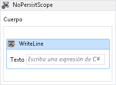
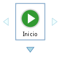
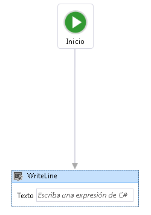
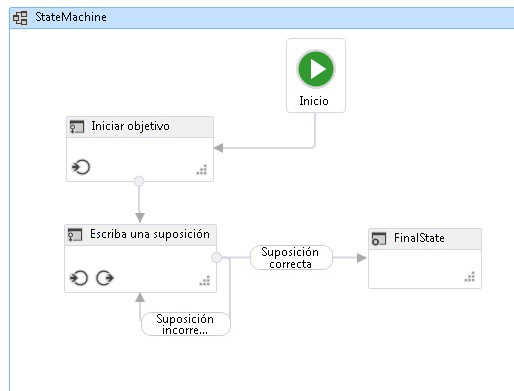

# <a name="what39s-new-in-windows-workflow-foundation-in-net-45"></a>¿Qué&#39;s de Windows Workflow Foundation en .NET Framework 4.5
Windows Workflow Foundation (WF) en [!INCLUDE[net_v45](../../../includes/net-v45-md.md)] presenta muchas características nuevas, como nuevas actividades, funciones de diseñador y modelos de desarrollo de flujo de trabajo. Aunque no todas, muchas de las nuevas características de flujo de trabajo presentadas en [!INCLUDE[net_v45](../../../includes/net-v45-md.md)] se admiten en el diseñador de flujo de trabajo que se ha vuelto a hospedar. Para obtener más información sobre las nuevas características que se admiten, consulte [compatibilidad con nuevas características de flujo de trabajo Foundation 4.5 en el Diseñador de flujo de trabajo Rehospedados](../../../docs/framework/windows-workflow-foundation/wf-features-in-the-rehosted-workflow-designer.md). Para obtener más información acerca de cómo migrar aplicaciones de flujo de trabajo de .NET 3.0 y 3.5 de .NET para usar la versión más reciente, consulte [Guía de migración](../../../docs/framework/windows-workflow-foundation/migration-guidance.md). Este tema proporciona información general de las nuevas características de flujo de trabajo presentadas en [!INCLUDE[net_v45](../../../includes/net-v45-md.md)].  
  
> [!WARNING]
>  Las nuevas características de Windows Workflow Foundation introducidas en [!INCLUDE[net_v45](../../../includes/net-v45-md.md)] no están disponibles para los proyectos que tienen como destino versiones anteriores de framework. Si un proyecto destinado a [!INCLUDE[net_v45](../../../includes/net-v45-md.md)] se reorienta a una versión anterior del marco de trabajo, puede que haya varios problemas.  
>   
>  -   Expresiones de C# se reemplazará en el diseñador con el mensaje **valor se estableció en XAML**.  
> -   Aparecerán muchos errores de compilación, incluido el siguiente.  
>   
>  **El formato de archivo no es compatible con .NET framework de destino actual. Para convertir el formato de archivo, guarde explícitamente el archivo. Este mensaje de error desaparecerá después de guardar el archivo y vuelva a abrir el diseñador.**  
  
##  <a name="BKMK_Versioning"></a> Control de versiones de flujo de trabajo  
 [!INCLUDE[net_v45](../../../includes/net-v45-md.md)] ha presentado nuevas características de control de versiones basadas en la nueva clase <xref:System.Activities.WorkflowIdentity>. <xref:System.Activities.WorkflowIdentity> proporciona a los autores de la aplicación de flujo de trabajo un mecanismo para asignar una instancia de flujo de trabajo persistente con su definición.  
  
-   Los desarrolladores que usen el hospedaje <xref:System.Activities.WorkflowApplication> pueden usar <xref:System.Activities.WorkflowIdentity> para habilitar el hospedaje de varias versiones de un flujo de trabajo en paralelo. Las instancias de flujo de trabajo persistentes se pueden cargar mediante la nueva clase <xref:System.Activities.WorkflowApplicationInstance> y el host puede usar <xref:System.Activities.WorkflowApplicationInstance.DefinitionIdentity%2A> para proporcionar la versión correcta de la definición de flujo de trabajo al crear instancias de <xref:System.Activities.WorkflowApplication>. Para obtener más información, consulte [utilizando WorkflowIdentity y control de versiones](../../../docs/framework/windows-workflow-foundation/using-workflowidentity-and-versioning.md) y [Cómo: Host varias versiones de un flujo de trabajo paralelo](../../../docs/framework/windows-workflow-foundation/how-to-host-multiple-versions-of-a-workflow-side-by-side.md).  
  
-   <xref:System.ServiceModel.WorkflowServiceHost> es ahora un host multiversión. Cuando se implementa una nueva versión de un servicio de flujo de trabajo, se crean nuevas instancias mediante el nuevo servicio, pero las instancias existentes se completan mediante la versión anterior. Para obtener más información, consulte [control de versiones en paralelo en WorkflowServiceHost](../../../docs/framework/wcf/feature-details/side-by-side-versioning-in-workflowservicehost.md).  
  
-   Se incluye la actualización dinámica que proporciona un mecanismo para actualizar la definición de una instancia de flujo de trabajo persistente. Para obtener más información, consulte [actualización dinámica](../../../docs/framework/windows-workflow-foundation/dynamic-update.md) y [Cómo: actualizar la definición de una instancia de flujo de trabajo ejecuta](../../../docs/framework/windows-workflow-foundation/how-to-update-the-definition-of-a-running-workflow-instance.md).  
  
-   Se proporciona un script de base de datos SqlWorkflowInstanceStoreSchemaUpgrade.sql para actualizar las bases de datos de persistencia creadas mediante los scripts de base de datos de [!INCLUDE[netfx40_short](../../../includes/netfx40-short-md.md)]. Este script actualiza las bases de datos de persistencia de [!INCLUDE[netfx40_short](../../../includes/netfx40-short-md.md)] para admitir las nuevas funciones de control de versiones presentadas en [!INCLUDE[net_v45](../../../includes/net-v45-md.md)]. Las instancias de flujo de trabajo persistentes en la base de datos reciben valores de control de versión predeterminados y pueden participar en ejecuciones en paralelo y en actualizaciones dinámicas. Para obtener más información, consulte [actualizar .NET Framework 4 persistencia bases de datos al control de versiones de flujo de trabajo de compatibilidad con](../../../docs/framework/windows-workflow-foundation/using-workflowidentity-and-versioning.md#UpdatingWF4PersistenceDatabases).  
  
##  <a name="BKMK_NewActivities"></a> Actividades  
 La biblioteca integrada de actividades contiene nuevas actividades y características para las actividades existentes.  
  
###  <a name="BKMK_NoPersistScope"></a> Ámbito de NoPersist  
 <xref:System.Activities.Statements.NoPersistScope> es una nueva actividad de contenedor que impide que un flujo de trabajo sea persistente cuando se están ejecutando actividades secundarias de NoPersistScope. Esto es útil en escenarios donde no es apropiado que el flujo de trabajo sea persistente, por ejemplo, cuando el flujo de trabajo está usando recursos específicos del equipo como identificadores de archivo o durante transacciones de base de datos. Anteriormente, para evitar la persistencia durante la ejecución de una actividad, era necesaria una <xref:System.Activities.NativeActivity> personalizada que usara un <xref:System.Activities.NoPersistHandle>.  
  
###  <a name="BKMK_NewFlowchartCapabilities"></a> Nuevas capacidades de diagrama de flujo  
 Se han actualizado los diagramas de flujo para [!INCLUDE[net_v45](../../../includes/net-v45-md.md)] y tienen las siguientes capacidades nuevas:  
  
-   Se puede editar la propiedad `DisplayName` de una actividad <xref:System.Activities.Statements.FlowSwitch%601> o <xref:System.Activities.Statements.FlowDecision>. Esto permitirá al diseñador de actividades mostrar más información sobre el propósito de la actividad.  
  
-   Los diagramas de flujo tienen una nueva propiedad denominada <xref:System.Activities.Statements.Flowchart.ValidateUnconnectedNodes%2A>; el valor predeterminado para esta propiedad es `False`. Si esta propiedad se establece en `True`, los nodos no conectados del diagrama de flujo generarán errores de validación.  
  
## <a name="support-for-partial-trust"></a>Compatibilidad con la confianza parcial  
 Los flujos de trabajo en [!INCLUDE[netfx40_long](../../../includes/netfx40-long-md.md)] requerían un dominio de aplicación de plena confianza. En [!INCLUDE[net_v45](../../../includes/net-v45-md.md)], los flujos de trabajo pueden funcionar en un entorno de confianza parcial. En un entorno de confianza parcial, los componentes de terceros se pueden usar sin garantizarles acceso completo a los recursos del host. A continuación, se presentan algunas cuestiones sobre la ejecución de flujos de trabajo en confianza parcial:  
  
1.  El uso de componentes heredados (incluidas las reglas) incluidos en la actividad <xref:System.Activities.Statements.Interop> no se admite en la confianza parcial.  
  
2.  No se admite la ejecución de flujos de trabajo en confianza parcial en <xref:System.ServiceModel.WorkflowServiceHost>.  
  
3.  La persistencia de excepciones en un escenario de confianza parcial constituye una amenaza de seguridad potencial. Para deshabilitar la persistencia de excepciones, se debe agregar una extensión de tipo <xref:System.Activities.ExceptionPersistenceExtension> al proyecto con el fin de descartar la persistencia de las excepciones. En el ejemplo de código siguiente, se muestra cómo implementar este tipo.  
  
    ```  
    public class ExceptionPersistenceExtension   
    {  
        public ExceptionPersistenceExtension()   
        {   
            this.PersistExceptions = false;   
        }   
        public bool PersistExceptions { get; set; }   
    }  
    ```  
  
     Si no se tienen que serializar excepciones, asegúrese de que se usan en un objeto <xref:System.Activities.Statements.NoPersistScope>.  
  
4.  Los autores de actividades deben invalidar <xref:System.Activities.Activity.CacheMetadata%2A> para que el runtime del flujo de trabajo ejecute la reflexión automáticamente en el tipo. Los argumentos y las actividades secundarias no deben ser NULL y se debe llamar a <xref:System.Activities.ActivityMetadata.Bind%2A> explícitamente. Para obtener más información sobre cómo reemplazar <xref:System.Activities.Activity.CacheMetadata%2A>, consulte [exponer datos con CacheMetadata](../../../docs/framework/windows-workflow-foundation/exposing-data-with-cachemetadata.md). Además, las instancias de los argumentos que son de un tipo que es `internal` o **privada** debe crearse explícitamente en <xref:System.Activities.Activity.CacheMetadata%2A> para evitar la creación por reflexión.  
  
5.  Los tipos no usarán <xref:System.Runtime.Serialization.ISerializable> o <xref:System.SerializableAttribute> para la serialización; los tipos que se van a serializar deben admitir <xref:System.Runtime.Serialization.DataContractSerializer>.  
  
6.  Las expresiones que usan <xref:System.Activities.Expressions.LambdaValue%601> requieren <xref:System.Security.Permissions.ReflectionPermissionAttribute.RestrictedMemberAccess%2A> y, por lo tanto, no funcionarán con la confianza parcial. Los flujos de trabajo que usan <xref:System.Activities.Expressions.LambdaValue%601> deben reemplazar dichas expresiones por actividades que se deriven de <xref:System.Activities.CodeActivity%601>. .  
  
7.  Las expresiones no se pueden compilar mediante <xref:System.Activities.XamlIntegration.TextExpressionCompiler> o el compilador hospedado de Visual Basic en confianza parcial, pero se pueden ejecutar las expresiones compiladas anteriormente.  
  
8.  Un único ensamblado que usa [transparencia de nivel 2](http://aka.ms/Level2Transparency) no se puede usar en [!INCLUDE[netfx40_short](../../../includes/netfx40-short-md.md)], [!INCLUDE[netfx_current_short](../../../includes/netfx-current-short-md.md)] en plena confianza, y [!INCLUDE[netfx_current_short](../../../includes/netfx-current-short-md.md)] en confianza parcial.  
  
##  <a name="BKMK_NewDesignerCapabilites"></a> Nuevas capacidades de diseñador  
  
###  <a name="BKMK_DesignerSearch"></a> Búsqueda de diseñador  
 Para que los flujos de trabajo mayores sean más fáciles de administrar, ahora se pueden buscar flujos de trabajo por palabra clave. Esta característica solo está disponible en Visual Studio; Esta característica no está disponible en un diseñador hospedado. Hay dos tipos de búsquedas disponibles:  
  
-   Búsqueda rápida, que se inicia con **CTRL+f** o **editar**, **buscar y reemplazar**, **búsqueda rápida**.  
  
-   Buscar en archivos, inicia con **Ctrl + Mayús + F** o **editar**, **buscar y reemplazar**, **buscar en archivos**.  
  
 Observe que Reemplazar no se admite.  
  
####  <a name="BKMK_QuickFind"></a> Búsqueda rápida  
 Las palabras clave buscadas en los flujos de trabajo coincidirán con los elementos del diseñador siguientes:  
  
-   Propiedades de los objetos <xref:System.Activities.Activity>, <xref:System.Activities.Statements.FlowNode>, <xref:System.Activities.Statements.State> y <xref:System.Activities.Statements.Transition>, así como otros elementos de control de flujo personalizados.  
  
-   Variables  
  
-   Argumentos  
  
-   Expresiones  
  
 La búsqueda rápida se realiza en el árbol de <xref:System.Activities.Presentation.Model.ModelItem> del diseñador. La búsqueda rápida no encontrará espacios de nombres importados en la definición de flujo de trabajo.  
  
####  <a name="BKMK_FindInFiles"></a> Buscar en archivos  
 Las palabras clave buscadas en flujos de trabajo coincidirán con el contenido real de los archivos de flujo de trabajo. Los resultados de la búsqueda se mostrarán en el panel de la vista Resultados de la búsqueda de Visual Studio. Al hacer doble clic, el elemento de resultado navegará a la actividad que contiene la coincidencia en el diseñador de flujo de trabajo.  
  
###  <a name="BKMK_VariableDeleteContextMenu"></a> Eliminar un elemento de menú contextual en el Diseñador de variables y argumentos  
 En [!INCLUDE[netfx40_short](../../../includes/netfx40-short-md.md)], las variables y los argumentos solo se podían eliminar en el diseñador con el teclado. A partir de [!INCLUDE[net_v45](../../../includes/net-v45-md.md)], las variables y los argumentos se pueden eliminar mediante el menú contextual.  
  
 En la captura de pantalla siguiente se muestra el menú contextual del diseñador de variables y argumentos.  
  
   
  
###  <a name="BKMK_AutoSurround"></a> Rodear de forma automática con secuencia  
 Debido a que un flujo de trabajo o determinadas actividades de contenedor (como <xref:System.Activities.Statements.NoPersistScope>) solo pueden contener una única actividad de cuerpo, para agregar una segunda actividad el desarrollador tenía que eliminar la primera actividad, agregar una actividad <xref:System.Activities.Statements.Sequence> y, a continuación, agregar ambas actividades a la actividad de secuencia. A partir de [!INCLUDE[net_v45](../../../includes/net-v45-md.md)], al agregar una segunda actividad a la superficie del diseñador, se creará una actividad `Sequence` automáticamente para incluir ambas actividades.  
  
 La captura de pantalla siguiente muestra una actividad `WriteLine` en `Body` de `NoPersistScope`.  
  
   
  
 La captura de pantalla siguiente muestra la actividad `Sequence` creada automáticamente en `Body` cuando se coloca un segundo elemento `WriteLine` debajo del primero.  
  
   
  
###  <a name="BKMK_PanMode"></a> Modo panorámico  
 Para navegar con mayor facilidad en un flujo de trabajo grande en el diseñador, se puede habilitar el modo panorámico, lo que permite al desarrollador hacer clic y arrastrar para mover la parte visible del flujo de trabajo, en lugar de tener que usar las barras de desplazamiento. El botón para activar el modo panorámico está en la esquina inferior derecha del diseñador.  
  
 En la captura de pantalla siguiente se muestra el botón de panorámica que se encuentra en la esquina inferior derecha del diseñador de flujo de trabajo.  
  
   
  
 El botón central del mouse o la barra espaciadora también se pueden usar para aplicar la panorámica al diseñador de flujo de trabajo.  
  
###  <a name="BKMK_MultiSelect"></a> Selección múltiple  
 Se pueden seleccionar varias actividades al mismo tiempo; para ello, se arrastra un rectángulo alrededor de ellas (cuando no se ha habilitado el modo panorámico) o manteniendo presionada la tecla CTRL y se hace clic en las actividades deseadas una por una.  
  
 Asimismo, se pueden arrastrar y colocar en el diseñador selecciones múltiples de actividad, y también se puede interactuar con ellas mediante el menú contextual.  
  
###  <a name="BKMK_DocumentOutline"></a> Vista de esquema de elementos de flujo de trabajo  
 Para que sea más fácil navegar en los flujos de trabajo jerárquicos, los componentes de un flujo de trabajo se muestran en una vista de esquema de árbol. La vista esquema se muestra en el **esquema del documento** vista. Para abrir esta vista, en el menú superior, seleccione **vista**, **otras ventanas**, **esquema del documento**, o presione Ctrl W, U. Al hacer clic en un nodo en la vista de esquema navegará a la actividad correspondiente en el diseñador de flujo de trabajo, y la vista de esquema se actualizará para mostrar las actividades seleccionadas en el diseñador.  
  
 La siguiente captura de pantalla de flujo de trabajo completado de la [Tutorial de introducción](../../../docs/framework/windows-workflow-foundation/getting-started-tutorial.md) muestra la vista de esquema con un flujo de trabajo secuencial.  
  
   
  
###  <a name="BKMK_CSharpExpressions"></a> Expresiones de C#  
 Antes de [!INCLUDE[net_v45](../../../includes/net-v45-md.md)], todas las expresiones de flujos de trabajo solo se podían escribir en Visual Basic. En [!INCLUDE[net_v45](../../../includes/net-v45-md.md)], las expresiones de Visual Basic solo se usan para los proyectos creados con Visual Basic. Los proyectos de Visual C# ahora usan C# para expresiones. Se proporciona un editor de expresiones de C# totalmente funcional con capacidades tales como resaltado de gramática e IntelliSense. Seguirán funcionando los proyectos de flujo de trabajo de C# creados en versiones anteriores que usan expresiones de Visual Basic.  
  
 Las expresiones de C# se validan en tiempo de diseño. Los errores en las expresiones de C# se marcan con un subrayado ondulado rojo.  
  
 Para obtener más información acerca de las expresiones de C#, vea [expresiones de C#](../../../docs/framework/windows-workflow-foundation/csharp-expressions.md).  
  
###  <a name="BKMK_Visibility"></a> Más control de visibilidad de la barra de shell y de encabezado de los elementos  
 En un diseñador rehospedado, algunos de los controles estándar de la interfaz de usuario pueden no tener significado para un flujo de trabajo determinado y se pueden desactivar. En [!INCLUDE[netfx40_short](../../../includes/netfx40-short-md.md)], solo la barra de shell de la parte inferior del diseñador admite esta personalización. En [!INCLUDE[net_v45](../../../includes/net-v45-md.md)], la visibilidad de los elementos de encabezado de shell en la parte superior del diseñador puede ajustarse si se establece <xref:System.Activities.Presentation.View.DesignerView.WorkflowShellHeaderItemsVisibility%2A> con el valor adecuado de <xref:System.Activities.Presentation.View.ShellHeaderItemsVisibility>.  
  
###  <a name="BKMK_AutoConnect"></a> La conexión automática e inserción automáticas en flujos de trabajo de diagrama de flujo y máquina de Estados  
 En [!INCLUDE[netfx40_short](../../../includes/netfx40-short-md.md)], las conexiones entre los nodos de un flujo de trabajo de diagrama de flujo tenían que agregarse manualmente. En [!INCLUDE[net_v45](../../../includes/net-v45-md.md)], los nodos de diagrama de flujo y de máquina de estados tienen puntos de conexión automática que se hacen visibles cuando se arrastra una actividad del cuadro de herramientas a la superficie del diseñador. Al colocar una actividad en uno de estos puntos se agrega automáticamente la actividad junto con la conexión necesaria.  
  
 La captura de pantalla siguiente muestra los puntos de unión que se hacen visibles cuando se arrastra una actividad desde el cuadro de herramientas.  
  
   
  
 Las actividades también se pueden arrastrar a las conexiones entre los nodos y estados de un diagrama de flujo para insertar automáticamente el nodo entre otros dos nodos. La captura de pantalla siguiente muestra la línea de conexión resaltada donde se pueden arrastrar y colocar actividades del cuadro de herramientas.  
  
   
  
###  <a name="BKMK_Annotations"></a> Anotaciones del diseñador  
 Para facilitar el desarrollo de flujos de trabajo de mayor tamaño, el diseñador admite ahora agregar anotaciones para ayudar a realizar el seguimiento del proceso de diseño. Se pueden agregar anotaciones a actividades, estados, nodos del diagrama de flujo, variables y argumentos. En la captura de pantalla siguiente se muestra el menú contextual usado para agregar anotaciones al diseñador.  
  
   
  
### <a name="debugging-states"></a>Estados de depuración  
 En [!INCLUDE[netfx40_short](../../../includes/netfx40-short-md.md)], los elementos de no actividad no podían admitir puntos de interrupción de depuración porque no eran unidades de ejecución. Esta versión proporciona un mecanismo para agregar puntos de interrupción a objetos <xref:System.Activities.Statements.State>. Cuando se establece un punto de interrupción en un <xref:System.Activities.Statements.State>, la ejecución se interrumpirá cuando se cambie al estado, antes de que se programen las actividades o desencadenadores de entrada.  
  
###  <a name="BKMK_ActivityDelegates"></a> Definir y usar objetos ActivityDelegate en el diseñador  
 Las actividades de [!INCLUDE[netfx40_short](../../../includes/netfx40-short-md.md)] usaban objetos <xref:System.Activities.ActivityDelegate> para exponer puntos de ejecución donde otras partes del flujo de trabajo podían interactuar con la ejecución de un flujo de trabajo, pero para usar estos puntos de ejecución a menudo era necesaria una cantidad de código considerable. En esta versión, los desarrolladores pueden definir y usar delegados de actividad mediante el diseñador de flujo de trabajo. Para obtener más información, consulte [Cómo: definir y utilizar delegados de actividad en el Diseñador de flujo de trabajo](/visualstudio/workflow-designer/how-to-define-and-consume-activity-delegates-in-the-workflow-designer).  
  
###  <a name="BKMK_BuildTimeValidation"></a> Validación en tiempo de compilación  
 En [!INCLUDE[netfx40_short](../../../includes/netfx40-short-md.md)], los errores de validación del flujo de trabajo no se contaban como errores de compilación durante la compilación de un proyecto de flujo de trabajo. Esto significaba que la compilación de un proyecto de flujo de trabajo podía realizarse correctamente aunque hubiera errores de validación del flujo de trabajo. En [!INCLUDE[net_v45](../../../includes/net-v45-md.md)], los errores de validación del flujo de trabajo provocan un error en la compilación.  
  
###  <a name="BKMK_DesignTimeValidation"></a> Validación en segundo plano de tiempo de diseño  
 En [!INCLUDE[netfx40_short](../../../includes/netfx40-short-md.md)], los flujos de trabajo se validaban como un proceso en primer plano, lo que podría hacer que la interfaz de usuario no respondiera durante un proceso de validación complejo o largo. La validación del flujo de trabajo ahora tiene lugar en un subproceso de fondo, para no bloquear la interfaz de usuario.  
  
###  <a name="BKMK_ViewState"></a> Estado de vista que se encuentra en una ubicación diferente en archivos XAML  
 En [!INCLUDE[netfx40_short](../../../includes/netfx40-short-md.md)], la información de estado de la vista para un flujo de trabajo se almacena en el archivo XAML en muchas ubicaciones diferentes. Esto es un problema para los desarrolladores que desean leer directamente XAML o escribir código para quitar la información de estado de la vista. En [!INCLUDE[net_v45](../../../includes/net-v45-md.md)], la información de estado de vista en el archivo XAML se serializa como un elemento independiente en el archivo XAML.  Los desarrolladores fácilmente pueden localizar y editar la información de estado de vista de una actividad o quite por completo el estado de vista.  
  
###  <a name="BKMK_ExpressionExtensibility"></a> Extensibilidad de la expresión  
 En [!INCLUDE[net_v45](../../../includes/net-v45-md.md)], se proporciona una manera para que los desarrolladores creen su propia expresión y su propia experiencia de creación de expresiones que se puede conectar en el diseñador de flujo de trabajo.  
  
###  <a name="BKMK_BackwardCompatRehostedDesigner"></a> Participar en las características de flujo de trabajo 4.5 en el diseñador rehospedado  
 Para mantener la compatibilidad con versiones anteriores, algunas características nuevas incluidas en [!INCLUDE[net_v45](../../../includes/net-v45-md.md)] no están habilitadas de forma predeterminada en el diseñador rehospedado. Esto sirve para asegurarse de que las aplicaciones existentes que usan el diseñador rehospedado no dejen de funcionar por la actualización a la versión más reciente. Para habilitar las nuevas características en el diseñador rehospedado, establezca <xref:System.Activities.Presentation.DesignerConfigurationService.TargetFrameworkName%2A> en ".NET Framework 4.5" o establezca miembros individuales de <xref:System.Activities.Presentation.DesignerConfigurationService> para habilitar características individuales.  
  
##  <a name="BKMK_NewWFModels"></a> Nuevos modelos de desarrollo de flujo de trabajo  
 Además de los modelos de desarrollo de flujo de trabajo de diagrama de flujo y secuenciales, esta versión incluye flujos de trabajo de máquina de estados y servicios de flujo de trabajo de contrato primero.  
  
###  <a name="BKMK_StateMachine"></a> Flujos de trabajo de máquina de Estados  
 Los flujos de trabajo de máquina de estados se incluyeron como parte de .NET Framework 4, versión 4.0.1 en el [actualización de la plataforma Microsoft .NET Framework 4 1](http://go.microsoft.com/fwlink/?LinkID=215092). Esta actualización incluía varias clases y actividades nuevas que permitían a los desarrolladores crear flujos de trabajo de máquina de estados. Estas clases y actividades se han actualizado para [!INCLUDE[net_v45](../../../includes/net-v45-md.md)]. Las actualizaciones incluyen:  
  
1.  Capacidad de establecer puntos de interrupción en estados  
  
2.  Capacidad de copiar y pegar transiciones en el diseñador de flujo de trabajo  
  
3.  Compatibilidad del diseñador para la creación de transiciones de desencadenador compartidas  
  
4.  Actividades usadas para crear flujos de trabajo de máquina de estados, incluidas: <xref:System.Activities.Statements.StateMachine>, <xref:System.Activities.Statements.State> y <xref:System.Activities.Statements.Transition>  
  
 Captura de pantalla siguiente muestra el flujo de trabajo de máquina de estado completado de la [Tutorial de introducción](../../../docs/framework/windows-workflow-foundation/getting-started-tutorial.md) paso [Cómo: crear un flujo de trabajo de máquina de estados](../../../docs/framework/windows-workflow-foundation/how-to-create-a-state-machine-workflow.md).  
  
   
  
 Para obtener más información sobre la creación de flujos de trabajo de máquina de Estados, vea [flujos de trabajo de máquina de estados](../../../docs/framework/windows-workflow-foundation/state-machine-workflows.md).  
  
###  <a name="BKMK_ContractFirst"></a> Desarrollo de flujo de trabajo de contrato primero  
 La herramienta de desarrollo de flujo de trabajo de contrato primero permite al desarrollador diseñar un contrato en code first y, después, con unos pocos clics en Visual Studio, generar automáticamente una plantilla de actividad en el cuadro de herramientas que representa cada operación. Estas actividades se usan para crear un flujo de trabajo que implemente las operaciones definidas por el contrato. El diseñador de flujo de trabajo validará el servicio de flujo de trabajo para garantizar que estas operaciones se implementan y la signatura del flujo de trabajo coincide con la signatura del contrato. El desarrollador también puede asociar un servicio de flujo de trabajo a una colección de contratos implementados. Para obtener más información sobre el desarrollo de servicios de flujo de trabajo de contrato primero, consulte [Cómo: crear un servicio de flujo de trabajo que consume un contrato de servicio existente](../../../docs/framework/windows-workflow-foundation/how-to-create-a-workflow-service-that-consumes-an-existing-service-contract.md).
