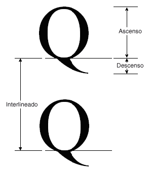

# C&#243;mo: Obtener medidas de fuentes
La clase <xref:System.Drawing.FontFamily> proporciona los métodos siguientes que recuperan diversas métricas para una combinación de familia y estilo concreta:  
  
-   <xref:System.Drawing.FontFamily.GetEmHeight%2A>\(FontStyle\)  
  
-   <xref:System.Drawing.FontFamily.GetCellAscent%2A>\(FontStyle\)  
  
-   <xref:System.Drawing.FontFamily.GetCellDescent%2A>\(FontStyle\)  
  
-   <xref:System.Drawing.FontFamily.GetLineSpacing%2A>\(FontStyle\)  
  
 Los números que devuelven estos métodos están en unidades de diseño de fuente, por lo que son independientes del tamaño y de las unidades de un objeto <xref:System.Drawing.Font> concreto.  
  
 En la siguiente ilustración se muestran las distintas métricas.  
  
   
  
## Ejemplo  
 En el ejemplo siguiente se muestran las métricas del estilo normal de la familia de fuentes Arial.  El código también crea un objeto <xref:System.Drawing.Font> \(basado en la familia Arial\) con un tamaño de 16 píxeles y muestra las métricas \(en píxeles\) de ese objeto <xref:System.Drawing.Font> concreto.  
  
 En la siguiente ilustración se muestra el resultado del código de ejemplo.  
  
   
  
 Observe las dos primeras líneas del resultado en la ilustración anterior.  El objeto <xref:System.Drawing.Font> devuelve un tamaño de 16 y el objeto <xref:System.Drawing.FontFamily> devuelve un alto Em de 2,048.  Estos dos números \(16 y 2.048\) son la clave para convertir unidades de diseño de fuente a las unidades \(en este caso, píxeles\) del objeto <xref:System.Drawing.Font>.  
  
 Por ejemplo, se puede convertir el ascenso de unidades de diseño a píxeles de la siguiente manera:  
  
   
  
 En el código anterior se sitúa el texto verticalmente estableciendo el miembro de datos <xref:System.Drawing.PointF.Y%2A> de un objeto <xref:System.Drawing.PointF>.  La coordenada y se incrementa en `font.Height` en cada nueva línea de texto.  La propiedad <xref:System.Drawing.Font.Height%2A> de un objeto <xref:System.Drawing.Font> devuelve el interlineado \(en píxeles\) de ese objeto <xref:System.Drawing.Font> concreto.  En este ejemplo, el número que devuelve <xref:System.Drawing.Font.Height%2A> es 19.  Observe que es el mismo número \(redondeado a un entero\) que el que se obtiene al convertir la métrica del interlineado a píxeles.  
  
 Observe que el alto Em \(también llamado tamaño o tamaño Em\) no es la suma del ascenso y del descenso.  La suma del ascenso y del descenso se denomina alto de celda.  El alto de la celda menos el espacio interno es igual al alto Em.  El alto de la celda más el espacio externo es igual al interlineado.  
  
 [!code-csharp[System.Drawing.FontsAndText#71](../../../../samples/snippets/csharp/VS_Snippets_Winforms/System.Drawing.FontsAndText/CS/Class1.cs#71)]
 [!code-vb[System.Drawing.FontsAndText#71](../../../../samples/snippets/visualbasic/VS_Snippets_Winforms/System.Drawing.FontsAndText/VB/Class1.vb#71)]  
  
## Compilar el código  
 El ejemplo anterior está diseñado para formularios Windows Forms y requiere <xref:System.Windows.Forms.PaintEventArgs> `e`, que es un parámetro de <xref:System.Windows.Forms.PaintEventHandler>.  
  
## Vea también  
 [Gráficos y dibujos en Windows Forms](../../../../docs/framework/winforms/advanced/graphics-and-drawing-in-windows-forms.md)   
 [Utilizar fuentes y texto](../../../../docs/framework/winforms/advanced/using-fonts-and-text.md)