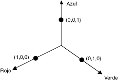

# C&#243;mo: Rotar colores
La rotación en un espacio de color cuatridimensional es difícil de visualizar.  Para poder ver la rotación fácilmente, se ha decidido mantener uno de los componentes de color fijo.  Supongamos que se decide fijar el componente alfa en 1 \(completamente opaco\).  Entonces se podrá ver un espacio de color tridimensional con los ejes rojo, verde y azul como se muestra en la siguiente ilustración.  
  
   
  
 Los colores se pueden considerar como puntos en un espacio tridimensional.  Por ejemplo, el punto \(1, 0, 0\) en un espacio representa el color rojo, mientras que el punto \(0, 1, 0\) en un espacio representa el color verde.  
  
 En la siguiente ilustración se muestra el resultado al rotar el color \(1, 0, 0\) en un ángulo de 60 grados en el plano Rojo\-Verde.  La rotación en un plano paralelo al plano Rojo\-Verde puede considerarse como una rotación sobre el eje azul.  
  
   
  
 En la siguiente ilustración se muestra cómo inicializar una matriz de color para realizar rotaciones sobre cada uno de los tres ejes de coordenadas \(rojo, verde, azul\).  
  
   
  
## Ejemplo  
 En el siguiente ejemplo se toma una imagen de un solo color \(1, 0, 0,6\) y se aplica una rotación de 60 grados sobre el eje azul.  El ángulo de rotación se trazará en un plano paralelo al plano rojo\-verde.  
  
 En la siguiente ilustración se muestra la imagen original a la izquierda y la imagen con rotación de colores a la derecha.  
  
   
  
 En la siguiente ilustración se muestra una visualización de la rotación de color realizada en el siguiente código.  
  
   
  
 [!code-csharp[System.Drawing.RotateColors#1](../../../../samples/snippets/csharp/VS_Snippets_Winforms/System.Drawing.RotateColors/CS/Form1.cs#1)]
 [!code-vb[System.Drawing.RotateColors#1](../../../../samples/snippets/visualbasic/VS_Snippets_Winforms/System.Drawing.RotateColors/VB/Form1.vb#1)]  
  
## Compilar el código  
 El ejemplo anterior está diseñado para formularios Windows Forms y requiere <xref:System.Windows.Forms.PaintEventArgs> `e`, que es un parámetro del controlador del evento <xref:System.Windows.Forms.Control.Paint>.  Reemplace `RotationInput.bmp` por un nombre de archivo de imagen y una ruta de acceso válidos en el sistema.  
  
## Vea también  
 <xref:System.Drawing.Imaging.ColorMatrix>   
 <xref:System.Drawing.Imaging.ImageAttributes>   
 [Gráficos y dibujos en Windows Forms](../../../../docs/framework/winforms/advanced/graphics-and-drawing-in-windows-forms.md)   
 [Cambiar el color de las imágenes](../../../../docs/framework/winforms/advanced/recoloring-images.md)