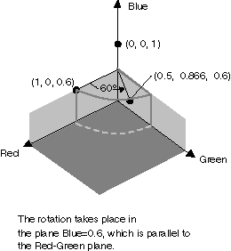

# Procedimiento Rotar colores
Es difícil visualizar la rotación en un espacio de colores de cuatro dimensiones. Podemos lo hacemos más fácil visualizar la rotación mediante decidido mantener uno de los componentes de color fijo. Supongamos que estamos de acuerdo mantener el componente alfa en 1 (completamente opaco). A continuación, podemos visualizar un espacio tridimensional de color con ejes de rojos, verde y azules como se muestra en la siguiente ilustración.  
  
   
  
 Un color puede considerarse como un punto en el espacio 3D. Por ejemplo, el punto (1, 0, 0) en el espacio representa el color rojo y el punto (0, 1, 0) en el espacio representa el color verde.  
  
 En la siguiente ilustración se muestra lo que significa girar el color (1, 0, 0) a través de un ángulo de 60 grados en el plano de color rojo verde. Rotación en un plano paralelo al plano de color rojo verde puede considerarse como la rotación sobre el eje azul.  
  
   
  
 La siguiente ilustración muestra cómo inicializar una matriz de colores para llevar a cabo las rotaciones sobre cada uno de los tres ejes de coordenadas (rojo, verde, azul).  
  
   
  
## Ejemplo  
 El ejemplo siguiente toma una imagen que es un color (1, 0, 0,6) y se aplica un giro de 60 grados sobre el eje azul. El ángulo de rotación se trazará en un plano paralelo al plano de color rojo verde.  
  
 La siguiente ilustración muestra la imagen original a la izquierda y la imagen gira de color de la derecha.  
  
   
  
 La siguiente ilustración muestra una visualización de la rotación de color realizada en el código siguiente.  
  
   
  
 [!code-csharp[System.Drawing.RotateColors#1](../../../../samples/snippets/csharp/VS_Snippets_Winforms/System.Drawing.RotateColors/CS/Form1.cs#1)]
 [!code-vb[System.Drawing.RotateColors#1](../../../../samples/snippets/visualbasic/VS_Snippets_Winforms/System.Drawing.RotateColors/VB/Form1.vb#1)]  
  
## Compilar el código  
 El ejemplo anterior está diseñado para su uso con Windows Forms y requiere <xref:System.Windows.Forms.PaintEventArgs> `e`, que es un parámetro de la <xref:System.Windows.Forms.Control.Paint> controlador de eventos. Reemplace `RotationInput.bmp` con un nombre de archivo de imagen y la ruta de acceso válida en su sistema.  
  
## Vea también
- <xref:System.Drawing.Imaging.ColorMatrix>
- <xref:System.Drawing.Imaging.ImageAttributes>
- [Gráficos y dibujos en Windows Forms](../../../../docs/framework/winforms/advanced/graphics-and-drawing-in-windows-forms.md)
- [Cambiar el color de las imágenes](../../../../docs/framework/winforms/advanced/recoloring-images.md)
