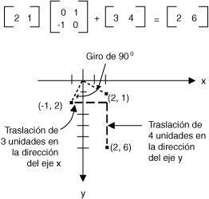
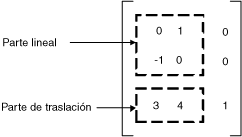

# Representaci&#243;n matricial de transformaciones
Una matriz m×n es un conjunto de números organizados en m filas y n columnas.  En la siguiente ilustración se muestran varias matrices.  
  
   
  
 Es posible sumar dos matrices del mismo tamaño mediante la adición de elementos individuales.  En la siguiente ilustración se muestran dos ejemplos de adición de matrices.  
  
   
  
 Una matriz m×n puede multiplicarse por una matriz n×p y el resultado es una matriz m×p.  El número de columnas de la primera matriz debe coincidir con el número de filas de la segunda matriz.  Por ejemplo, una matriz 4x2 puede multiplicarse por una matriz 2×3 para generar una matriz 4×3.  
  
 Los puntos en el plano y las filas y columnas de una matriz pueden considerarse como vectores.  Por ejemplo, \(2, 5\) es un vector con dos componentes, y \(3, 7, 1\) es un vector con tres componentes.  El producto de puntos de dos vectores se define de esta forma:  
  
 \(a, b\) • \(c, d\) \= ac \+ bd  
  
 \(a, b, c\) • \(d, e, f\) \= ad \+ be \+ cf  
  
 Por ejemplo, el producto de puntos de los vectores \(2, 3\) y \(5, 4\) es \(2\)\(5\) \+ \(3\)\(4\) \= 22.  El producto de puntos de los vectores \(2, 5, 1\) y \(4, 3, 1\) es \(2\)\(4\) \+ \(5\)\(3\) \+ \(1\)\(1\) \= 24.   Observe que el producto de puntos de dos vectores es un número, no otro vector.  Observe también que sólo se puede calcular el producto de puntos de dos vectores si éstos tienen el mismo número de componentes.  
  
 Consideremos que A\(i, j\) es una entrada de la matriz A, en la fila i, columna j.  Por ejemplo, A\(3, 2\) es la entrada de la matriz A situada en la tercera fila y la segunda columna.  Supongamos que A, B y C son matrices, y que AB \= C.  Las entradas de C se calculan de esta forma:  
  
 C\(i, j\) \= \(fila i de A\) • \(columna j de B\)  
  
 En la siguiente ilustración se muestran varios ejemplos de multiplicación de matrices.  
  
   
  
 Si se considera un punto en un plano como una matriz 1x2, se puede transformar dicho punto multiplicándolo por una matriz 2x2.  En la siguiente ilustración se muestran varias transformaciones que se han aplicado al punto \(2, 1\).  
  
   
  
 Todas las transformaciones que se muestran en la ilustración anterior son transformaciones lineales.  Otros tipos de transformaciones, como la traslación, no son lineales y no pueden expresarse en forma de multiplicación por una matriz 2x2.  Supongamos que se desea rotar 90 grados, trasladar 3 unidades en la dirección del eje x y trasladar 4 unidades en la dirección del eje y al punto \(2, 1\).  Todo esto puede realizarse mediante una multiplicación de matrices seguida de una adición de matrices.  
  
   
  
 Se denomina transformación afín a una transformación lineal \(multiplicación por una matriz 2x2\) seguida de una traslación \(adición de una matriz 1x2\).  Una alternativa al almacenamiento de una transformación afín en un par de matrices \(una para la parte lineal y otra para la traslación\) es el almacenamiento de toda la transformación en una matriz 3x3.  Para que esto funcione, hay que almacenar un punto del plano en una matriz 1x3 con una tercera coordenada ficticia.  La técnica más habitual es hacer que todas las terceras coordenadas sean igual a 1.  Por ejemplo, el punto \(2, 1\) se representa con la matriz \[2 1 1\].  En la siguiente ilustración se muestra una transformación afín \(rotación de 90 grados, y traslación de 3 unidades en la dirección del eje x y de 4 unidades en la dirección del eje y\) que se expresa como la multiplicación por una única matriz 3x3.  
  
   
  
 En el ejemplo anterior, el punto \(2, 1\) se asigna al punto \(2, 6\).  Observe que la tercera columna de la matriz 3×3 contiene los números 0, 0, 1.  Esto siempre será así para el caso de la matriz 3x3 de una transformación afín.  Los números importantes son los seis números de las columnas 1 y 2.  La parte superior izquierda 2x2 de la matriz representa la parte lineal de la transformación y las dos primeras entradas de la tercera fila representan la traslación.  
  
   
  
 En [!INCLUDE[ndptecgdiplus](../../../../includes/ndptecgdiplus-md.md)] es posible almacenar una transformación afín en un objeto <xref:System.Drawing.Drawing2D.Matrix>.  Como la tercera columna de una matriz que representa una transformación afín siempre es \(0, 0, 1\), cuando se construye un objeto <xref:System.Drawing.Drawing2D.Matrix> sólo se especifican los seis números de las dos primeras columnas.  La instrucción `Matrix myMatrix = new Matrix(0, 1, -1, 0, 3, 4)` crea la matriz mostrada en la figura anterior.  
  
## Transformaciones compuestas  
 Una transformación compuesta es una secuencia de transformaciones, una tras otra.  Observe las matrices y las transformaciones de la siguiente lista:  
  
|||  
|-|-|  
|Matriz A|Rotación de 90 grados|  
|Matriz B|Ajuste de escala en un factor de 2 en la dirección del eje x|  
|Matriz C|Traslación de 3 unidades en la dirección del eje y|  
  
 Si se comienza con el punto \(2, 1\), representado por la matriz \[2 1 1\], y se multiplica por A, después por B y después por C, el punto \(2, 1\) experimentará las tres transformaciones en el orden indicado.  
  
 \[2 1 1\]ABC \= \[\-2 5 1\]  
  
 En lugar de almacenar las tres partes de la transformación compuesta en tres matrices diferentes, se pueden multiplicar A, B y C a la vez para obtener una única matriz 3x3 que almacene toda la transformación compuesta.  Imagine que ABC \= D.  En este caso, un punto multiplicado por D da el mismo resultado que un punto multiplicado por A, después por B y después por C.  
  
 \[2 1 1\]D \= \[\-2 5 1\]  
  
 En la siguiente ilustración se muestran las matrices A, B, C y D.  
  
   
  
 El hecho de que la matriz de una transformación compuesta pueda crearse multiplicando matrices de transformación individuales significa que cualquier secuencia de transformaciones afines puede almacenarse en un único objeto <xref:System.Drawing.Drawing2D.Matrix>.  
  
> [!CAUTION]
>  El orden de una transformación compuesta es importante.  En general, un orden de rotación, ajuste de escala y traslación no es lo mismo que un orden de ajuste de escala, rotación y traslación.  Análogamente, el orden de multiplicación de matrices es importante.  En general, ABC no es lo mismo que BAC.  
  
 La clase <xref:System.Drawing.Drawing2D.Matrix> proporciona varios métodos para compilar una transformación compuesta: <xref:System.Drawing.Drawing2D.Matrix.Multiply%2A>, <xref:System.Drawing.Drawing2D.Matrix.Rotate%2A>, <xref:System.Drawing.Drawing2D.Matrix.RotateAt%2A>, <xref:System.Drawing.Drawing2D.Matrix.Scale%2A>, <xref:System.Drawing.Drawing2D.Matrix.Shear%2A> y <xref:System.Drawing.Drawing2D.Matrix.Translate%2A>.  En el siguiente ejemplo se crea la matriz de una transformación compuesta que, primero, rota 30 grados, después ajusta la escala en un factor de 2 en la dirección del eje y, y después se traslada 5 unidades en la dirección del eje x:  
  
 [!code-csharp[System.Drawing.CoordinateSystems#11](../../../../samples/snippets/csharp/VS_Snippets_Winforms/System.Drawing.CoordinateSystems/CS/Class1.cs#11)]
 [!code-vb[System.Drawing.CoordinateSystems#11](../../../../samples/snippets/visualbasic/VS_Snippets_Winforms/System.Drawing.CoordinateSystems/VB/Class1.vb#11)]  
  
 En la siguiente ilustración se muestra la matriz.  
  
   
  
## Vea también  
 [Sistemas de coordenadas y transformaciones](../../../../docs/framework/winforms/advanced/coordinate-systems-and-transformations.md)   
 [Usar transformaciones en la interfaz GDI\+ administrada](../../../../docs/framework/winforms/advanced/using-transformations-in-managed-gdi.md)