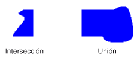

# Regiones de GDI+
Una región es una parte del área de presentación de un dispositivo de salida. Las regiones pueden ser simples (un único rectángulo) o complejas (una combinación de polígonos y curvas cerradas). En la siguiente ilustración se muestra dos regiones: una construida a partir de un rectángulo y la otra construida a partir de una ruta de acceso.  
  
   
  
## Utilizar regiones  
 Las regiones se utilizan a menudo para recortar y la prueba de posicionamiento. Recortar implica la restricción del dibujo a una región determinada del área de presentación, normalmente la parte que debe actualizarse. La prueba de posicionamiento implica la comprobación para determinar si el cursor está en una región determinada de la pantalla cuando se presiona un botón del mouse.  
  
 Puede construir una región de un rectángulo o una ruta de acceso. También puede crear regiones complejas mediante la combinación de regiones existentes. El <xref:System.Drawing.Region> clase proporciona los siguientes métodos para combinar regiones: <xref:System.Drawing.Region.Intersect%2A>, <xref:System.Drawing.Region.Union%2A>, <xref:System.Drawing.Region.Xor%2A>, <xref:System.Drawing.Region.Exclude%2A>, y <xref:System.Drawing.Region.Complement%2A>.  
  
 La intersección de dos regiones es el conjunto de todos los puntos que pertenecen a ambas regiones. La unión es el conjunto de todos los puntos que pertenecen a una u otra materia o ambas regiones. El complemento de una región es el conjunto de todos los puntos que no están en la región. En la siguiente ilustración muestra la intersección y la unión de las dos regiones que se muestra en la ilustración anterior.  
  
   
  
 El <xref:System.Drawing.Region.Xor%2A> método, que se aplique a un par de regiones, genera una región que contiene todos los puntos que pertenecen a una región o la otra, pero no ambos. El <xref:System.Drawing.Region.Exclude%2A> método, que se aplique a un par de regiones, genera una región que contiene todos los puntos de la primera región que no están en la segunda región. En la siguiente ilustración se muestra las regiones que son el resultado de aplicar el <xref:System.Drawing.Region.Xor%2A> y <xref:System.Drawing.Region.Exclude%2A> métodos a las dos regiones mostradas al principio de este tema.  
  
   
  
 Para rellenar una región, son necesarios un <xref:System.Drawing.Graphics> objeto, un <xref:System.Drawing.Brush> objeto y un <xref:System.Drawing.Region> objeto. El <xref:System.Drawing.Graphics> objeto proporciona el <xref:System.Drawing.Graphics.FillRegion%2A> método y el <xref:System.Drawing.Brush> objeto almacena atributos del relleno, como el color o una trama. En el ejemplo siguiente se rellena una región con un color sólido.  
  
 [!code-csharp[LinesCurvesAndShapes#61](../../../../samples/snippets/csharp/VS_Snippets_Winforms/LinesCurvesAndShapes/CS/Class1.cs#61)]
 [!code-vb[LinesCurvesAndShapes#61](../../../../samples/snippets/visualbasic/VS_Snippets_Winforms/LinesCurvesAndShapes/VB/Class1.vb#61)]  
  
## Vea también  
 <xref:System.Drawing.Region?displayProperty=nameWithType>  
 [Líneas, curvas y formas](../../../../docs/framework/winforms/advanced/lines-curves-and-shapes.md)  
 [Utilizar regiones](../../../../docs/framework/winforms/advanced/using-regions.md)
