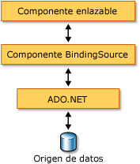

# Información general sobre el componente BindingSource
El componente <xref:System.Windows.Forms.BindingSource> está diseñado para simplificar el proceso de enlazar controles a un origen de datos subyacente. El componente <xref:System.Windows.Forms.BindingSource> actúa como canalización y como origen de datos al que se enlazarán otros controles. Proporciona una abstracción de la conexión de datos de su formulario al pasar comandos a la lista de datos subyacente. Además, puede agregar datos directamente a él para que el propio componente funcione como un origen de datos.  
  
## Componente BindingSource como intermediario  
 El componente <xref:System.Windows.Forms.BindingSource> actúa como origen de datos para algunos o todos los controles del formulario. En Visual Studio, el <xref:System.Windows.Forms.BindingSource> se puede enlazar a un control por medio de la `DataBindings` propiedad, que es accesible desde el **propiedades** ventana. Vea también [Cómo: Enlazar controles de Windows Forms con el componente BindingSource mediante el Diseñador](../../../../docs/framework/winforms/controls/bind-wf-controls-with-the-bindingsource.md).  
  
 Puede enlazar el componente <xref:System.Windows.Forms.BindingSource> a orígenes de datos simples, como una única propiedad de un objeto o una colección básica como <xref:System.Collections.ArrayList>, y a orígenes de datos complejos, como una tabla de base de datos. El componente <xref:System.Windows.Forms.BindingSource> actúa como el intermediario que proporciona los servicios de administración de enlace y moneda. En tiempo de diseño o en tiempo de ejecución, puede enlazar un componente <xref:System.Windows.Forms.BindingSource> a un origen de datos complejo estableciendo sus propiedades <xref:System.Windows.Forms.BindingSource.DataSource%2A> y <xref:System.Windows.Forms.BindingSource.DataMember%2A> en la base de datos y en la tabla, respectivamente. En la siguiente ilustración se muestra dónde encaja el componente <xref:System.Windows.Forms.BindingSource> en la arquitectura de enlace de datos existente.  
  
   
  
> [!NOTE]
>  En tiempo de diseño, algunas acciones, como arrastrar una tabla de base de datos desde una ventana de datos en un formulario en blanco, crearán el componente <xref:System.Windows.Forms.BindingSource>, lo enlazarán al origen de datos subyacente y agregarán controles compatibles con datos en una sola operación. Vea también [Enlazar controles de Windows Forms a datos en Visual Studio](/visualstudio/data-tools/bind-windows-forms-controls-to-data-in-visual-studio).  
  
## Componente BindingSource como origen de datos  
 Si comienza agregando elementos al componente <xref:System.Windows.Forms.BindingSource> sin especificar primero la lista a la que se enlazará, el componente actuará como un origen de datos de estilo de lista y aceptará estos elementos agregados.  
  
 Además, puede escribir código para proporcionar la funcionalidad personalizada "AddNew" mediante el evento <xref:System.Windows.Forms.BindingSource.AddingNew>, que se genera cuando se llama al método <xref:System.Windows.Forms.BindingSource.AddNew%2A> antes de que el elemento se agregue a la lista. Para más información, consulte [Arquitectura del componente BindingSource](../../../../docs/framework/winforms/controls/bindingsource-component-architecture.md).  
  
## Navegación  
 Para los usuarios que necesiten navegar por los datos de un formulario, el componente <xref:System.Windows.Forms.BindingNavigator> permite navegar por los datos y manipularlos, en colaboración con un componente <xref:System.Windows.Forms.BindingSource>. Para más información, consulte [Control BindingNavigator](../../../../docs/framework/winforms/controls/bindingnavigator-control-windows-forms.md).  
  
## Manipulación de datos  
 El componente <xref:System.Windows.Forms.BindingSource> actúa como un <xref:System.Windows.Forms.CurrencyManager> para todos sus enlaces y, por lo tanto, puede proporcionar acceso a la información de posición y de moneda relativa al origen de datos. En la tabla siguiente se muestran los miembros que el componente <xref:System.Windows.Forms.BindingSource> proporciona para acceder a los datos subyacentes y manipularlos.  
  
|Miembro|Descripción|  
|------------|-----------------|  
|Propiedad <xref:System.Windows.Forms.BindingSource.Current%2A>|Obtiene el elemento actual del origen de datos.|  
|Propiedad <xref:System.Windows.Forms.BindingSource.Position%2A>|Obtiene o establece la posición actual en la lista subyacente.|  
|Propiedad <xref:System.Windows.Forms.BindingSource.List%2A>|Obtiene la lista que es la evaluación de <xref:System.Windows.Forms.BindingSource.DataSource%2A> y <xref:System.Windows.Forms.BindingSource.DataMember%2A>. Si <xref:System.Windows.Forms.BindingSource.DataMember%2A> no está establecido, devuelve la lista especificada por <xref:System.Windows.Forms.BindingSource.DataSource%2A>.|  
|Método <xref:System.Windows.Forms.BindingSource.Insert%2A>|Inserta un elemento en el índice especificado de la lista.|  
|Método <xref:System.Windows.Forms.BindingSource.RemoveCurrent%2A>|Quita el elemento actual de la lista.|  
|Método <xref:System.Windows.Forms.BindingSource.EndEdit%2A>|Aplica los cambios pendientes al origen de datos subyacente.|  
|Método <xref:System.Windows.Forms.BindingSource.CancelEdit%2A>|Cancela la operación de edición actual.|  
|Método <xref:System.Windows.Forms.BindingSource.AddNew%2A>|Agrega un nuevo elemento a la lista subyacente. Si el origen de datos implementa <xref:System.ComponentModel.IBindingList> y devuelve un elemento para el evento <xref:System.Windows.Forms.BindingSource.AddingNew>, agrega este elemento. De lo contrario, la solicitud se pasa al método <xref:System.ComponentModel.IBindingList.AddNew%2A> de la lista. Si la lista subyacente no es una <xref:System.ComponentModel.IBindingList>, el elemento se crea automáticamente mediante su constructor público predeterminado.|  
  
## Ordenar y filtrar  
 Normalmente, debe trabajar con una vista filtrada u ordenada del origen de datos. En la tabla siguiente se muestran los miembros que el origen de datos del componente <xref:System.Windows.Forms.BindingSource> proporciona.  
  
|Miembro|Descripción|  
|------------|-----------------|  
|Propiedad <xref:System.Windows.Forms.BindingSource.Sort%2A>|Si el origen de datos es una <xref:System.ComponentModel.IBindingList>, obtiene o establece el nombre de columna usado para ordenar y el criterio de ordenación. Si el origen de datos es una <xref:System.ComponentModel.IBindingListView> y admite la ordenación avanzada, obtiene varios nombres de columna usados para ordenar y el criterio de ordenación.|  
|Propiedad <xref:System.Windows.Forms.BindingSource.Filter%2A>|Si el origen de datos es una <xref:System.ComponentModel.IBindingListView>, obtiene o establece la expresión usada para filtrar qué filas se ven.|  
  
## Vea también  
 <xref:System.Windows.Forms.BindingSource>  
 <xref:System.Windows.Forms.BindingNavigator>  
 [Arquitectura del componente BindingSource](../../../../docs/framework/winforms/controls/bindingsource-component-architecture.md)  
 [Componente BindingSource](../../../../docs/framework/winforms/controls/bindingsource-component.md)  
 [BindingNavigator (control)](../../../../docs/framework/winforms/controls/bindingnavigator-control-windows-forms.md)  
 [Enlace de datos en Windows Forms](../../../../docs/framework/winforms/windows-forms-data-binding.md)  
 [Controles que se utilizan en formularios Windows Forms](../../../../docs/framework/winforms/controls/controls-to-use-on-windows-forms.md)
