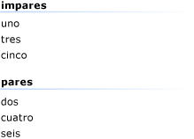

# Filtrar Agrupar elementos en un Control de ListView de Windows Forms mediante el diseñador
La característica de agrupación de la <xref:System.Windows.Forms.ListView> control permite mostrar conjuntos relacionados de elementos en grupos. Estos grupos se separan en la pantalla con los encabezados de grupo horizontal que contienen los títulos de grupo. Puede usar <xref:System.Windows.Forms.ListView> grupos para facilitar la navegación sea más fácil de listas grandes mediante la agrupación de elementos por orden alfabético, por fecha, o por cualquier otra agrupación lógica. La imagen siguiente muestra algunos elementos agrupados.  
  
   
  
 El procedimiento siguiente requiere una **aplicación Windows** proyecto con un formulario que contenga un <xref:System.Windows.Forms.ListView> control. Para obtener información acerca de cómo configurar un proyecto de este tipo, vea [Cómo: Cree un proyecto de aplicación de Windows Forms](/visualstudio/ide/step-1-create-a-windows-forms-application-project) y [Cómo: Agregar controles a Windows Forms](../../../../docs/framework/winforms/controls/how-to-add-controls-to-windows-forms.md).  
  
 Para habilitar la agrupación, primero debe crear uno o varios <xref:System.Windows.Forms.ListViewGroup> objetos en el diseñador o mediante programación. Una vez que se ha definido un grupo, puede asignar elementos a él.  
  
> [!NOTE]
>  <xref:System.Windows.Forms.ListView> grupos solo están disponibles en [!INCLUDE[WinXpFamily](../../../../includes/winxpfamily-md.md)] cuando la aplicación llama el <xref:System.Windows.Forms.Application.EnableVisualStyles%2A?displayProperty=nameWithType> método. En sistemas operativos anteriores, cualquier código relacionado con grupos no tiene ningún efecto y no aparecerán los grupos. Para obtener más información, consulta <xref:System.Windows.Forms.ListView.Groups%2A?displayProperty=nameWithType>.  
>   
>  Los cuadros de diálogo y comandos de menú que se ven pueden diferir de los descritos en la Ayuda, en función de los valores de configuración o de edición activos. Para cambiar la configuración, elija la opción **Importar y exportar configuraciones** del menú **Herramientas** . Para más información, vea [Personalizar el IDE de Visual Studio](/visualstudio/ide/personalizing-the-visual-studio-ide).  
  
### Para agregar o quitar grupos en el diseñador  
  
1.  En el **propiedades** ventana, haga clic en el **puntos suspensivos** () situado junto a el <xref:System.Windows.Forms.ListView.Groups%2A> propiedad.  
  
     El **Editor de la colección ListViewGroup** aparece.  
  
2.  Para agregar un grupo, haga clic en el **agregar** botón. A continuación, puede establecer las propiedades del nuevo grupo, tales como la <xref:System.Windows.Forms.ListViewGroup.Header%2A> y <xref:System.Windows.Forms.ListViewGroup.HeaderAlignment%2A> propiedades. Para quitar un grupo, selecciónelo y haga clic en el **quitar** botón.  
  
### Para asignar elementos a grupos en el diseñador  
  
1.  En el **propiedades** ventana, haga clic en el **puntos suspensivos** () situado junto a el <xref:System.Windows.Forms.ListView.Items%2A> propiedad.  
  
     El **Editor de la colección ListViewItem** aparece.  
  
2.  Para agregar un nuevo elemento, haga clic en el **agregar** botón. A continuación, puede establecer las propiedades del nuevo elemento, tales como la <xref:System.Windows.Forms.ListViewItem.Text%2A> y <xref:System.Windows.Forms.ListViewItem.ImageIndex%2A> propiedades.  
  
3.  Seleccione el <xref:System.Windows.Forms.ListViewItem.Group%2A> propiedad y elija un grupo en la lista desplegable.  
  
## Vea también
- <xref:System.Windows.Forms.ListView>
- <xref:System.Windows.Forms.ListView.Groups%2A>
- <xref:System.Windows.Forms.ListViewGroup>
- [ListView (Control)](../../../../docs/framework/winforms/controls/listview-control-windows-forms.md)
- [Información general del control ListView](../../../../docs/framework/winforms/controls/listview-control-overview-windows-forms.md)
- [Cómo: Agregar y quitar elementos con el Control ListView de formularios de Windows](../../../../docs/framework/winforms/controls/how-to-add-and-remove-items-with-the-windows-forms-listview-control.md)
