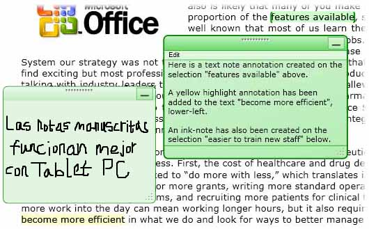

# Informaci&#243;n general sobre anotaciones
Escribir notas o comentarios en documentos impresos es una actividad tan habitual que la damos casi por sentada.  Estas notas o comentarios son "anotaciones" que se agregan a los documentos para marcar la información o resaltar elementos de interés, a fin de consultarlos más adelante.  Aunque escribir notas en documentos impresos resulta fácil y es frecuente, la capacidad de agregar comentarios personales a los documentos electrónicos suele estar muy limitada, si es que está disponible en absoluto.  
  
 En este tema se revisan varios tipos comunes de anotaciones, en particular las notas rápidas y el resaltado, y se muestra cómo [!INCLUDE[TLA#tla_caf](../../../../includes/tlasharptla-caf-md.md)] facilita estos tipos de anotaciones en las aplicaciones gracias a los controles de vista de documentos de [!INCLUDE[TLA#tla_wpf](../../../../includes/tlasharptla-wpf-md.md)].  Los controles de vista de documentos de [!INCLUDE[TLA2#tla_wpf](../../../../includes/tla2sharptla-wpf-md.md)] que admiten anotaciones incluyen <xref:System.Windows.Controls.FlowDocumentReader> y <xref:System.Windows.Controls.FlowDocumentScrollViewer>, así como los controles derivados de <xref:System.Windows.Controls.Primitives.DocumentViewerBase> como <xref:System.Windows.Controls.DocumentViewer> y <xref:System.Windows.Controls.FlowDocumentPageViewer>.  
  
   
  
   
## Notas rápidas  
 Una nota rápida típica contiene información escrita en un papelito coloreado que se "adhiere" a un documento.  Las notas rápidas digitales proporcionan una funcionalidad similar para los documentos electrónicos, pero con la flexibilidad agregada de incluir muchos otros tipos de contenido, como texto mecanografiado, notas manuscritas \(por ejemplo, trazos "de lápiz" de [!INCLUDE[TLA#tla_tpc](../../../../includes/tlasharptla-tpc-md.md)]\) o vínculos web.  
  
 La ilustración siguiente muestra algunos ejemplos de anotaciones de resaltado, nota rápida de texto y nota rápida de entrada de lápiz.  
  
   
  
 En el ejemplo siguiente se muestra el método que puede utilizar para habilitar la compatibilidad con las anotaciones en la aplicación.  
  
 [!code-csharp[DocViewerAnnotationsXml#DocViewXmlStartAnnotations](../../../../samples/snippets/csharp/VS_Snippets_Wpf/DocViewerAnnotationsXml/CSharp/Window1.xaml.cs#docviewxmlstartannotations)]
 [!code-vb[DocViewerAnnotationsXml#DocViewXmlStartAnnotations](../../../../samples/snippets/visualbasic/VS_Snippets_Wpf/DocViewerAnnotationsXml/visualbasic/window1.xaml.vb#docviewxmlstartannotations)]  
  
   
## Resaltados  
 Las personas utilizan métodos creativos para llamar la atención sobre los elementos de interés cuando marcan a un documento impreso, como subrayar, resaltar, rodear palabras de una frase o dibujar marcas o símbolos en el margen.  Las anotaciones de resaltado de [!INCLUDE[TLA#tla_caf](../../../../includes/tlasharptla-caf-md.md)] proporcionan características parecidas para marcar la a información mostrada en los controles de vista de documentos de [!INCLUDE[TLA2#tla_wpf](../../../../includes/tla2sharptla-wpf-md.md)].  
  
 En la ilustración siguiente se muestra un ejemplo de una anotación de resaltado.  
  
   
  
 Para crear una anotación, el usuario suele seleccionar primero algún texto o elemento de interés y, a continuación, hacer clic con el botón secundario del mouse para mostrar un <xref:System.Windows.Controls.ContextMenu> de opciones de anotación.  En el ejemplo siguiente se muestra [!INCLUDE[TLA#tla_xaml](../../../../includes/tlasharptla-xaml-md.md)] que puede utilizar para declarar <xref:System.Windows.Controls.ContextMenu> con comandos enrutados a los que el usuario puede tener acceso para crear y administrar anotaciones.  
  
 [!code-xml[DocViewerAnnotationsXps#CreateDeleteAnnotations](../../../../samples/snippets/csharp/VS_Snippets_Wpf/DocViewerAnnotationsXps/CSharp/Window1.xaml#createdeleteannotations)]  
  
   
## Delimitación de datos  
 [!INCLUDE[TLA2#tla_caf](../../../../includes/tla2sharptla-caf-md.md)] enlaza las anotaciones a los datos que el usuario selecciona, no sólo a una posición en la vista de presentación.  Por consiguiente, si la vista del documento cambia, como cuando el usuario se desplaza o cambia el tamaño de la ventana de presentación, la anotación permanece con la selección de datos a la que está enlazada.  Por ejemplo, en el gráfico siguiente se muestra una anotación que el usuario ha realizado en una selección de texto.  Cuando la vista del documento cambia \(se desplaza, cambia de tamaño, cambia de escala o se mueve de cualquier otro modo\), la anotación de resaltado se mueve a la par que la selección de datos original.  
  
   
  
   
## Hacer coincidir las anotaciones con los objetos anotados  
 Puede hacer coincidir las anotaciones con los objetos anotados correspondientes.  Por ejemplo, supongamos que tiene una aplicación de lector de documentos simple con un panel de comentarios.  El panel de comentarios podría ser un cuadro de lista que muestre el texto de una lista de anotaciones delimitadas en un documento.  Si el usuario selecciona un elemento en el cuadro de lista, la aplicación muestra el párrafo del documento en el que está delimitado el objeto de anotación correspondiente.  
  
 En el ejemplo siguiente se muestra cómo implementar un controlador de eventos de este tipo de cuadro de lista que actúa como un panel de comentarios.  
  
 [!code-csharp[FlowDocumentAnnotatedViewer#Handler](../../../../samples/snippets/csharp/VS_Snippets_Wpf/FlowDocumentAnnotatedViewer/CSharp/Window1.xaml.cs#handler)]
 [!code-vb[FlowDocumentAnnotatedViewer#Handler](../../../../samples/snippets/visualbasic/VS_Snippets_Wpf/FlowDocumentAnnotatedViewer/visualbasic/window1.xaml.vb#handler)]  
  
 Otro ejemplo de escenario es el de las aplicaciones que habilitan el intercambio de anotaciones y notas rápidas entre los lectores del documento a través del correo electrónico.  Esta característica permite que estas aplicaciones naveguen por el lector hasta la página que contiene la anotación intercambiada.  
  
## Vea también  
 <xref:System.Windows.Controls.Primitives.DocumentViewerBase>   
 <xref:System.Windows.Controls.DocumentViewer>   
 <xref:System.Windows.Controls.FlowDocumentPageViewer>   
 <xref:System.Windows.Controls.FlowDocumentScrollViewer>   
 <xref:System.Windows.Controls.FlowDocumentReader>   
 <xref:System.Windows.Annotations.IAnchorInfo>   
 [Esquema en anotaciones](../../../../docs/framework/wpf/advanced/annotations-schema.md)   
 [Información general sobre ContextMenu](../../../../docs/framework/wpf/controls/contextmenu-overview.md)   
 [Información general sobre comandos](../../../../docs/framework/wpf/advanced/commanding-overview.md)   
 [Información general sobre documentos dinámicos](../../../../docs/framework/wpf/advanced/flow-document-overview.md)   
 [How to: Add a Command to a MenuItem](http://msdn.microsoft.com/es-es/013d68a0-5373-4a68-bd91-5de574307370)