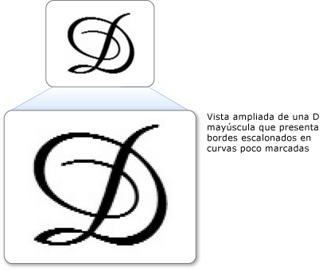
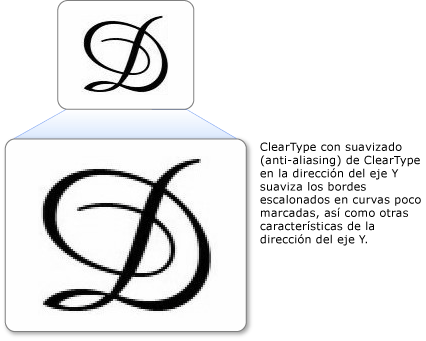

# Información general sobre ClearType
En este tema se proporciona información general sobre la tecnología [!INCLUDE[TLA#tla_ct](../../../../includes/tlasharptla-ct-md.md)] que se encuentra en [!INCLUDE[TLA#tla_winclient](../../../../includes/tlasharptla-winclient-md.md)].  
  
  
   
## Información general sobre la tecnología  
 [!INCLUDE[TLA2#tla_ct](../../../../includes/tla2sharptla-ct-md.md)] es una tecnología de software desarrollada por [!INCLUDE[TLA#tla_ms](../../../../includes/tlasharptla-ms-md.md)] que mejora la legibilidad del texto en pantallas de cristal líquido (LCD) existentes, como las de portátiles, Pocket PC y monitores de pantalla plana.  [!INCLUDE[TLA2#tla_ct](../../../../includes/tla2sharptla-ct-md.md)] funciona mediante el acceso a los elementos de franjas de color vertical individuales en cada píxel de una pantalla LCD. Antes de [!INCLUDE[TLA2#tla_ct](../../../../includes/tla2sharptla-ct-md.md)], el menor nivel de detalle que un equipo podía mostrar era un solo píxel, pero con [!INCLUDE[TLA2#tla_ct](../../../../includes/tla2sharptla-ct-md.md)] en ejecución en un monitor LCD, ahora se pueden mostrar características de texto tan pequeñas como una fracción de un píxel de ancho. Esta resolución adicional aumenta la nitidez de los detalles diminutos en la presentación del texto, lo que facilita la lectura durante largos períodos de tiempo.  
  
 La tecnología [!INCLUDE[TLA2#tla_ct](../../../../includes/tla2sharptla-ct-md.md)] disponible en [!INCLUDE[TLA#tla_winclient](../../../../includes/tlasharptla-winclient-md.md)] es la última generación de [!INCLUDE[TLA2#tla_ct](../../../../includes/tla2sharptla-ct-md.md)], que presenta varias mejoras en comparación con la versión que se encuentra en [!INCLUDE[TLA#tla_gdi](../../../../includes/tlasharptla-gdi-md.md)].  
  
   
## Posicionamiento de subpíxeles  
 Una mejora significativa con respecto a la versión anterior de [!INCLUDE[TLA2#tla_ct](../../../../includes/tla2sharptla-ct-md.md)] es el uso del posicionamiento de subpíxeles. A diferencia de la implementación de [!INCLUDE[TLA2#tla_ct](../../../../includes/tla2sharptla-ct-md.md)] que se encuentra en [!INCLUDE[TLA2#tla_gdi](../../../../includes/tla2sharptla-gdi-md.md)], la implementación de [!INCLUDE[TLA2#tla_ct](../../../../includes/tla2sharptla-ct-md.md)] que se encuentra en [!INCLUDE[TLA#tla_winclient](../../../../includes/tlasharptla-winclient-md.md)] permite que los glifos comiencen en el píxel y no solo en el límite inicial del píxel. Debido a esta resolución adicional al posicionar los glifos, el espaciado y las proporciones de los glifos son más precisos y coherentes.  
  
 En los dos ejemplos siguientes se muestra cómo pueden comenzar los glifos en cualquier límite de subpíxel cuando se usa el posicionamiento de subpíxeles. El ejemplo de la izquierda se representa mediante la versión anterior del representador de [!INCLUDE[TLA2#tla_ct](../../../../includes/tla2sharptla-ct-md.md)], que no empleaba el posicionamiento de subpíxeles. El ejemplo de la derecha se representa mediante la nueva versión del representador de [!INCLUDE[TLA2#tla_ct](../../../../includes/tla2sharptla-ct-md.md)] con el posicionamiento de subpíxeles. Observe que todas las **e** y **l** de la imagen de la derecha se representan de manera ligeramente diferente porque cada una de ellas se inicia en un subpíxel diferente. Al ver el texto con su tamaño normal en la pantalla, esta diferencia no es apreciable debido al alto contraste de la imagen de glifo. Esto solo es posible gracias al sofisticado filtrado de color incorporado en [!INCLUDE[TLA2#tla_ct](../../../../includes/tla2sharptla-ct-md.md)].  
  
   
Texto mostrado con versiones anteriores y posteriores de ClearType  
  
 En los dos ejemplos siguientes se compara la salida del representador de [!INCLUDE[TLA2#tla_ct](../../../../includes/tla2sharptla-ct-md.md)] anterior con la nueva versión del representador de [!INCLUDE[TLA2#tla_ct](../../../../includes/tla2sharptla-ct-md.md)]. El posicionamiento de subpíxeles, que se muestra a la derecha, mejora enormemente el espaciado del tipo en la pantalla, especialmente con tamaños pequeños, donde la diferencia entre un subpíxel y un píxel completo representa una proporción considerable del ancho del glifo. Observe que el espaciado entre las letras es más uniforme en la segunda imagen. La ventaja acumulada del posicionamiento de subpíxeles para la apariencia general de una pantalla de texto aumenta considerablemente y representa una evolución significativa de la tecnología [!INCLUDE[TLA2#tla_ct](../../../../includes/tla2sharptla-ct-md.md)].  
  
   
Texto con versiones anteriores y posteriores de ClearType  
  
   
## Suavizado de contorno de la dirección del eje Y  
 Otra mejora de [!INCLUDE[TLA2#tla_ct](../../../../includes/tla2sharptla-ct-md.md)] en [!INCLUDE[TLA#tla_winclient](../../../../includes/tlasharptla-winclient-md.md)] es el suavizado de contorno de la dirección del eje Y. [!INCLUDE[TLA2#tla_ct](../../../../includes/tla2sharptla-ct-md.md)] de [!INCLUDE[TLA2#tla_gdi](../../../../includes/tla2sharptla-gdi-md.md)] sin el suavizado de contorno de la dirección de Y proporciona una mejor resolución en el eje X, pero no en el eje Y. En las partes superiores e inferiores de las curvas superficiales, los bordes escalonados restan valor a legibilidad.  
  
 En el ejemplo siguiente se muestra el efecto de no tener ningún suavizado de contorno de la dirección del eje Y. En este caso, los bordes escalonados de las partes superior e inferior de la carta son evidentes.  
  
   
Texto con bordes escalonados en curvas suaves  
  
 [!INCLUDE[TLA2#tla_ct](../../../../includes/tla2sharptla-ct-md.md)] en [!INCLUDE[TLA#tla_winclient](../../../../includes/tlasharptla-winclient-md.md)] proporciona suavizado de contorno en el nivel de la dirección del eje Y para suavizar los bordes escalonados. Esto es especialmente importante para mejorar la legibilidad de los idiomas del este asiático, cuyos ideogramas tienen una cantidad casi igual de curvas suaves horizontales y verticales.  
  
 En el ejemplo siguiente se muestra el efecto de suavizado de contorno de la dirección del eje Y. En este caso, las partes superior e inferior de la letra muestran una curva suave.  
  
   
Texto con función de suavizado de contorno de ClearType en la dirección del eje Y  
  
   
## Aceleración de hardware  
 La tecnología [!INCLUDE[TLA2#tla_ct](../../../../includes/tla2sharptla-ct-md.md)] de [!INCLUDE[TLA#tla_winclient](../../../../includes/tlasharptla-winclient-md.md)] puede aprovechar la aceleración de hardware para mejorar el rendimiento y reducir los requisitos de memoria del sistema y carga de la CPU. Al usar los sombreadores de píxeles y la memoria de vídeo de una tarjeta gráfica, [!INCLUDE[TLA2#tla_ct](../../../../includes/tla2sharptla-ct-md.md)] proporciona una representación más rápida del texto, especialmente cuando se usa la animación.  
  
 La tecnología [!INCLUDE[TLA2#tla_ct](../../../../includes/tla2sharptla-ct-md.md)] de [!INCLUDE[TLA#tla_winclient](../../../../includes/tlasharptla-winclient-md.md)] no modifica la configuración de [!INCLUDE[TLA2#tla_ct](../../../../includes/tla2sharptla-ct-md.md)] de todo el sistema. Al deshabilitar [!INCLUDE[TLA2#tla_ct](../../../../includes/tla2sharptla-ct-md.md)] en [!INCLUDE[TLA#tla_mswin](../../../../includes/tlasharptla-mswin-md.md)], se establece el suavizado de contorno de [!INCLUDE[TLA#tla_winclient](../../../../includes/tlasharptla-winclient-md.md)] en el modo de escala de grises. Además, la tecnología [!INCLUDE[TLA2#tla_ct](../../../../includes/tla2sharptla-ct-md.md)] de [!INCLUDE[TLA#tla_winclient](../../../../includes/tlasharptla-winclient-md.md)] no modifica la configuración de [ClearType Tuner PowerToy](https://www.microsoft.com/typography/ClearTypePowerToy.mspx).  
  
 Una de las decisiones de diseño de arquitectura de [!INCLUDE[TLA#tla_winclient](../../../../includes/tlasharptla-winclient-md.md)] consiste en mejorar la compatibilidad del diseño independiente de la resolución con monitores de mayor resolución de PPP, cuyo uso se está generalizando. Como consecuencia, [!INCLUDE[TLA#tla_winclient](../../../../includes/tlasharptla-winclient-md.md)] no admite la representación de texto con alias ni los mapas de bits de algunas fuentes del este asiático, porque ambos dependen de la resolución.  
  
   
## Información adicional  
 [ClearType Information](https://www.microsoft.com/typography/ClearTypeInfo.mspx) (Información de ClearType)  
  
 [ClearType Tuner PowerToy](https://www.microsoft.com/typography/ClearTypePowerToy.mspx)  
  
## Vea también  
 [Configuración del Registro de ClearType](../../../../docs/framework/wpf/advanced/cleartype-registry-settings.md)
