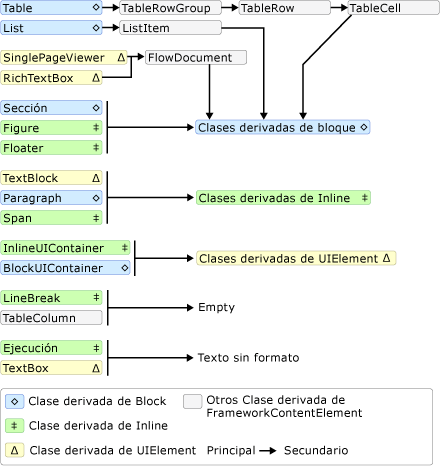

# Informaci&#243;n general sobre el modelo de contenido de TextElement
En esta información general del modelo de contenido se describe el contenido compatible con <xref:System.Windows.Documents.TextElement>.  La clase <xref:System.Windows.Documents.Paragraph> es un tipo de <xref:System.Windows.Documents.TextElement>.  Un modelo de contenido describe qué objetos o elementos se pueden contener en otros.  En esta información general se resume el modelo de contenido utilizado para los objetos derivados de <xref:System.Windows.Documents.TextElement>.  Para obtener más información, consulte [Información general sobre documentos dinámicos](../../../../docs/framework/wpf/advanced/flow-document-overview.md).  
  
   
  
   
## Diagrama del modelo de contenido  
 En el diagrama siguiente se resume el modelo de contenido para las clases derivadas de <xref:System.Windows.Documents.TextElement>, y también cómo encajan en este modelo otras clases que no son `TextElement`.  
  
   
  
 Como se puede observar en el diagrama anterior, los elementos secundarios que se permiten para un elemento no vienen determinados necesariamente por el hecho de si una clase se deriva de la clase <xref:System.Windows.Documents.Block> o de una clase <xref:System.Windows.Documents.Inline>.  Por ejemplo, <xref:System.Windows.Documents.Span> \(una clase derivada de <xref:System.Windows.Documents.Inline>\) únicamente puede tener elementos secundarios <xref:System.Windows.Documents.Inline>, pero una clase <xref:System.Windows.Documents.Figure> \(también derivada de <xref:System.Windows.Documents.Inline>\) únicamente puede tener elementos secundarios <xref:System.Windows.Documents.Block>.  Por consiguiente, un diagrama es útil para determinar rápidamente qué elemento puede incluirse en otro.  Como ejemplo, utilicemos el diagrama para determinar cómo construir el contenido dinámico de un elemento <xref:System.Windows.Controls.RichTextBox>.  
  
1.  Un objeto <xref:System.Windows.Controls.RichTextBox> debe contener un elemento <xref:System.Windows.Documents.FlowDocument>, que a su vez debe contener un objeto derivado de <xref:System.Windows.Documents.Block>.  A continuación, se muestra el segmento correspondiente del diagrama anterior.  
  
       
  
     Llegados a este punto, esta es la apariencia que podría tener el marcado.  
  
     [!code-xml[FlowOvwSnippets_snip#SchemaWalkThrough1](../../../../samples/snippets/csharp/VS_Snippets_Wpf/FlowOvwSnippets_snip/CS/MiscSnippets.xaml#schemawalkthrough1)]  
  
2.  Según el diagrama, hay varios elementos <xref:System.Windows.Documents.Block> entre los que elegir, incluidos <xref:System.Windows.Documents.Paragraph>, <xref:System.Windows.Documents.Section>, <xref:System.Windows.Documents.Table>, <xref:System.Windows.Documents.List> y <xref:System.Windows.Documents.BlockUIContainer> \(vea las clases derivadas de Block en el diagrama anterior\).  Supongamos que deseamos un elemento <xref:System.Windows.Documents.Table>.  Según el diagrama anterior, un objeto <xref:System.Windows.Documents.Table> incluye un elemento <xref:System.Windows.Documents.TableRowGroup> que contiene elementos <xref:System.Windows.Documents.TableRow>, que a su vez contienen elementos <xref:System.Windows.Documents.TableCell> que incluyen un objeto derivado de <xref:System.Windows.Documents.Block>.  A continuación se muestra el segmento correspondiente para el elemento <xref:System.Windows.Documents.Table> tomado del diagrama anterior.  
  
       
  
     A continuación, se muestra el marcado correspondiente.  
  
     [!code-xml[FlowOvwSnippets_snip#SchemaWalkThrough2](../../../../samples/snippets/csharp/VS_Snippets_Wpf/FlowOvwSnippets_snip/CS/MiscSnippets.xaml#schemawalkthrough2)]  
  
3.  De nuevo, se requieren uno o varios elementos <xref:System.Windows.Documents.Block> debajo de un elemento <xref:System.Windows.Documents.TableCell>.  Para facilitar el proceso, coloquemos texto dentro de la celda.  Podemos hacerlo utilizando un objeto <xref:System.Windows.Documents.Paragraph> con un elemento <xref:System.Windows.Documents.Run>.  A continuación se muestran los segmentos correspondientes del diagrama que demuestran que un objeto <xref:System.Windows.Documents.Paragraph> puede aceptar un elemento <xref:System.Windows.Documents.Inline> y que un objeto <xref:System.Windows.Documents.Run> \(un elemento <xref:System.Windows.Documents.Inline>\) sólo puede aceptar texto sin formato.  
  
       
  
       
  
 A continuación se muestra el ejemplo completo en el marcado.  
  
 [!code-xml[FlowOvwSnippets_snip#SchemaExampleWholePage](../../../../samples/snippets/csharp/VS_Snippets_Wpf/FlowOvwSnippets_snip/CS/SchemaExample.xaml#schemaexamplewholepage)]  
  
   
## Trabajar mediante programación con contenido de TextElement  
 El contenido de un elemento <xref:System.Windows.Documents.TextElement> está compuesto por colecciones; en consecuencia, para manipular mediante programación el contenido de los objetos <xref:System.Windows.Documents.TextElement> se trabaja con estas colecciones.  Hay tres colecciones diferentes utilizadas por las clases derivadas de <xref:System.Windows.Documents.TextElement>:  
  
-   <xref:System.Windows.Documents.InlineCollection>: Representa una colección de elementos <xref:System.Windows.Documents.Inline>.  <xref:System.Windows.Documents.InlineCollection> define el contenido secundario admitido de los elementos <xref:System.Windows.Documents.Paragraph>, <xref:System.Windows.Documents.Span> y <xref:System.Windows.Controls.TextBlock>.  
  
-   <xref:System.Windows.Documents.BlockCollection>: Representa una colección de elementos <xref:System.Windows.Documents.Block>.  <xref:System.Windows.Documents.BlockCollection> define el contenido secundario admitido de los elementos <xref:System.Windows.Documents.FlowDocument>, <xref:System.Windows.Documents.Section>, <xref:System.Windows.Documents.ListItem>, <xref:System.Windows.Documents.TableCell>, <xref:System.Windows.Documents.Floater> y <xref:System.Windows.Documents.Figure>.  
  
-   <xref:System.Windows.Documents.ListItemCollection>: elemento de contenido dinámico que representa un elemento de contenido concreto en una <xref:System.Windows.Documents.List> ordenada o sin ordenar.  
  
 Puede manipular estas colecciones \(agregar o quitar elementos\) utilizando las propiedades respectivas de **Inlines**, **Blocks** y **ListItems**.  En los ejemplos siguientes se muestra cómo manipular el contenido de un objeto Span mediante la propiedad **Inlines**.  
  
> [!NOTE]
>  El objeto Table utiliza varias colecciones para manipular su contenido, pero no se abordan aquí.  Para obtener más información, consulte [Información general sobre tablas](../../../../docs/framework/wpf/advanced/table-overview.md).  
  
 En el ejemplo siguiente se crea un nuevo objeto <xref:System.Windows.Documents.Span> y, a continuación, se utiliza el método `Add` para agregar dos series de texto como elementos de contenido secundarios de <xref:System.Windows.Documents.Span>.  
  
 [!code-csharp[SpanSnippets#_SpanInlinesAdd](../../../../samples/snippets/csharp/VS_Snippets_Wpf/SpanSnippets/CSharp/Window1.xaml.cs#_spaninlinesadd)]
 [!code-vb[SpanSnippets#_SpanInlinesAdd](../../../../samples/snippets/visualbasic/VS_Snippets_Wpf/SpanSnippets/visualbasic/window1.xaml.vb#_spaninlinesadd)]  
  
 En el ejemplo siguiente se crea un nuevo elemento <xref:System.Windows.Documents.Run> y se inserta al principio de <xref:System.Windows.Documents.Span>.  
  
 [!code-csharp[SpanSnippets#_SpanInlinesInsert](../../../../samples/snippets/csharp/VS_Snippets_Wpf/SpanSnippets/CSharp/Window1.xaml.cs#_spaninlinesinsert)]
 [!code-vb[SpanSnippets#_SpanInlinesInsert](../../../../samples/snippets/visualbasic/VS_Snippets_Wpf/SpanSnippets/visualbasic/window1.xaml.vb#_spaninlinesinsert)]  
  
 En el siguiente ejemplo se elimina el último elemento <xref:System.Windows.Documents.Inline> de <xref:System.Windows.Documents.Span>.  
  
 [!code-csharp[SpanSnippets#_SpanInlinesRemoveLast](../../../../samples/snippets/csharp/VS_Snippets_Wpf/SpanSnippets/CSharp/Window1.xaml.cs#_spaninlinesremovelast)]
 [!code-vb[SpanSnippets#_SpanInlinesRemoveLast](../../../../samples/snippets/visualbasic/VS_Snippets_Wpf/SpanSnippets/visualbasic/window1.xaml.vb#_spaninlinesremovelast)]  
  
 En el siguiente ejemplo se borra todo el contenido \(los elementos <xref:System.Windows.Documents.Inline>\) de <xref:System.Windows.Documents.Span>.  
  
 [!code-csharp[SpanSnippets#_SpanInlinesClear](../../../../samples/snippets/csharp/VS_Snippets_Wpf/SpanSnippets/CSharp/Window1.xaml.cs#_spaninlinesclear)]
 [!code-vb[SpanSnippets#_SpanInlinesClear](../../../../samples/snippets/visualbasic/VS_Snippets_Wpf/SpanSnippets/visualbasic/window1.xaml.vb#_spaninlinesclear)]  
  
   
## Tipos que comparten este modelo de contenido  
 Los tipos siguientes heredan de la clase <xref:System.Windows.Documents.TextElement> y se utilizan para mostrar el contenido descrito en esta información general.  
  
 <xref:System.Windows.Documents.Bold>, <xref:System.Windows.Documents.Figure>, <xref:System.Windows.Documents.Floater>, <xref:System.Windows.Documents.Hyperlink>, <xref:System.Windows.Documents.InlineUIContainer>, <xref:System.Windows.Documents.Italic>, <xref:System.Windows.Documents.LineBreak>, <xref:System.Windows.Documents.List>, <xref:System.Windows.Documents.ListItem>, <xref:System.Windows.Documents.Paragraph>, <xref:System.Windows.Documents.Run>, <xref:System.Windows.Documents.Section>, <xref:System.Windows.Documents.Span>, <xref:System.Windows.Documents.Table>, <xref:System.Windows.Documents.Underline>.  
  
 Observe que esta lista incluye únicamente los tipos no abstractos distribuidos con [!INCLUDE[TLA2#tla_winfxsdk](../../../../includes/tla2sharptla-winfxsdk-md.md)].  Puede utilizar otros tipos que heredan de <xref:System.Windows.Documents.TextElement>.  
  
   
## Tipos que pueden contener objetos TextElement  
 Vea [Modelo de contenido de WPF](../../../../docs/framework/wpf/controls/wpf-content-model.md).  
  
## Vea también  
 [Manipular un objeto FlowDocument mediante la propiedad Blocks](../../../../docs/framework/wpf/advanced/how-to-manipulate-a-flowdocument-through-the-blocks-property.md)   
 [Manipular elementos de contenido dinámico mediante la propiedad Blocks](../../../../docs/framework/wpf/advanced/how-to-manipulate-flow-content-elements-through-the-blocks-property.md)   
 [Manipular un objeto FlowDocument mediante la propiedad Blocks](../../../../docs/framework/wpf/advanced/how-to-manipulate-a-flowdocument-through-the-blocks-property.md)   
 [Manipular las columnas de una tabla mediante la propiedad Columns](../../../../docs/framework/wpf/advanced/how-to-manipulate-table-columns-through-the-columns-property.md)   
 [Manipular grupos de filas de una tabla mediante la propiedad RowGroups](../../../../docs/framework/wpf/advanced/how-to-manipulate-table-row-groups-through-the-rowgroups-property.md)