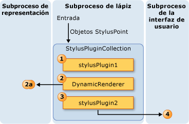
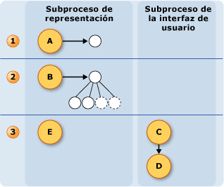

# Modelo de subprocesamiento de entrada manuscrita
Una de las ventajas de la entrada de lápiz en un Tablet PC es que se asemeja mucho a la escritura normal con lápiz y papel.  Para conseguirlo, el lápiz de Tablet PC recopila los datos de entrada a una velocidad muy superior a la del mouse y representa la entrada de lápiz mientras el usuario escribe.  El subproceso de la interfaz de usuario de la aplicación no es suficiente para recopilar los datos del lápiz y representar la entrada de lápiz, porque se puede bloquear.  Para resolverlo, una aplicación [!INCLUDE[TLA2#tla_winclient](../../../../includes/tla2sharptla-winclient-md.md)] usa dos subprocesos adicionales cuando un usuario escribe entrada de lápiz.  
  
 En la lista siguiente se describen los subprocesos que participan en la recopilación y representación de la entrada de lápiz digital:  
  
-   Subproceso del lápiz, que es el que toma la entrada del lápiz.  \(En realidad, es un grupo de subprocesos, pero en este tema se le designa como subproceso del lápiz.\)  
  
-   Subproceso de interfaz de usuario de aplicación, que es el subproceso que controla la interfaz de usuario de la aplicación.  
  
-   Subproceso de representación dinámica, que es el que representa la entrada de lápiz mientras el usuario dibuja un trazo.  El subproceso de representación dinámica es diferente del subproceso que representa otros elementos de la interfaz de usuario para la aplicación, como se menciona en [Modelo de subprocesos](../../../../docs/framework/wpf/advanced/threading-model.md) de Window Presentation Foundation.  
  
 El modelo de entrada de lápiz es el mismo si la aplicación usa <xref:System.Windows.Controls.InkCanvas> o un control personalizado similar al de [Creación de un control de entrada manuscrita](../../../../docs/framework/wpf/advanced/creating-an-ink-input-control.md).  Aunque en este tema se analiza el subprocesamiento en lo que se refiere a <xref:System.Windows.Controls.InkCanvas>, se aplican los mismos conceptos al crear un control personalizado.  
  
## Información general acerca del subprocesamiento  
 El diagrama siguiente ilustra el modelo de subprocesos cuando un usuario dibuja un trazo:  
  
   
  
1.  Acciones que suceden mientras el usuario dibuja el trazo  
  
    1.  Cuando el usuario dibuja un trazo, los puntos del lápiz se incorporan al subproceso del lápiz.  Los complementos del lápiz, incluido <xref:System.Windows.Input.StylusPlugIns.DynamicRenderer>, aceptan los puntos del lápiz en el subproceso del lápiz y tienen la oportunidad de modificarlos antes de que <xref:System.Windows.Controls.InkCanvas> los reciba.  
  
    2.  <xref:System.Windows.Input.StylusPlugIns.DynamicRenderer> representa los puntos del lápiz en el subproceso de representación dinámica.  Esto sucede al mismo tiempo que el paso anterior.  
  
    3.  <xref:System.Windows.Controls.InkCanvas> recibe los puntos del lápiz en el subproceso de la interfaz de usuario.  
  
2.  Acciones que suceden después de que el usuario finaliza el trazo  
  
    1.  Cuando el usuario termina de dibujar el trazo, <xref:System.Windows.Controls.InkCanvas> crea un objeto <xref:System.Windows.Ink.Stroke> y lo agrega a <xref:System.Windows.Controls.InkPresenter>, que lo representa estáticamente.  
  
    2.  El subproceso de la interfaz de usuario advierte a <xref:System.Windows.Input.StylusPlugIns.DynamicRenderer> de que el trazo se representa estáticamente, por lo que <xref:System.Windows.Input.StylusPlugIns.DynamicRenderer> quita su representación visual del trazo.  
  
## Recopilación de la entrada de lápiz y complementos del lápiz  
 Cada <xref:System.Windows.UIElement> tiene una <xref:System.Windows.Input.StylusPlugIns.StylusPlugInCollection>.  Los objetos <xref:System.Windows.Input.StylusPlugIns.StylusPlugIn> de <xref:System.Windows.Input.StylusPlugIns.StylusPlugInCollection> reciben y pueden modificar los puntos del lápiz en el subproceso del lápiz.  Los objetos <xref:System.Windows.Input.StylusPlugIns.StylusPlugIn> reciben los puntos del lápiz según su orden en <xref:System.Windows.Input.StylusPlugIns.StylusPlugInCollection>.  
  
 El diagrama siguiente ilustra la situación hipotética de que la colección <xref:System.Windows.UIElement.StylusPlugIns%2A> de <xref:System.Windows.UIElement> contenga `stylusPlugin1`, <xref:System.Windows.Input.StylusPlugIns.DynamicRenderer> y `stylusPlugin2`, por ese orden.  
  
   
  
 En el diagrama anterior, se produce el siguiente comportamiento:  
  
1.  `StylusPlugin1` modifica los valores de x e y.  
  
2.  <xref:System.Windows.Input.StylusPlugIns.DynamicRenderer> recibe los puntos del lápiz modificados y los representa en el subproceso de representación dinámica.  
  
3.  `StylusPlugin2` recibe los puntos del lápiz modificados y modifica una vez más los valores de x e y.  
  
4.  La aplicación recopila los puntos del lápiz y, cuando el usuario finaliza el trazo, lo representa estáticamente.  
  
 Supongamos que `stylusPlugin1` restringe los puntos del lápiz a un rectángulo y `stylusPlugin2` traslada los puntos del lápiz a la derecha.  En el escenario anterior, <xref:System.Windows.Input.StylusPlugIns.DynamicRenderer> recibe los puntos del lápiz restringidos, pero no los puntos del lápiz trasladados.  Cuando el usuario dibuja el trazo, el trazo se representa dentro de los límites del rectángulo, pero el trazo no parece trasladarse hasta que el usuario levanta el lápiz.  
  
### Operaciones con un complemento de lápiz óptico en el subproceso de la interfaz de usuario  
 Dado que no se puede realizar una prueba de aciertos precisa en el subproceso del lápiz, algunos elementos podrían recibir ocasionalmente entrada del lápiz dirigida a otros elementos.  Si necesita asegurarse de que la entrada se enrutó correctamente antes de realizar una operación, realice la operación en el método <xref:System.Windows.Input.StylusPlugIns.StylusPlugIn.OnStylusDownProcessed%2A>, <xref:System.Windows.Input.StylusPlugIns.StylusPlugIn.OnStylusMoveProcessed%2A>o <xref:System.Windows.Input.StylusPlugIns.StylusPlugIn.OnStylusUpProcessed%2A> después de suscribirse al mismo.  El subproceso de la aplicación invoca estos métodos una vez realizada una prueba de aciertos precisa.  Para suscribirse a estos métodos, llame al método <xref:System.Windows.Input.StylusPlugIns.RawStylusInput.NotifyWhenProcessed%2A> en el método que se ejecuta en el subproceso del lápiz.  
  
 El diagrama siguiente ilustra la relación entre el subproceso del lápiz y subproceso de la interfaz de usuario con respecto a los eventos de lápiz de <xref:System.Windows.Input.StylusPlugIns.StylusPlugIn>.  
  
   
  
## Representación de la entrada de lápiz  
 A medida que el usuario dibuja un trazo, <xref:System.Windows.Input.StylusPlugIns.DynamicRenderer> representa la entrada de lápiz en un subproceso independiente, de forma que la entrada de lápiz parece "fluir" del lápiz cuando el subproceso de la interfaz de usuario no está disponible.  <xref:System.Windows.Input.StylusPlugIns.DynamicRenderer> compila un árbol visual en el subproceso de representación dinámica mientras recopila los puntos del lápiz.  Cuando el usuario finaliza el trazo, <xref:System.Windows.Input.StylusPlugIns.DynamicRenderer> solicita que se le notifique cuando la aplicación realice el siguiente paso de representación.  Después de que la aplicación completa el siguiente paso de representación, <xref:System.Windows.Input.StylusPlugIns.DynamicRenderer> borra su árbol visual.  En el diagrama siguiente se muestra este proceso.  
  
   
  
1.  El usuario inicia el trazo.  
  
    1.  <xref:System.Windows.Input.StylusPlugIns.DynamicRenderer> crea el árbol visual.  
  
2.  El usuario está dibujando el trazo.  
  
    1.  <xref:System.Windows.Input.StylusPlugIns.DynamicRenderer> compila el árbol visual.  
  
3.  El usuario finaliza el trazo.  
  
    1.  <xref:System.Windows.Controls.InkPresenter> agrega el trazo a su árbol visual.  
  
    2.  La capa de integración multimedia \(MIL\) representa los trazos estáticamente.  
  
    3.  <xref:System.Windows.Input.StylusPlugIns.DynamicRenderer> borra la representación visual.