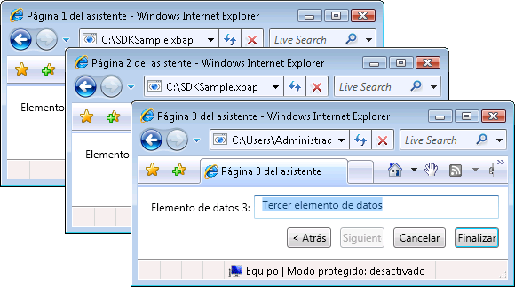
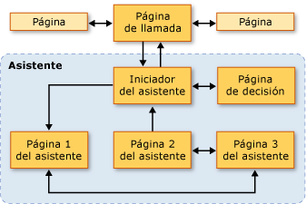

# Informaci&#243;n general sobre topolog&#237;as de navegaci&#243;n
 En esta información general se proporciona una introducción a las topologías de navegación en [!INCLUDE[TLA2#tla_wpf](../../../../includes/tla2sharptla-wpf-md.md)].  A continuación, se abordan tres topologías de navegación comunes, con ejemplos.  
  
> [!NOTE]
>  Antes de leer este tema, debe estar familiarizado con el concepto de navegación estructurada de [!INCLUDE[TLA2#tla_wpf](../../../../includes/tla2sharptla-wpf-md.md)] mediante funciones de página.  Para obtener más información acerca de estos dos temas, consulte [Información general sobre la navegación estructurada](../../../../docs/framework/wpf/app-development/structured-navigation-overview.md).  
  
 Este tema contiene las siguientes secciones:  
  
-   [Topologías de navegación](#Navigation_Topologies)  
  
-   [Topologías de navegación estructuradas](#Structured_Navigation_Topologies)  
  
-   [Navegación por una topología fija lineal](#Navigation_over_a_Fixed_Linear_Topology)  
  
-   [Navegación dinámica por una topología fija jerárquica](#Dynamic_Navigation_over_a_Fixed_Hierarchical_Topology)  
  
-   [Ejemplo de navegación por una topología generada dinámicamente](#Navigation_over_a_Dynamically_Generated_Topology)  
  
   
## Topologías de navegación  
 En [!INCLUDE[TLA2#tla_wpf](../../../../includes/tla2sharptla-wpf-md.md)], la navegación suele estar compuesta de páginas \(<xref:System.Windows.Controls.Page>\) con hipervínculos \(<xref:System.Windows.Documents.Hyperlink>\) que navegan a otras páginas cuando se hace clic en ellos.  Las páginas a las que se navega se identifican mediante [!INCLUDE[TLA#tla_uri#plural](../../../../includes/tlasharptla-urisharpplural-md.md)] \(consulte [Empaquetar URI en WPF](../../../../docs/framework/wpf/app-development/pack-uris-in-wpf.md)\).  Estudie el ejemplo siguiente sencillo, en el que se muestran páginas, hipervínculos y [!INCLUDE[TLA#tla_uri#plural](../../../../includes/tlasharptla-urisharpplural-md.md)]:  
  
 [!code-xml[NavigationTopologiesOverviewSnippets#Page1](../../../../samples/snippets/csharp/VS_Snippets_Wpf/NavigationTopologiesOverviewSnippets/CS/Page1.xaml#page1)]  
  
 [!code-xml[NavigationTopologiesOverviewSnippets#Page2](../../../../samples/snippets/csharp/VS_Snippets_Wpf/NavigationTopologiesOverviewSnippets/CS/Page2.xaml#page2)]  
  
 Estas páginas están organizadas en una *topología de navegación* cuya estructura se determina en virtud de cómo se puede navegar entre ellas.  Esta topología de navegación concreta es adecuada en escenarios simples, aunque la navegación puede exigir topologías más complejas, algunas de las cuales sólo se pueden definir cuando una aplicación se está ejecutando.  
  
 En este tema se abarcan tres topologías de navegación comunes: *fija lineal*, *fija jerárquica* y *generada dinámicamente*.  Cada topología de navegación se muestra con un ejemplo que tiene una [!INCLUDE[TLA2#tla_ui](../../../../includes/tla2sharptla-ui-md.md)] como la mostrada en la ilustración siguiente:  
  
   
  
   
## Topologías de navegación estructuradas  
 Hay dos tipos generales de topologías de navegación:  
  
-   **Topología fija**: se define en tiempo de compilación y no cambia en tiempo de ejecución.  Las topologías fijas son útiles para la navegación a través de una secuencia fija de páginas en orden lineal o jerárquico.  
  
-   **Topología dinámica**: se define en tiempo de ejecución basándose en los datos proporcionados por el usuario, la aplicación o el sistema.  Las topologías dinámicas son útiles cuando se puede navegar por las páginas en secuencias diferentes.  
  
 Aunque es posible crear topologías de navegación mediante páginas, en los ejemplos se utilizan funciones de página, porque proporcionan compatibilidad adicional que simplifica la compatibilidad con el paso y la devolución de datos a través de las páginas de una topología.  
  
   
## Navegación por una topología fija lineal  
 Una topología fija lineal es parecida a la estructura de un asistente, que tiene una o más páginas por las que se navega siguiendo una secuencia fija.  En la ilustración siguiente se muestra la estructura de nivel superior y el flujo de un asistente con una topología fija lineal.  
  
   
  
 Los comportamientos típicos para navegar por una topología fija lineal son:  
  
-   Navegar desde la página de llamada a una página de inicio que inicializa el asistente y navega a la primera página de este último.  No se requiere una página de inicio \(<xref:System.Windows.Navigation.PageFunction%601> sin [!INCLUDE[TLA2#tla_ui](../../../../includes/tla2sharptla-ui-md.md)]\), ya que una página de llamada puede llamar directamente a la primera página del asistente.  Sin embargo, el uso de una página de inicio puede simplificar la inicialización del asistente, especialmente si es compleja.  
  
-   El usuario puede navegar de una página a otra mediante los botones \(o hipervínculos\) de retroceso y avance \(Atrás y Siguiente\).  
  
-   El usuario puede navegar de una página a otra mediante el diario.  
  
-   El usuario puede cancelar el asistente desde cualquier página del mismo presionando el botón de cancelación \(Cancelar\).  
  
-   El usuario puede aceptar el asistente en la última página del mismo presionando un botón de finalización \(Finalizar\).  
  
-   Si se cancela un asistente, éste devuelve el resultado correspondiente y no devuelve ningún dato.  
  
-   Si el usuario acepta un asistente, éste devuelve el resultado correspondiente y los datos que ha recolectado.  
  
-   Cuando se completa el asistente \(se acepta o se cancela\), las páginas que componen el asistente se quitan del diario.  De este modo, cada instancia del asistente se mantiene aislada, lo que evita posibles anomalías en los datos o en el estado.  
  
   
## Navegación dinámica por una topología fija jerárquica  
 En algunas aplicaciones, las páginas permiten la navegación a dos o más otras páginas, como se muestra en la ilustración siguiente.  
  
   
  
 Esta estructura se denomina topología fija jerárquica y la aplicación o el usuario suelen determinar en tiempo de ejecución la secuencia en la que se recorre la jerarquía.  En tiempo de ejecución, cada página de la jerarquía que permite la navegación a dos o más otras páginas recolecta los datos necesarios para determinar a qué página se va a navegar.  En la ilustración siguiente se muestra una de las distintas secuencias de navegación posibles basándose en la ilustración anterior.  
  
   
  
 Aunque la secuencia en la que se navega por las páginas en una estructura fija jerárquica se determina en tiempo de ejecución, la experiencia del usuario es igual que en una topología fija lineal:  
  
-   Navegar desde la página de llamada a una página de inicio que inicializa el asistente y navega a la primera página de este último.  No se requiere una página de inicio \(<xref:System.Windows.Navigation.PageFunction%601> sin [!INCLUDE[TLA2#tla_ui](../../../../includes/tla2sharptla-ui-md.md)]\), ya que una página de llamada puede llamar directamente a la primera página del asistente.  Sin embargo, el uso de una página de inicio puede simplificar la inicialización del asistente, especialmente si es compleja.  
  
-   El usuario puede navegar de una página a otra mediante los botones \(o hipervínculos\) de retroceso y avance \(Atrás y Siguiente\).  
  
-   El usuario puede navegar de una página a otra mediante el diario.  
  
-   El usuario puede cambiar la secuencia de navegación si navega hacia atrás en el diario.  
  
-   El usuario puede cancelar el asistente desde cualquier página del mismo presionando el botón de cancelación \(Cancelar\).  
  
-   El usuario puede aceptar el asistente en la última página del mismo presionando un botón de finalización \(Finalizar\).  
  
-   Si se cancela un asistente, éste devuelve el resultado correspondiente y no devuelve ningún dato.  
  
-   Si el usuario acepta un asistente, éste devuelve el resultado correspondiente y los datos que ha recolectado.  
  
-   Cuando se completa el asistente \(se acepta o se cancela\), las páginas que componen el asistente se quitan del diario.  De este modo, cada instancia del asistente se mantiene aislada, lo que evita posibles anomalías en los datos o en el estado.  
  
   
## Ejemplo de navegación por una topología generada dinámicamente  
 En algunas aplicaciones, la secuencia en la que se navega por dos o más páginas se puede determinar únicamente en tiempo de ejecución, ya sea por el usuario, por la aplicación o por los datos externos.  En la ilustración siguiente se muestra un conjunto de páginas con una secuencia de navegación indeterminada.  
  
   
  
 En la figura siguiente se muestra una secuencia de navegación elegida por el usuario en tiempo de ejecución.  
  
   
  
 La secuencia de navegación se denomina topología generada dinámicamente.  Para el usuario, al igual que en las otras topologías de navegación, la experiencia es igual que en las topologías anteriores:  
  
-   Navegar desde la página de llamada a una página de inicio que inicializa el asistente y navega a la primera página de este último.  No se requiere una página de inicio \(<xref:System.Windows.Navigation.PageFunction%601> sin [!INCLUDE[TLA2#tla_ui](../../../../includes/tla2sharptla-ui-md.md)]\), ya que una página de llamada puede llamar directamente a la primera página del asistente.  Sin embargo, el uso de una página de inicio puede simplificar la inicialización del asistente, especialmente si es compleja.  
  
-   El usuario puede navegar de una página a otra mediante los botones \(o hipervínculos\) de retroceso y avance \(Atrás y Siguiente\).  
  
-   El usuario puede navegar de una página a otra mediante el diario.  
  
-   El usuario puede cancelar el asistente desde cualquier página del mismo presionando el botón de cancelación \(Cancelar\).  
  
-   El usuario puede aceptar el asistente en la última página del mismo presionando un botón de finalización \(Finalizar\).  
  
-   Si se cancela un asistente, éste devuelve el resultado correspondiente y no devuelve ningún dato.  
  
-   Si el usuario acepta un asistente, éste devuelve el resultado correspondiente y los datos que ha recolectado.  
  
-   Cuando se completa el asistente \(se acepta o se cancela\), las páginas que componen el asistente se quitan del diario.  De este modo, cada instancia del asistente se mantiene aislada, lo que evita posibles anomalías en los datos o en el estado.  
  
## Vea también  
 <xref:System.Windows.Controls.Page>   
 <xref:System.Windows.Navigation.PageFunction%601>   
 <xref:System.Windows.Navigation.NavigationService>   
 [Información general sobre la navegación estructurada](../../../../docs/framework/wpf/app-development/structured-navigation-overview.md)