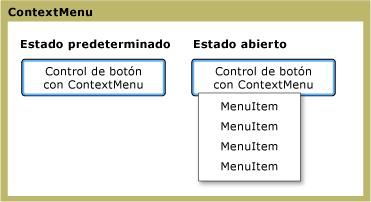

# ContextMenu
<xref:System.Windows.Controls.ContextMenu> permite a un control mostrar un menú \(<xref:System.Windows.Controls.Menu>\) específico del contexto del control.  Normalmente, <xref:System.Windows.Controls.ContextMenu> se expone en la [!INCLUDE[TLA#tla_ui](../../../../includes/tlasharptla-ui-md.md)] a través del botón secundario del mouse o a través de la tecla de menú del teclado.  
  
 En la figura siguiente se muestra <xref:System.Windows.Controls.ContextMenu> en dos estados diferentes: el estado predeterminado y el estado abierto.  En el estado predeterminado, el control está contraído.  Cuando se presiona el botón secundario del mouse con el cursor situado sobre el elemento primario del menú, el control se expande y muestra los elementos del menú.  
  
   
ContextMenu en estados diferentes  
  
## En esta sección  
 [Información general sobre ContextMenu](../../../../docs/framework/wpf/controls/contextmenu-overview.md)  
  
## Referencia  
 <xref:System.Windows.Controls.ContextMenu>  
  
## Secciones relacionadas