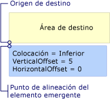
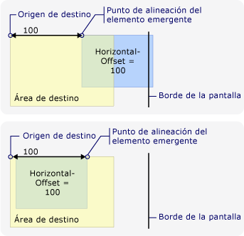
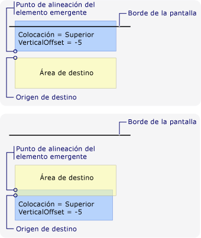
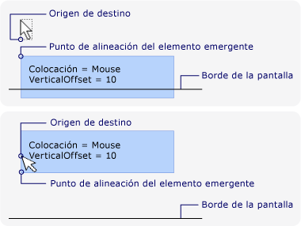

# Posici&#243;n de un control Popup
Un <xref:System.Windows.Controls.Primitives.Popup> control muestra el contenido en una ventana independiente que flota sobre una aplicación. Puede especificar la posición de un <xref:System.Windows.Controls.Primitives.Popup> con respecto a un control, el mouse o la pantalla mediante el uso de la <xref:System.Windows.Controls.Primitives.Popup.PlacementTarget%2A>, <xref:System.Windows.Controls.Primitives.Popup.Placement%2A>, <xref:System.Windows.Controls.Primitives.Popup.PlacementRectangle%2A>, <xref:System.Windows.Controls.Primitives.Popup.HorizontalOffset%2A>, y <xref:System.Windows.Controls.Primitives.Popup.VerticalOffset%2A> propiedades.  Estas propiedades funcionan conjuntamente para proporcionar flexibilidad para especificar la posición de la <xref:System.Windows.Controls.Primitives.Popup>.  
  
> [!NOTE]
>  El <xref:System.Windows.Controls.ToolTip> y <xref:System.Windows.Controls.ContextMenu> clases también definen estas cinco propiedades y se comportan de forma similar.  
  
 [!INCLUDE[autoOutline](../Token/autoOutline_md.md)]  
  
   
## Colocar el elemento emergente  
 La colocación de un <xref:System.Windows.Controls.Primitives.Popup> puede ser relativo a un <xref:System.Windows.UIElement> o a toda la pantalla.  En el ejemplo siguiente se crea cuatro <xref:System.Windows.Controls.Primitives.Popup> controles relativo a un <xref:System.Windows.UIElement>: en este caso, una imagen. Todos los <xref:System.Windows.Controls.Primitives.Popup> controles tienen la <xref:System.Windows.Controls.Primitives.Popup.PlacementTarget%2A> propiedad establecida en `image1`, pero cada <xref:System.Windows.Controls.Primitives.Popup> tiene un valor diferente para la propiedad de ubicación.  
  
 [!code-xml[PopupPositionSnippet#3](../../../../samples/snippets/csharp/VS_Snippets_Wpf/PopupPositionSnippet/CS/Window1.xaml#3)]  
  
 La siguiente ilustración muestra la imagen y la <xref:System.Windows.Controls.Primitives.Popup> controles  
  
   
Imagen con cuatro emergentes  
  
 Este sencillo ejemplo demuestra cómo establecer el <xref:System.Windows.Controls.Primitives.Popup.PlacementTarget%2A> y <xref:System.Windows.Controls.Primitives.Popup.Placement%2A> propiedades, pero utilizando la <xref:System.Windows.Controls.Primitives.Popup.PlacementRectangle%2A>, <xref:System.Windows.Controls.Primitives.Popup.HorizontalOffset%2A>, y <xref:System.Windows.Controls.Primitives.Popup.VerticalOffset%2A> propiedades, tiene más control sobre la ubicación donde el <xref:System.Windows.Controls.Primitives.Popup> se coloca.  
  
   
## Definiciones de términos: Anatomía de un elemento emergente  
 Los siguientes términos son útiles para entender cómo la <xref:System.Windows.Controls.Primitives.Popup.PlacementTarget%2A>, <xref:System.Windows.Controls.Primitives.Popup.Placement%2A>, <xref:System.Windows.Controls.Primitives.Popup.PlacementRectangle%2A>, <xref:System.Windows.Controls.Primitives.Popup.HorizontalOffset%2A>, y <xref:System.Windows.Controls.Primitives.Popup.VerticalOffset%2A> propiedades se relacionan entre sí y la <xref:System.Windows.Controls.Primitives.Popup>:  
  
-   Objeto de destino  
  
-   Área de destino  
  
-   Origen de destino  
  
-   Punto de alineación del elemento emergente  
  
 Estos términos son una manera cómoda para hacer referencia a distintos aspectos de la <xref:System.Windows.Controls.Primitives.Popup> y el control que está asociado.  
  
### Objeto de destino  
 El *objeto de destino* es el elemento que el <xref:System.Windows.Controls.Primitives.Popup> está asociado. Si el <xref:System.Windows.Controls.Primitives.Popup.PlacementTarget%2A> propiedad se establece, especifica el objeto de destino.  Si <xref:System.Windows.Controls.Primitives.Popup.PlacementTarget%2A> no está establecida y el <xref:System.Windows.Controls.Primitives.Popup> tiene un elemento primario, el elemento primario es el objeto de destino.  Si no hay ningún <xref:System.Windows.Controls.Primitives.Popup.PlacementTarget%2A> valor y ningún elemento primario, no hay ningún objeto de destino y el <xref:System.Windows.Controls.Primitives.Popup> se sitúa en relación con la pantalla.  
  
 En el ejemplo siguiente se crea un <xref:System.Windows.Controls.Primitives.Popup> que es el elemento secundario de un <xref:System.Windows.Controls.Canvas>.  El ejemplo establece la <xref:System.Windows.Controls.Primitives.Popup.PlacementTarget%2A> propiedad en el <xref:System.Windows.Controls.Primitives.Popup>. El valor predeterminado de <xref:System.Windows.Controls.Primitives.Popup.Placement%2A> es <xref:System.Windows.Controls.Primitives.PlacementMode?displayProperty=fullName>, por lo que la <xref:System.Windows.Controls.Primitives.Popup> aparece debajo de la <xref:System.Windows.Controls.Canvas>.  
  
 [!code-xml[PopupPositionSnippet#1](../../../../samples/snippets/csharp/VS_Snippets_Wpf/PopupPositionSnippet/CS/Window1.xaml#1)]  
  
 La siguiente ilustración muestra la <xref:System.Windows.Controls.Primitives.Popup> se coloca relativo a la <xref:System.Windows.Controls.Canvas>.  
  
   
Elemento emergente sin PlacementTarget  
  
 En el ejemplo siguiente se crea un <xref:System.Windows.Controls.Primitives.Popup> que es el elemento secundario de un <xref:System.Windows.Controls.Canvas>, pero esta vez el <xref:System.Windows.Controls.Primitives.Popup.PlacementTarget%2A> está establecido en `ellipse1`, por lo que el elemento emergente aparece debajo de la <xref:System.Windows.Shapes.Ellipse>.  
  
 [!code-xml[PopupPositionSnippet#2](../../../../samples/snippets/csharp/VS_Snippets_Wpf/PopupPositionSnippet/CS/Window1.xaml#2)]  
  
 La siguiente ilustración muestra la <xref:System.Windows.Controls.Primitives.Popup> se coloca relativo a la <xref:System.Windows.Shapes.Ellipse>.  
  
   
Popup con PlacementTarget  
  
> [!NOTE]
>  Para <xref:System.Windows.Controls.ToolTip>, el valor predeterminado de <xref:System.Windows.Controls.Primitives.Popup.Placement%2A> es <xref:System.Windows.Controls.Primitives.PlacementMode>.  Para <xref:System.Windows.Controls.ContextMenu>, el valor predeterminado de <xref:System.Windows.Controls.Primitives.Popup.Placement%2A> es <xref:System.Windows.Controls.Primitives.PlacementMode>. Estos valores se explican más adelante, en "Cómo funcionan las propiedades juntos."  
  
### Área de destino  
 El *área de destino* es el área de la pantalla que el <xref:System.Windows.Controls.Primitives.Popup> es relativo. En los ejemplos anteriores, la <xref:System.Windows.Controls.Primitives.Popup> se alinea con los límites del objeto de destino, pero en algunos casos, el <xref:System.Windows.Controls.Primitives.Popup> se alinea con otros límites, incluso si la <xref:System.Windows.Controls.Primitives.Popup> tiene un objeto de destino.  Si el <xref:System.Windows.Controls.Primitives.Popup.PlacementRectangle%2A> propiedad está establecida, el área de destino es diferente de los límites del objeto de destino.  
  
 En el ejemplo siguiente se crean dos <xref:System.Windows.Controls.Canvas> objetos, cada uno con un <xref:System.Windows.Shapes.Rectangle> y un <xref:System.Windows.Controls.Primitives.Popup>.  En ambos casos, el destino del objeto para el <xref:System.Windows.Controls.Primitives.Popup> es el <xref:System.Windows.Controls.Canvas>. El <xref:System.Windows.Controls.Primitives.Popup> en la primera <xref:System.Windows.Controls.Canvas> tiene la <xref:System.Windows.Controls.Primitives.Popup.PlacementRectangle%2A> establecido, con su <xref:System.Windows.Rect.X%2A>, <xref:System.Windows.Rect.Y%2A>, <xref:System.Windows.Rect.Width%2A>, y <xref:System.Windows.Rect.Height%2A> se establecen en 50, 50, 50 y 100, respectivamente. El <xref:System.Windows.Controls.Primitives.Popup> en el segundo <xref:System.Windows.Controls.Canvas> no tiene la <xref:System.Windows.Controls.Primitives.Popup.PlacementRectangle%2A> establecido.  Como resultado, la primera <xref:System.Windows.Controls.Primitives.Popup> está situado debajo de la <xref:System.Windows.Controls.Primitives.Popup.PlacementRectangle%2A> y el segundo <xref:System.Windows.Controls.Primitives.Popup> está situado debajo de la <xref:System.Windows.Controls.Canvas>. Cada <xref:System.Windows.Controls.Canvas> también contiene un <xref:System.Windows.Shapes.Rectangle> que tiene los mismos límites que el <xref:System.Windows.Controls.Primitives.Popup.PlacementRectangle%2A> para la primera <xref:System.Windows.Controls.Primitives.Popup>.  Tenga en cuenta que el <xref:System.Windows.Controls.Primitives.Popup.PlacementRectangle%2A> no crea un elemento visible en la aplicación; en el ejemplo se crea un <xref:System.Windows.Shapes.Rectangle> para representar la <xref:System.Windows.Controls.Primitives.Popup.PlacementRectangle%2A>.  
  
 [!code-xml[PopupPositionSnippet#4](../../../../samples/snippets/csharp/VS_Snippets_Wpf/PopupPositionSnippet/CS/Window1.xaml#4)]  
  
 La ilustración siguiente muestra el resultado del ejemplo anterior.  
  
   
Elemento emergente con y sin PlacementRectangle  
  
### Origen del destino y el punto de alineación del elemento emergente  
 El *destino origen* y *punto de alineación emergente* son puntos de referencia en el área de destino y un menú emergente, respectivamente, que se utilizan para colocar. Puede usar el <xref:System.Windows.Controls.Primitives.Popup.HorizontalOffset%2A> y <xref:System.Windows.Controls.Primitives.Popup.VerticalOffset%2A> propiedades para desplazar el elemento emergente desde el área de destino.  El <xref:System.Windows.Controls.Primitives.Popup.HorizontalOffset%2A> y <xref:System.Windows.Controls.Primitives.Popup.VerticalOffset%2A> están en relación con el origen del destino y el punto de alineación del elemento emergente. El valor de la <xref:System.Windows.Controls.Primitives.Popup.Placement%2A> propiedad determina donde se encuentra el punto de alineación de origen y los elementos emergentes de destino.  
  
 En el ejemplo siguiente se crea un <xref:System.Windows.Controls.Primitives.Popup> y establece la <xref:System.Windows.Controls.Primitives.Popup.HorizontalOffset%2A> y <xref:System.Windows.Controls.Primitives.Popup.VerticalOffset%2A> propiedades a 20.  El <xref:System.Windows.Controls.Primitives.Popup.Placement%2A> propiedad está establecida en <xref:System.Windows.Controls.Primitives.PlacementMode> (valor predeterminado), por lo que el origen de destino es la esquina inferior izquierda del área de destino y el punto de alineación del elemento emergente es la esquina superior izquierda de la <xref:System.Windows.Controls.Primitives.Popup>.  
  
 [!code-xml[PopupPositionSnippet#5](../../../../samples/snippets/csharp/VS_Snippets_Wpf/PopupPositionSnippet/CS/Window1.xaml#5)]  
  
 La ilustración siguiente muestra el resultado del ejemplo anterior.  
  
   
Elemento emergente con HorizontalOffset y VerticalOffset  
  
   
## Cómo funcionan conjuntamente las propiedades  
 Los valores de <xref:System.Windows.Controls.Primitives.Popup.PlacementTarget%2A>, <xref:System.Windows.Controls.Primitives.Popup.PlacementRectangle%2A>, y <xref:System.Windows.Controls.Primitives.Popup.Placement%2A> tener en cuenta para calcular el área de destino correcto, origen del destino y punto de alineación del elemento emergente.  Por ejemplo, si el valor de <xref:System.Windows.Controls.Primitives.Popup.Placement%2A> es <xref:System.Windows.Controls.Primitives.PlacementMode>, no hay ningún objeto de destino, el <xref:System.Windows.Controls.Primitives.Popup.PlacementRectangle%2A> se omite, y el área de destino corresponde a los límites del puntero del mouse. Por otro lado, si <xref:System.Windows.Controls.Primitives.Popup.Placement%2A> es <xref:System.Windows.Controls.Primitives.PlacementMode>, <xref:System.Windows.Controls.Primitives.Popup.PlacementTarget%2A> o primario determina el objeto de destino y <xref:System.Windows.Controls.Primitives.Popup.PlacementRectangle%2A> determina el área de destino.  
  
 La tabla siguiente se describe el objeto de destino, el área de destino, el origen del destino y el punto de alineación del elemento emergente y se indica si <xref:System.Windows.Controls.Primitives.Popup.PlacementTarget%2A> y <xref:System.Windows.Controls.Primitives.Popup.PlacementRectangle%2A> se utilizan para cada <xref:System.Windows.Controls.Primitives.PlacementMode> valor de enumeración.  
  
|PlacementMode|Objeto de destino|Área de destino|Origen de destino|Punto de alineación del elemento emergente|  
|-------------------|-------------------|-----------------|-------------------|---------------------------|  
|<xref:System.Windows.Controls.Primitives.PlacementMode>|No es aplicable. <xref:System.Windows.Controls.Primitives.Popup.PlacementTarget%2A> se omite.|La pantalla o <xref:System.Windows.Controls.Primitives.Popup.PlacementRectangle%2A> si se establece.  El <xref:System.Windows.Controls.Primitives.Popup.PlacementRectangle%2A> es relativa a la pantalla.|La esquina superior izquierda del área de destino.|La esquina superior izquierda de la <xref:System.Windows.Controls.Primitives.Popup>.|  
|<xref:System.Windows.Controls.Primitives.PlacementMode>|No es aplicable. <xref:System.Windows.Controls.Primitives.Popup.PlacementTarget%2A> se omite.|La pantalla o <xref:System.Windows.Controls.Primitives.Popup.PlacementRectangle%2A> si se establece.  El <xref:System.Windows.Controls.Primitives.Popup.PlacementRectangle%2A> es relativa a la pantalla.|La esquina superior izquierda del área de destino.|La esquina superior izquierda de la <xref:System.Windows.Controls.Primitives.Popup>.|  
|<xref:System.Windows.Controls.Primitives.PlacementMode>|<xref:System.Windows.Controls.Primitives.Popup.PlacementTarget%2A> o primario.|El objeto de destino, o <xref:System.Windows.Controls.Primitives.Popup.PlacementRectangle%2A> si se establece.  El <xref:System.Windows.Controls.Primitives.Popup.PlacementRectangle%2A> es relativa al objeto de destino.|La esquina inferior izquierda del área de destino.|La esquina superior izquierda de la <xref:System.Windows.Controls.Primitives.Popup>.|  
|<xref:System.Windows.Controls.Primitives.PlacementMode>|<xref:System.Windows.Controls.Primitives.Popup.PlacementTarget%2A> o primario.|El objeto de destino, o <xref:System.Windows.Controls.Primitives.Popup.PlacementRectangle%2A> si se establece.  El <xref:System.Windows.Controls.Primitives.Popup.PlacementRectangle%2A> es relativa al objeto de destino.|El centro del área de destino.|El centro de la <xref:System.Windows.Controls.Primitives.Popup>.|  
|<xref:System.Windows.Controls.Primitives.PlacementMode>|<xref:System.Windows.Controls.Primitives.Popup.PlacementTarget%2A> o primario.|El objeto de destino, o <xref:System.Windows.Controls.Primitives.Popup.PlacementRectangle%2A> si se establece.  El <xref:System.Windows.Controls.Primitives.Popup.PlacementRectangle%2A> es relativa al objeto de destino.|Definido por el <xref:System.Windows.Controls.Primitives.CustomPopupPlacementCallback>.|Definido por el <xref:System.Windows.Controls.Primitives.CustomPopupPlacementCallback>.|  
|<xref:System.Windows.Controls.Primitives.PlacementMode>|<xref:System.Windows.Controls.Primitives.Popup.PlacementTarget%2A> o primario.|El objeto de destino, o <xref:System.Windows.Controls.Primitives.Popup.PlacementRectangle%2A> si se establece.  El <xref:System.Windows.Controls.Primitives.Popup.PlacementRectangle%2A> es relativa al objeto de destino.|La esquina superior izquierda del área de destino.|La esquina superior derecha de la <xref:System.Windows.Controls.Primitives.Popup>.|  
|<xref:System.Windows.Controls.Primitives.PlacementMode>|No es aplicable. <xref:System.Windows.Controls.Primitives.Popup.PlacementTarget%2A> se omite.|Los límites del puntero del mouse. <xref:System.Windows.Controls.Primitives.Popup.PlacementRectangle%2A> se omite.|La esquina inferior izquierda del área de destino.|La esquina superior izquierda de la <xref:System.Windows.Controls.Primitives.Popup>.|  
|<xref:System.Windows.Controls.Primitives.PlacementMode>|No es aplicable. <xref:System.Windows.Controls.Primitives.Popup.PlacementTarget%2A> se omite.|Los límites del puntero del mouse. <xref:System.Windows.Controls.Primitives.Popup.PlacementRectangle%2A> se omite.|La esquina superior izquierda del área de destino.|La esquina superior izquierda de la <xref:System.Windows.Controls.Primitives.Popup>.|  
|<xref:System.Windows.Controls.Primitives.PlacementMode>|<xref:System.Windows.Controls.Primitives.Popup.PlacementTarget%2A> o primario.|El objeto de destino, o <xref:System.Windows.Controls.Primitives.Popup.PlacementRectangle%2A> si se establece.  El <xref:System.Windows.Controls.Primitives.Popup.PlacementRectangle%2A> es relativa al objeto de destino.|La esquina superior izquierda del área de destino.|La esquina superior izquierda de la <xref:System.Windows.Controls.Primitives.Popup>.|  
|<xref:System.Windows.Controls.Primitives.PlacementMode>|<xref:System.Windows.Controls.Primitives.Popup.PlacementTarget%2A> o primario.|El objeto de destino, o <xref:System.Windows.Controls.Primitives.Popup.PlacementRectangle%2A> si se establece.  El <xref:System.Windows.Controls.Primitives.Popup.PlacementRectangle%2A> es relativa al objeto de destino.|La esquina superior izquierda del área de destino.|La esquina superior izquierda de la <xref:System.Windows.Controls.Primitives.Popup>.|  
|<xref:System.Windows.Controls.Primitives.PlacementMode>|<xref:System.Windows.Controls.Primitives.Popup.PlacementTarget%2A> o primario.|El objeto de destino, o <xref:System.Windows.Controls.Primitives.Popup.PlacementRectangle%2A> si se establece.  El <xref:System.Windows.Controls.Primitives.Popup.PlacementRectangle%2A> es relativa al objeto de destino.|La esquina superior derecha del área de destino.|La esquina superior izquierda de la <xref:System.Windows.Controls.Primitives.Popup>.|  
|<xref:System.Windows.Controls.Primitives.PlacementMode>|<xref:System.Windows.Controls.Primitives.Popup.PlacementTarget%2A> o primario.|El objeto de destino, o <xref:System.Windows.Controls.Primitives.Popup.PlacementRectangle%2A> si se establece.  El <xref:System.Windows.Controls.Primitives.Popup.PlacementRectangle%2A> es relativa al objeto de destino.|La esquina superior izquierda del área de destino.|La esquina inferior izquierda de la <xref:System.Windows.Controls.Primitives.Popup>.|  
  
 Las ilustraciones siguientes se muestra la <xref:System.Windows.Controls.Primitives.Popup>, seleccione el área de destino, el origen del destino y la alineación del elemento emergente para cada <xref:System.Windows.Controls.Primitives.PlacementMode> valor. En cada figura, el área de destino es amarillo y la <xref:System.Windows.Controls.Primitives.Popup> es azul.  
  
   
La posición es Absolute o AbsolutePoint  
  
   
La posición es inferior  
  
   
Selección de ubicación es el centro  
  
   
Placement es Left  
  
   
Placement es Mouse  
  
   
Posición MousePoint  
  
   
La posición es Relative o RelativePoint  
  
   
Placement es Right  
  
   
Placement es Top  
  
   
## Cuando el elemento emergente encuentra el borde de la pantalla  
 Por motivos de seguridad, un <xref:System.Windows.Controls.Primitives.Popup> no puede estar oculto por el borde de una pantalla. Se produce una de estas tres cosas cuando el <xref:System.Windows.Controls.Primitives.Popup> se encuentra con un borde de la pantalla:  
  
-   El elemento emergente se vuelve a alinear a lo largo del borde de la pantalla que ocultaría la <xref:System.Windows.Controls.Primitives.Popup>.  
  
-   El elemento emergente usa un punto de alineación del elemento emergente diferente.  
  
-   El elemento emergente usa un punto de alineación de origen y los elementos emergentes de destino diferente.  
  
 Estas opciones se describen con más detalle más adelante en esta sección.  
  
 El comportamiento de la <xref:System.Windows.Controls.Primitives.Popup> cuando encuentra un borde de la pantalla depende del valor de la <xref:System.Windows.Controls.Primitives.Popup.Placement%2A> propiedad y que la pantalla borde el elemento emergente se encuentra. En la tabla siguiente se resume el comportamiento cuando el <xref:System.Windows.Controls.Primitives.Popup> encuentra un borde de la pantalla para cada <xref:System.Windows.Controls.Primitives.PlacementMode> valor.  
  
|PlacementMode|Borde superior|Borde inferior|Borde izquierdo|Borde derecho|  
|-------------------|--------------|-----------------|---------------|----------------|  
|<xref:System.Windows.Controls.Primitives.PlacementMode>|Alinea el borde superior.|Alinea el borde inferior.|Alinea el borde izquierdo.|Alinea el borde derecho.|  
|<xref:System.Windows.Controls.Primitives.PlacementMode>|Alinea el borde superior.|El punto de alineación del elemento emergente cambia a la esquina inferior izquierda de la <xref:System.Windows.Controls.Primitives.Popup>.|Alinea el borde izquierdo.|El punto de alineación del elemento emergente cambia a la esquina superior derecha de la <xref:System.Windows.Controls.Primitives.Popup>.|  
|<xref:System.Windows.Controls.Primitives.PlacementMode>|Alinea el borde superior.|El origen del destino cambia a la esquina superior izquierda del área de destino y el punto de alineación del elemento emergente cambia a la esquina inferior izquierda de la <xref:System.Windows.Controls.Primitives.Popup>.|Alinea el borde izquierdo.|Alinea el borde derecho.|  
|<xref:System.Windows.Controls.Primitives.PlacementMode>|Alinea el borde superior.|Alinea el borde inferior.|Alinea el borde izquierdo.|Alinea el borde derecho.|  
|<xref:System.Windows.Controls.Primitives.PlacementMode>|Alinea el borde superior.|Alinea el borde inferior.|El origen del destino cambia a la esquina superior derecha del área de destino y el punto de alineación del elemento emergente cambia a la esquina superior izquierda de la <xref:System.Windows.Controls.Primitives.Popup>.|Alinea el borde derecho.|  
|<xref:System.Windows.Controls.Primitives.PlacementMode>|Alinea el borde superior.|El origen del destino cambia a la esquina superior izquierda del área de destino (los límites del puntero del mouse) y el punto de alineación del elemento emergente cambia a la esquina inferior izquierda de la <xref:System.Windows.Controls.Primitives.Popup>.|Alinea el borde izquierdo.|Alinea el borde derecho.|  
|<xref:System.Windows.Controls.Primitives.PlacementMode>|Alinea el borde superior.|El punto de alineación del elemento emergente cambia a la esquina inferior izquierda de la <xref:System.Windows.Controls.Primitives.Popup>.|Alinea el borde izquierdo.|Punto de la alineación del elemento emergente cambia a la esquina superior derecha de la ventana emergente.|  
|<xref:System.Windows.Controls.Primitives.PlacementMode>|Alinea el borde superior.|Alinea el borde inferior.|Alinea el borde izquierdo.|Alinea el borde derecho.|  
|<xref:System.Windows.Controls.Primitives.PlacementMode>|Alinea el borde superior.|El punto de alineación del elemento emergente cambia a la esquina inferior izquierda de la <xref:System.Windows.Controls.Primitives.Popup>.|Alinea el borde izquierdo.|Punto de la alineación del elemento emergente cambia a la esquina superior derecha de la ventana emergente.|  
|<xref:System.Windows.Controls.Primitives.PlacementMode>|Alinea el borde superior.|Alinea el borde inferior.|Alinea el borde izquierdo.|El origen del destino cambia a la esquina superior izquierda del área de destino y el punto de alineación del elemento emergente cambia a la esquina superior derecha de la <xref:System.Windows.Controls.Primitives.Popup>.|  
|<xref:System.Windows.Controls.Primitives.PlacementMode>|El origen del destino cambia a la esquina inferior izquierda del área de destino y el punto de alineación del elemento emergente cambia a la esquina superior izquierda de la <xref:System.Windows.Controls.Primitives.Popup>. De hecho, es el mismo que cuando <xref:System.Windows.Controls.Primitives.Popup.Placement%2A> es <xref:System.Windows.Controls.Primitives.PlacementMode>.|Alinea el borde inferior.|Alinea el borde izquierdo.|Alinea el borde derecho.|  
  
### Alinear con el borde de la pantalla  
 Un <xref:System.Windows.Controls.Primitives.Popup> puede alinear con el borde de la pantalla cambiándose de posición por lo que todo el <xref:System.Windows.Controls.Primitives.Popup> está visible en la pantalla.  Cuando esto ocurre, la distancia entre el punto de alineación de origen y los elementos emergentes de destino puede diferir de los valores de <xref:System.Windows.Controls.Primitives.Popup.HorizontalOffset%2A> y <xref:System.Windows.Controls.Primitives.Popup.VerticalOffset%2A>. Cuando <xref:System.Windows.Controls.Primitives.Popup.Placement%2A> es <xref:System.Windows.Controls.Primitives.PlacementMode>, <xref:System.Windows.Controls.Primitives.PlacementMode>, o <xref:System.Windows.Controls.Primitives.PlacementMode>, <xref:System.Windows.Controls.Primitives.Popup> se alinea automáticamente a cada borde de la pantalla.  Por ejemplo, supongamos que un <xref:System.Windows.Controls.Primitives.Popup> tiene <xref:System.Windows.Controls.Primitives.Popup.Placement%2A> establecido en <xref:System.Windows.Controls.Primitives.PlacementMode> y <xref:System.Windows.Controls.Primitives.Popup.VerticalOffset%2A> establecido en 100.  Si la parte inferior de la pantalla oculta todo o parte de la <xref:System.Windows.Controls.Primitives.Popup>, el <xref:System.Windows.Controls.Primitives.Popup> cambia de posición a lo largo de la parte inferior de la pantalla y la distancia vertical entre el origen del destino y el elemento emergente punto de alineación es menor que 100. La siguiente ilustración se muestra cómo hacerlo.  
  
   
Elemento emergente que se alinea con el borde de la pantalla  
  
### Cambiar el punto de alineación del elemento emergente  
 Si <xref:System.Windows.Controls.Primitives.Popup.Placement%2A> es <xref:System.Windows.Controls.Primitives.PlacementMode>, <xref:System.Windows.Controls.Primitives.PlacementMode>, o <xref:System.Windows.Controls.Primitives.PlacementMode>, el punto de alineación del elemento emergente cambia cuando el elemento emergente encuentra con el borde inferior o derecho de la pantalla.  
  
 La siguiente ilustración muestra que cuando el borde inferior de la pantalla oculta todo o parte de la <xref:System.Windows.Controls.Primitives.Popup>, el punto de alineación del elemento emergente es la esquina inferior izquierda de la <xref:System.Windows.Controls.Primitives.Popup>.  
  
   
Elemento emergente encuentra con el borde inferior de la pantalla y cambia el punto de alineación del elemento emergente  
  
 La siguiente ilustración muestra que, cuando la <xref:System.Windows.Controls.Primitives.Popup> está oculto por el borde derecho de la pantalla, el punto de alineación del elemento emergente es la esquina superior derecha de la <xref:System.Windows.Controls.Primitives.Popup>.  
  
   
Elemento emergente encuentra con el borde derecho de la pantalla y cambia el punto de alineación del elemento emergente  
  
 Si el <xref:System.Windows.Controls.Primitives.Popup> encuentra los bordes inferior y derecho de la pantalla, el punto de alineación del elemento emergente es la esquina inferior derecha de la <xref:System.Windows.Controls.Primitives.Popup>.  
  
### Cambiar el origen del destino y el punto de alineación del elemento emergente  
 Cuando <xref:System.Windows.Controls.Primitives.Popup.Placement%2A> es <xref:System.Windows.Controls.Primitives.PlacementMode>, <xref:System.Windows.Controls.Primitives.PlacementMode>, <xref:System.Windows.Controls.Primitives.PlacementMode>, <xref:System.Windows.Controls.Primitives.PlacementMode>, o <xref:System.Windows.Controls.Primitives.PlacementMode>, cambio de punto de la alineación de origen y los elementos emergentes de destino si se encuentra un determinado de borde de la pantalla.  El borde de la pantalla que provoca el cambio de posición depende del <xref:System.Windows.Controls.Primitives.PlacementMode> valor.  
  
 La siguiente ilustración muestra que cuando <xref:System.Windows.Controls.Primitives.Popup.Placement%2A> es <xref:System.Windows.Controls.Primitives.PlacementMode> y <xref:System.Windows.Controls.Primitives.Popup> encuentra el borde inferior de la pantalla, el origen del destino es la esquina superior izquierda del área de destino y el punto de alineación del elemento emergente es la esquina inferior izquierda de la <xref:System.Windows.Controls.Primitives.Popup>.  
  
   
Posición es inferior y el elemento emergente encuentra con el borde inferior de la pantalla  
  
 La siguiente ilustración muestra que cuando <xref:System.Windows.Controls.Primitives.Popup.Placement%2A> es <xref:System.Windows.Controls.Primitives.PlacementMode> y <xref:System.Windows.Controls.Primitives.Popup> encuentra con el borde izquierdo de la pantalla, el origen del destino es la esquina superior derecha del área de destino y el punto de alineación del elemento emergente es la esquina superior izquierda de la <xref:System.Windows.Controls.Primitives.Popup>.  
  
   
Placement es Left y el elemento emergente encuentra con el borde izquierdo de la pantalla  
  
 La siguiente ilustración muestra que cuando <xref:System.Windows.Controls.Primitives.Popup.Placement%2A> es <xref:System.Windows.Controls.Primitives.PlacementMode> y <xref:System.Windows.Controls.Primitives.Popup> encuentra con el borde derecho de la pantalla, el origen del destino es la esquina superior izquierda del área de destino y el punto de alineación del elemento emergente es la esquina superior derecha de la <xref:System.Windows.Controls.Primitives.Popup>.  
  
   
Placement es Right y el elemento emergente encuentra con el borde derecho de la pantalla  
  
 En la siguiente ilustración se muestra que, cuando <xref:System.Windows.Controls.Primitives.Popup.Placement%2A> es <xref:System.Windows.Controls.Primitives.PlacementMode> y la <xref:System.Windows.Controls.Primitives.Popup> encuentra con el borde superior de la pantalla, el origen del destino es la esquina inferior izquierda del área de destino y el punto de alineación del elemento emergente es la esquina superior izquierda de la <xref:System.Windows.Controls.Primitives.Popup>.  
  
   
Placement es Top y el elemento emergente encuentra con el borde superior de la pantalla  
  
 La siguiente ilustración muestra que cuando <xref:System.Windows.Controls.Primitives.Popup.Placement%2A> es <xref:System.Windows.Controls.Primitives.PlacementMode> y <xref:System.Windows.Controls.Primitives.Popup> encuentra el borde inferior de la pantalla, el origen del destino es la esquina superior izquierda del área de destino (los límites del puntero del mouse) y el punto de alineación del elemento emergente es la esquina inferior izquierda de la <xref:System.Windows.Controls.Primitives.Popup>.  
  
   
Placement es Mouse y el elemento emergente encuentra con el borde inferior de la pantalla  
  
### Personalización de colocación de elemento emergente  
 Puede personalizar el punto de alineación de origen y los elementos emergentes de destino estableciendo el <xref:System.Windows.Controls.Primitives.Popup.Placement%2A> propiedad <xref:System.Windows.Controls.Primitives.PlacementMode>. A continuación, defina un <xref:System.Windows.Controls.Primitives.CustomPopupPlacementCallback> delegado que devuelve un conjunto de puntos de colocación posibles y ejes primarios (en orden de preferencia) para la <xref:System.Windows.Controls.Primitives.Popup>. El punto que muestra la mayor parte de la <xref:System.Windows.Controls.Primitives.Popup> está seleccionada.  La posición de la <xref:System.Windows.Controls.Primitives.Popup> se ajusta automáticamente si la <xref:System.Windows.Controls.Primitives.Popup> está oculto por el borde de la pantalla. Para obtener un ejemplo, vea [especifican la posición emergente personalizada](../../../../docs/framework/wpf/controls/how-to-specify-a-custom-popup-position.md).  
  
## Vea también  
 [Popup Placement Sample](http://go.microsoft.com/fwlink/?LinkID=160032)