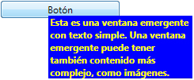

# Popup
El <xref:System.Windows.Controls.Primitives.Popup> control muestra el contenido en una ventana independiente que flota sobre la ventana de la aplicación actual.  
  
 La siguiente ilustración muestra un <xref:System.Windows.Controls.Primitives.Popup> control que se coloca con respecto a un <xref:System.Windows.Controls.Button> que es su elemento primario.  
  
   
  
## En esta sección  
 [Información general sobre el control Popup](../../../../docs/framework/wpf/controls/popup-overview.md)  
 [Posición de un control Popup](../../../../docs/framework/wpf/controls/popup-placement-behavior.md)  
 [Temas "Cómo..."](../../../../docs/framework/wpf/controls/popup-how-to-topics.md)  
  
## Referencia  
 <xref:System.Windows.Controls.Primitives.Popup>  
  
## Secciones relacionadas
